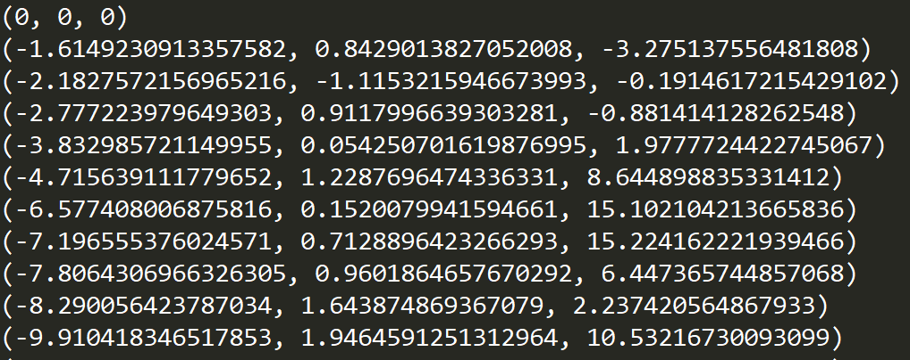
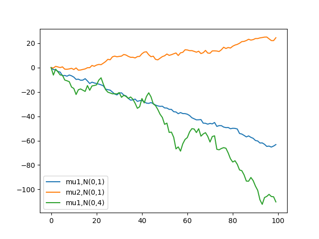
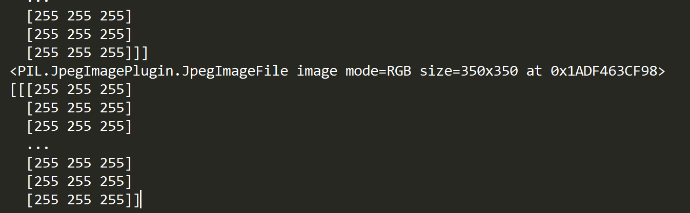
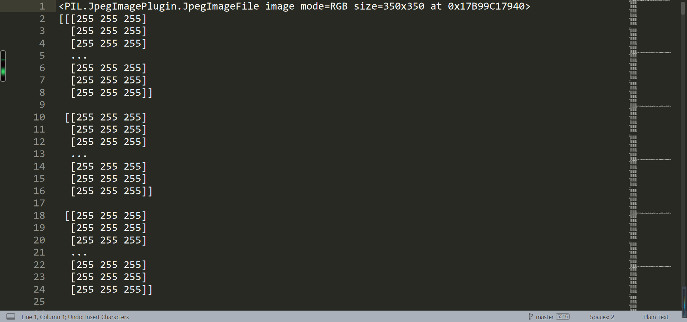

## Week10 生成器与迭代器

### 10.1 作业内容

生成器和迭代器有两种常见的使用场景。

#### 10.1.1 随机游走数据 

后项需要前项导出，且无法通过列表推导式生成。例如，时间序列中的“随机游走”便是一种满足上述条件的序列数据。其公式为
$$
X_t = \mu + X_{t-1} + w_t
$$
其中$\mu$为漂移量，$w_{t}$是满足某种条件的独立同分布的随机变量，这里假设其服从正态分布N(0, $\sigma^2$)。本题要求写出实现该功能的迭代器函数。具体要求如下：

1. 实现random_walk生成器，输入参数$\mu$, $X_0$, $\sigma^2$，$N$，函数将迭代返回N个随机游走生成的变量。

2. 利用zip，实现拼合多个random_walk的生成器，以生成一组时间上对齐的多维随机游走序列。 

#### 10.1.2 大数据加载


需要迭代的内容数据量过大，无法一次性加载。例如，在图像相关的深度学习任务中，由于数据总量过大，一次性加载全部数据耗时过长、内存占用过大，因此一般会采用批量加载数据的方法。（注：实际应用中由于需要进行采样等操作，通常数据加载类的实现原理更接近字典，例如pytorch中的Dataset类。）现提供文件FaceImages.zip，其中包含5500张人脸图片。要求设计FaceDataset类，实现图片数据的加载。具体要求：

1. 类接收图片路径列表

2. 类支持将一张图片数据以ndarray的形式返回（可以利用PIL库实现）。

3. 实现\_\_iter\_\_函数。

4. 实现\_\_next\_\_函数，根据类内的图片路径列表，迭代地加载并以ndarray形式返回图片数据。

### 10.2 随机游走实现

+ 装饰器实现

```python
import random
import numpy as np

def my_randn(sigma2,mu=0):
    while True:
        u = random.random()
        v = random.random()
        x = np.sqrt(-2 * np.log(u)) * np.cos(2 * np.pi * v)
        x = x * sigma2 + mu
        yield x

def random_walk(mu,x0,sigma2,N):
    n = 0
    x = x0
    while (n<N):
        yield x
        x = x + mu + next(my_randn(sigma2))
        n += 1
    return 'done'
```

通过下列公式构造生成器，获得服从标准正态分布的随机数；并
$$
z_{1}=\sqrt{-2 \log u} \cos 2 \pi v
$$
再经过变换得到满足题意的正态分布
$$
x = z_1\sigma^2 + \mu
$$
最后利用生成器实现最多N个数的随机游走过程

+ zip函数合并生成器

```python
def main():
    random.seed(21)

    mu1 = -1 + 2 * random.random()
    g1 = random_walk(mu1, 0, 1, 100)
    mu2 = -1 + 2 * random.random()
    g2 = random_walk(mu2, 0, 1, 100)
    g3 = random_walk(mu1, 0, 4, 100)

    G = zip(g1, g2, g3)
    for i in G:
        print(i)

if __name__ == "__main__":main()
```





### 10.3 大数据加载实现

+ 图像基类
  + 属性：图片集的文件路径
  + 方法：
    + 加载数据：根据某一文件路径打开图片
    + 图片转换：将图片数据转换成ndarray形式

```python
class Faces:
	def __init__(self,dirname):
		self._dirname = dirname
		self._imglist = os.listdir(dirname)
		#print(os.path.join(dirname,self._imglist[0]))

	def load_image(self,name):
		path = os.path.join(self._dirname,name)
		print(path)
		return Image.open(path)

	def image2array(self,img):
		im2arr = np.array(img)
		print(im2arr.shape,im2arr.size)
		return im2arr
```

+ 图像迭代类（方法1）
  + 继承Faces类的图片处理方法，增加迭代功能
  + 方法：
    + `__iter__`：返回特殊迭代器对象，使其能够被`iter`函数
    + `__next__`：实现类的next方法，记住当前状态并正常返回（**Image对象**）

```python
class FaceDataset(Faces):
	def __init__(self,dirname,start=1,step=1,max=2):
		super(FaceDataset, self).__init__(dirname)
		self._start = start
		self._step = step
		self._max = max

	def __iter__(self):
		self._a = self._start
		return self

	def __next__(self):
		if self._a <= self._max:
			ind = self._a
			self._a += self._step
			return Image.open(os.path.join(self._dirname,
										   self._imglist[ind]))
		else:
			raise StopIteration('大于max:{}'.format(self._max))
```

主函数

```python
fd = FaceDataset("../FaceImages/Images",start=1,step=3,max=6)
for x in fd:
	print(x)
	print(fd.image2array(x))
```

返回结果：图片1，图片4



+ 图像迭代类（方法2）：`__iter__`函数返回图片名列表，FaceDataset2为一个**可迭代对象**（而非Iterator），由于没有`__next__`方法对其进行控制，其效果为遍历可迭代对象中的`__iter__`方法返回的迭代器

```python
class FaceDataset2(Faces):
	def __init__(self,dirname,start=1,step=1,max=10):
		super(FaceDataset2, self).__init__(dirname)
		self._start = start
		self._step = step
		self._max = max

	def __iter__(self):
		self._a = self._start
		if self._a <= self._max:
			self._a += self._step
			return iter(self._imglist)
		else:
			raise StopIteration('大于max:{}'.format(self._max))
```

主函数：将ndarray信息写入`test.txt`中

```python
with open("test.txt","w") as f:
	for x in fd2:
		filename = os.path.join("../FaceImages/Images", x)
		img = Image.open(filename)
		f.write(img.__str__()+'\n')
		f.write(str(fd2.image2array(img)))
```



注：全为255是由于能够展示的部分在边缘，可以通过`np.set_printoptions(threshold=np.inf)`设置打印阈值，即可看到图像主体的数据