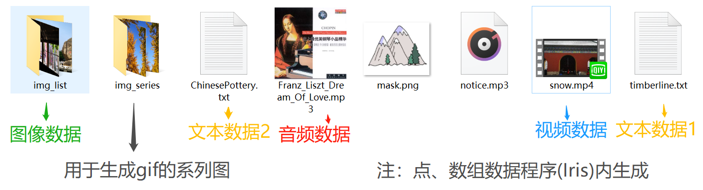
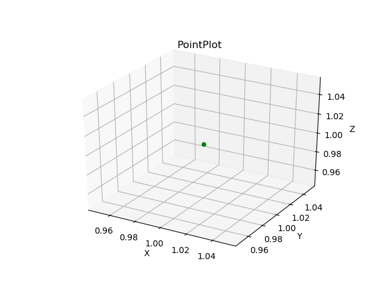
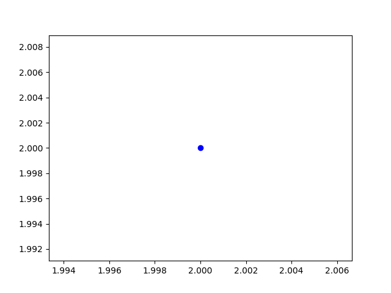
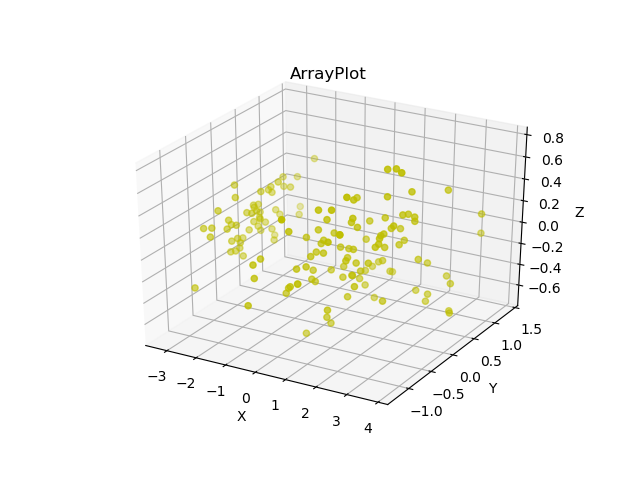
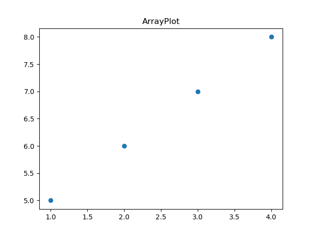
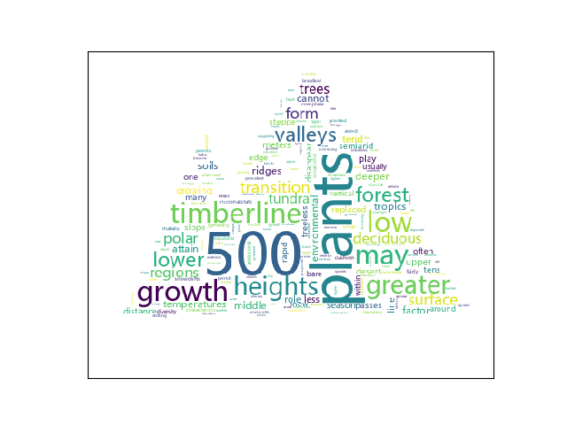
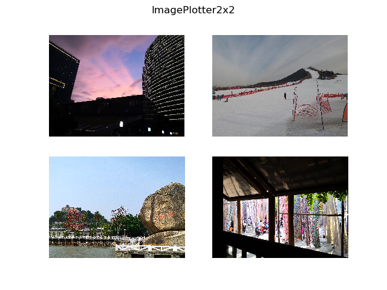
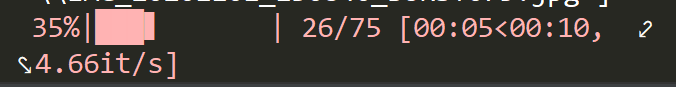
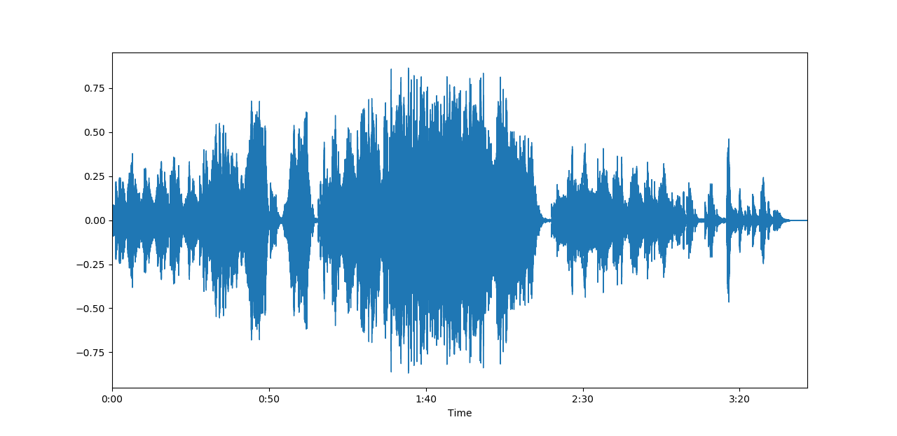
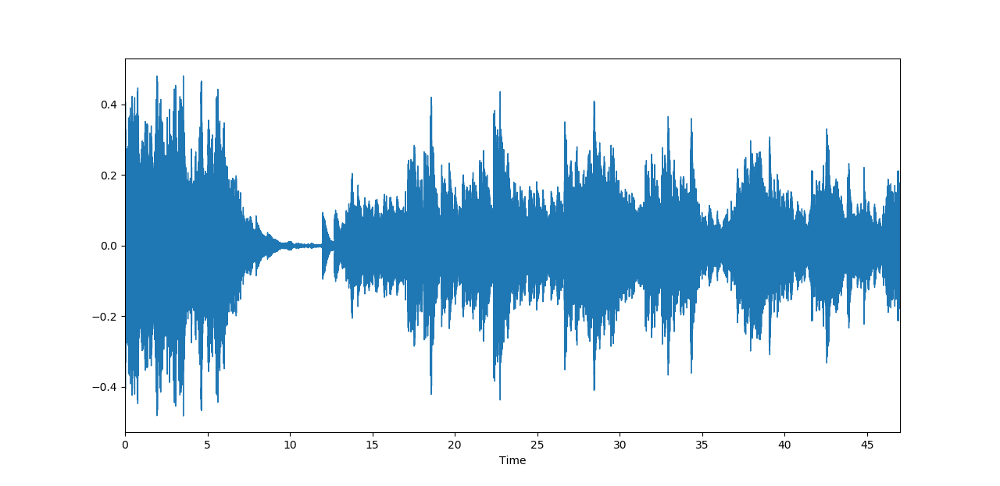

## Week11 抽象类和适配器

### 11.1 作业要求

在使用python时，我们经常会用到许多工具库，它们提供了较为方便的函数调用。但是仍然会有一些情况，例如数据类型或格式不符合函数要求，参数存在差异等，使得调用前需要对数据进行额外处理。本次作业要求基于matplotlib，wordcloud，PIL, imageio等绘图库的绘制函数，设计并实现适配器抽象类和不同的适配类，以实现不同类型数据的多样化可视。具体要求如下：

1. 要求设计抽象类Plotter，至少包含抽象方法plot(data, *args, **kwargs)方法，以期通过不同子类的具体实现来支持多类型数据的绘制，至少包括数值型数据，文本，图片等。

2. 实现类PointPlotter, 实现数据点型数据的绘制，即输入数据为[(x,y)...]型，每个元素为一个Point类的实例。

3. 实现类ArrayPlotter, 实现多维数组型数据的绘制，即输入数据可能是[[x1,x2...],[y1,y2...]]或者[[x1,x2...],[y1,y2...],[z1,z2...]]。

4. 实现类TextPlotter，实现文本型数据的绘制，即输入数据为一段或多段文本，应进行切词，关键词选择（根据频率或tf-idf)，继而生成词云。

5. 实现类ImagePlotter，实现图片型数据的绘制，即输入数据为图片的路径或者图片内容（可以是多张图片），呈现图片并按某种布局组织（如2x2等)。

6. 实现类GifPlotter, 支持一组图片序列的可视化（通过文件路径或图片内容输入），但输出是gif格式的动态图。

**（注意：如下附加题不做要求，有余暇且对相关数据感兴趣的同学可以尝试，做得好了要发朋友圈宣传）**

附加7：在3中，如果多维数组超过3维，可否支持pca等降维并绘制？（了解pca或者TSNE）

附件8：如果输入是一段音频（比如mp3文件），如何进行绘制？（了解librosa里的display模块）

附加9：在6中，如果输入是一段落视频的话，能否通过帧采样，将视频绘制为gif并输出为微信表情包？（了解cv2)

### 11.2 抽象类和适配器

#### 11.2.1 抽象类

```python
class Plotter(metaclass=abc.ABCMeta):
    @abc.abstractmethod
    def plot(self,data,*args,**kwargs):
        pass
```

#### 11.2.2 适配器

```python
class Adapter:
	def __init__(self,adp_obj,adp_methods):
		self.obj=adp_obj
		self.__dict__.update(adp_methods)

	def __str__(self):
		return str(self.obj)
```

#### 11.2.3 结果展示

+ 测试数据集

```python
    dataset = list([Point(1,1,1),Point(2,2),
                    np.transpose(iris.data),np.array([[1,2,3,4],[5,6,7,8]]),
                    texts,
                    i_list,
                    gif_ipth_list,
                    "../data/Franz_Liszt_Dream_Of_Love.mp3"
                    cv2.VideoCapture('../data/snow.mp4')
                   ])
    
```

具体内容如下所示：

```python
iris = load_iris()

with open("../data/timberline.txt") as f:
    texts1 = f.read().splitlines()
with open("../data/ChinesePottery.txt") as f:
    texts2 = f.read().splitlines()

img_dir = "../data/img_list"
ipth_list = os.listdir(img_dir)
i_list = []
for i in ipth_list:
    i = os.path.join("../data/img_list", i)
    i_list.append(Image.open(i))

gif_dir = "../data/img_series"
gif_ipth_list = os.listdir(gif_dir)
for i in range(len(gif_ipth_list)):
    gif_ipth_list[i] = os.path.join("../data/img_series", gif_ipth_list[i])
```



+ **PointPlotter**

```python
# 3d Point
data = dataset[0]
proxy = ProxyPlot(data)
mode = proxy.get_adapter_type()
proxy = Adapter(proxy, adapter_dict[mode])
proxy.plot(data,c='g')
# 2d Point
data = dataset[1]
proxy = ProxyPlot(data)
mode = proxy.get_adapter_type()
proxy = Adapter(proxy, adapter_dict[mode])
proxy.plot(data,c='b')
```

<center class="half">    

</center>

+ ArrayPlotter

```python
# 数组1[4维数据]
data = dataset[2]
proxy = ProxyPlot(data)
mode = proxy.get_adapter_type()
proxy = Adapter(proxy, adapter_dict[mode])
proxy.plot(data,c='y')
# 数组2[2维数据]
data = dataset[3]
proxy = ProxyPlot(data)
mode = proxy.get_adapter_type()
proxy = Adapter(proxy, adapter_dict[mode])
proxy.plot(data)
```

<center class="half">    

</center>

+ TextPlotter

```python
# 文本1
data = dataset[4]
proxy = ProxyPlot(data)
mode = proxy.get_adapter_type()
proxy = Adapter(proxy, adapter_dict[mode])
proxy.plot(data,max_word = 200)
# 文本2
data = dataset[5]
proxy = ProxyPlot(data)
mode = proxy.get_adapter_type()
proxy = Adapter(proxy, adapter_dict[mode])
proxy.plot(data,max_word = 100)
```

文本1：

文本2：

+ ImagePlotter

```python
data = dataset[6]
proxy = ProxyPlot(data)
mode = proxy.get_adapter_type()
proxy = Adapter(proxy, adapter_dict[mode])
proxy.plot(data,nrow=2,ncol=2,max_img=4)
```



+ GifPlotter

```python
data = dataset[7]
proxy = ProxyPlot(data)
mode = proxy.get_adapter_type()
proxy = Adapter(proxy, adapter_dict[mode])
proxy.plot(data,fps=100)  # fps表示帧切换率,值越大,切换越快
```




+ SoundPlotter

```python
data = dataset[8]
proxy = ProxyPlot(data)
mode = proxy.get_adapter_type()
proxy = Adapter(proxy, adapter_dict[mode])
proxy.plot(data,duration=341)  # duration为秒数,此处选取李斯特《爱之梦》共计3分41秒,选取全首歌
```



```python
proxy.plot(data,offset=128,duration=47) # 选取高潮+华彩部分的音频展示
```




+ **VideoPlot**

```python
data = dataset[-1]
proxy = ProxyPlot(data)
mode = proxy.get_adapter_type()
proxy = Adapter(proxy, adapter_dict[mode])
proxy.plot(data)
```


### 11.3 各可视化类实现

#### 11.3.1 PointPlotter

+ 首先创建一个点类，然后进行绘制

```python
import matplotlib.pyplot as plt
from mpl_toolkits.mplot3d import Axes3D

class Point:
    def __init__(self,x,y,*args):
        self.x = x
        self.y = y
        if args != ():    # 空元组
            self.z = args[0]

class PointPlotter(Plotter):
    def plot(self,data,*args,**kwargs):
        #print(data)
        if hasattr(data, 'z'):
            self.x = data.x
            self.y = data.y
            self.z = data.z
            ax = plt.subplot(111, projection='3d')
            ax.scatter(self.x, self.y, self.z, *args,**kwargs)

            ax.set_zlabel('Z')
            ax.set_ylabel('Y')
            ax.set_xlabel('X')
            plt.title("PointPlot")
        else:
            self.x = data.x
            self.y = data.y
            plt.scatter(self.x,self.y,*args,**kwargs)
        plt.show()
```

#### 11.3.2 ArrayPlotter

+ 首先检查数组维度`dim`，

  若大于等于3进行PCA降维，在三维平面上绘图；

  若为1或2维数据，则在二维平面上绘图

```python
import numpy as np
from sklearn.datasets import load_iris
from sklearn.decomposition import PCA
import matplotlib.pyplot as plt
from mpl_toolkits.mplot3d import Axes3D

class ArrayPlotter(Plotter):
    def plot(self,data,*args,**kwargs):
        dim = len(data)
        n_components = 3
        if dim >= n_components:
            pca = PCA(n_components=n_components)
            data_pca = pca.fit_transform(data.transpose())
            #print(type(data_pca))
            #print("data_pca=",data_pca)
            self.x = [row[0] for row in data_pca]   # 提取相应元素
            self.y = [row[1] for row in data_pca]
            self.z = [row[2] for row in data_pca]
            ax = plt.subplot(111, projection='3d')
            ax.set_zlabel('Z')
            ax.set_ylabel('Y')
            ax.set_xlabel('X')
            ax.scatter(self.x, self.y, self.z, *args,**kwargs)
        else:
            self.x = data[0]
            self.y = data[1]
            plt.scatter(self.x,self.y,*args,**kwargs)
        plt.title("ArrayPlot")
        plt.show()
```

#### 11.3.3 TextPlotter

```python
from PIL import Image,JpegImagePlugin
from wordcloud import WordCloud
from sklearn.feature_extraction.text import TfidfVectorizer
import matplotlib.pyplot as plt

class TextPlotter(Plotter):

    def _get_tfidf_keyword(self,texts,max_word):
        stop_words = stopwords.words('english')   
        tfidf = TfidfVectorizer(max_features=max_word,stop_words=stop_words)  # 默认值
        weight = tfidf.fit_transform(texts).toarray()  # 将tf-idf权重转换成numpy列表
        word = tfidf.get_feature_names()  # 得到单词本身
        #print(word)
        word_fre = {}
        for i in range(len(weight)):     # 几段文本
            for j in range(len(word)):
                if word[j] not in word_fre:
                    word_fre[word[j]] = weight[i][j]
                else:
                    word_fre[word[j]] = max(word_fre[word[j]], weight[i][j]) 
        #print(word_fre)
        return word_fre

    def plot(self,texts,*args,**kwargs):
        max_word = kwargs['max_word']
        word_fre = self._get_tfidf_keyword(texts,max_word)
        word_cloud = WordCloud(
                mask=np.array(Image.open("../data/mask.png")),  # 设置北京样式
                font_path="msyh.ttc",  # 设置字体
                background_color="white",
                max_font_size=70,
                max_words= max_word,
                width=500,height=500)
        word_cloud.fit_words(word_fre)
        word_cloud.generate_from_frequencies(word_fre)
        plt.imshow(word_cloud)
        plt.xticks([])  # 去掉横坐标
        plt.yticks([])  # 去掉纵坐标
        plt.show()
```

tips: 一些关键变量的取值，以`timberline.txt`为例

> **weight**
>
> [[0.         0.         0.         ... 0.15740528 0.         0.10897363]
>  [0.4020076  0.         0.         ... 0.         0.         0.        ]
>  [0.         0.         0.         ... 0.         0.         0.        ]
>  [0.         0.         0.         ... 0.         0.         0.        ]
>  [0.         0.         0.12017985 ... 0.         0.14655824 0.10146409]
>  [0.         0.14102693 0.1156441  ... 0.         0.         0.0976347 ]] （二维列表，len=6表示**6段文本**）
>
> **word**
>
> ['500', 'additional', 'adjacent', 'advantage', 'agreed', 'alpine', ...] （列表，共200个，因为max_word取200）
>
>  **word_fre**
>
> {'500': 0.4020075954563743, 'additional': 0.14102693487791892, 'adjacent': 0.12017985420098469, 'advantage': 0.1156441040181635, 'agreed': 0.1016563954100693, 'alpine': 0.12017985420098469...}

#### 11.3.4 ImagePlotter

输入一个列表，列表中为需要展示的图像类型，可以设置展示的长宽和数量

```python
from PIL import Image,JpegImagePlugin
import matplotlib.pyplot as plt

class ImagePlotter(Plotter):
    def plot(self,data,nrow,ncol,max_img=6,*args,**kwargs):
        plt.figure(*args,**kwargs)
        plt.suptitle(f"ImagePlotter{nrow}x{ncol}")
        for i in range(len(data[:max_img])):
            plt.subplot(nrow,ncol,i+1)
            plt.imshow(data[i])
            plt.axis('off')
        plt.show()
```

#### 11.3.5 GifPlotter

输入为一个列表，列表中包含了所有合成gif所需图片的路径

```python
import imageio

class GifPlotter(Plotter):
    def plot(self,data,*args,**kwargs):

        gif_images = []
        #print(data)
        bar = tqdm(data)
        for path in bar:
            #bar.set_description("Now get pic " + path)
            gif_images.append(imageio.imread(path))
        imageio.mimsave("test_mini.gif", gif_images, **kwargs)
```

#### 11.3.6 SoundPlotter

输入一个音频文件的地址

```python
import librosa.display

class SoundPlotter(Plotter):
    def plot(self,data,*args,**kwargs):
        y, sr = librosa.load(path=data, *args,**kwargs)
        #print(y,sr)
        librosa.display.waveplot(y, sr=sr)
        plt.show()
```

#### 11.3.7 VideoPlot

输入一个`cv2.VideoCapture`对象，进行帧采样，得到图片列表后需要借助GifPlotter进行绘图

```python
class VideoPlotter(Plotter):
    def plot(self,data,*args,**kwargs):

        i = 0
        while (data.isOpened()):
            ret, frame = data.read()
            if ret == False:
                break

            img_file = "../data/mp4_img"
            if not os.path.exists(img_file):
                os.mkdir(img_file)
            cv2.imwrite(img_file + "/" + str(i) + '.jpg', frame)
            i += 1
        data.release()
        cv2.destroyAllWindows()
        #print("hello")

        gp = GifPlotter()
        gif_ipth_list = os.listdir(img_file)
        for i in range(len(gif_ipth_list)):
            gif_ipth_list[i] = os.path.join(img_file, gif_ipth_list[i])
        gp.plot(gif_ipth_list,fps=200)
```

#### 11.3.8 ProxyPlot

+ 设置ProxyPlot类来进行图形的绘制，根据数据类型对ProxyPlot进行判断

```python
class ProxyPlot():
    def __init__(self,data):
        self.data = data

    def get_adapter_type(self):
        try:
            if isinstance(self.data,Point):
                self.type = 'point'
            elif isinstance(self.data,np.ndarray):
                self.type = 'array'
            elif isinstance(self.data,str):
                if os.path.splitext(self.data)[-1] in \
                    ['.mp3','.wma','.rm','.wav','.mid']:
                    self.type = 'sound'
            elif isinstance(self.data,cv2.VideoCapture):
                self.type = 'video'
            elif isinstance(self.data,list):
                if isinstance(self.data[0],JpegImagePlugin.JpegImageFile):
                    self.type = 'image'
                elif isinstance(self.data[0],str):
                    if os.path.splitext(self.data[0])[-1] in \
                        ['.jpg','.png','.jpeg','.bmp']:
                        self.type = 'gif'
                    # elif os.path.splitext(self.data[0])[-1] in \
                    #     ['.mp3','.wma','.rm','.wav','.mid']
                    #     self.type = 'sound'
                    else:
                        self.type = 'text'
            return self.type
        except:
            print("we can't print the data, plz check whether the data structure is valid")
            print("valid data structure : Point / Array / Text / Img / Sound / file of Img or Sound")
            exit()
```

此外，在主函数中定义适配器的类型，结合上述方法进行判断。

```python
adapter_dict = {'point':dict(plot=PointPlotter().plot),  # 实例化
                'array':dict(plot=ArrayPlotter().plot),
                'text':dict(plot=TextPlotter().plot),
                'image':dict(plot=ImagePlotter().plot),
                'gif':dict(plot=GifPlotter().plot),
                'sound':dict(plot=SoundPlotter().plot),
                'video':dict(plot=VideoPlotter().plot)}
```

即通过向ProxyPlot传入数据类型，可以实现ProxyPlot中的方法判断绘图对象的数据结构，并返回该对象的数据结构，根据该数据结构来寻找合适的适配器类型。

配置好后，即可利用11.2中的使用方法，使用plot函数来绘制各种数据类型

### 11.4 附录

+ 一些新用法

  + 3d图绘制

  ```python
  import numpy as np
  import matplotlib.pyplot as plt
  from mpl_toolkits.mplot3d import Axes3D
  
  data = np.random.randint(0, 255, size=[40, 40, 40])
  print(data)
  x, y, z = data[0], data[1], data[2]
  ax = plt.subplot(111, projection='3d')  # 创建一个三维的绘图工程
  #  将数据点分成三部分画，在颜色上有区分度
  ax.scatter(x[:10], y[:10], z[:10], c='y')  # 绘制数据点
  # ax.scatter(x[10:20], y[10:20], z[10:20], c='r')
  # ax.scatter(x[30:40], y[30:40], z[30:40], c='g')
  
  ax.set_zlabel('Z')  # 坐标轴
  ax.set_ylabel('Y')
  ax.set_xlabel('X')
  #plt.show()
  ```

  + tf-idf分词

  ```python
  from sklearn.feature_extraction.text import TfidfVectorizer
  
  s = ['文本 分词 工具 可 用于 对 文本 进行 分词 处理',
       '常见 的 用于 处理 文本 的 分词 处理 工具 有 很多']
  tfidf = TfidfVectorizer(stop_words=None,
                          token_pattern=r"(?u)\b\w\w+\b", max_features=6)
  weight = tfidf.fit_transform(s).toarray()
  word = tfidf.get_feature_names()
  
  print('vocabulary list:\n')
  vocab = tfidf.vocabulary_.items()
  vocab = sorted(vocab, key=lambda x: x[1])
  print(vocab)
  print('IFIDF词频矩阵:')
  print(weight)
  
  for i in range(len(weight)):
      # 打印每类文本的tf-idf词语权重，第一个for遍历所有文本，
      # 第二个for便利某一类文本下的词语权重
      print(u"-------这里输出第", i, u"类文本的词语tf-idf权重------")
      for j in range(len(word)):
          print(word[j], weight[i][j])  # 第i个文本中，第j个次的tfidf值
  ```

  + 处理gif

  ```python
  gif_images = []
  for path in bar:    # bar是存放所有图片路径的列表
  	gif_images.append(imageio.imread(path))
      imageio.mimsave("test_mini.gif", gif_images, **kwargs)
  ```

  + 处理音频

  ```python
  y, sr = librosa.load(path=filepath, *args,**kwargs)
  #print(y,sr)
  librosa.display.waveplot(y, sr=sr)
  plt.show()
  ```

  + 视频帧采样

  ```python
  import cv2
  import os
  # Opens the Video file
  cap= cv2.VideoCapture('../data/snow.mp4')
  i=0
  while(cap.isOpened()):
      ret, frame = cap.read()
      if ret == False:
          break
  
      img_file = "../data/mp4_img"
      if not os.path.exists(img_file):
          os.mkdir(img_file)
      cv2.imwrite(img_file + "/" + str(i) + '.jpg', frame)
  
      i += 1
  
  cap.release()
  cv2.destroyAllWindows()
  ```

  其中，存放文件到指定位置可以利用如下写法[**解决忘记新建文件夹**]

  ```python
      if not os.path.exists(img_file):
          os.mkdir(img_file)
      cv2.imwrite(img_file + "/" + str(i) + '.jpg', frame)
  ```

+ 适配器写法

  ```python
  class Adapter:
  	def __init__(self,adp_obj,adp_methods):
  		self.obj=adp_obj
  		self.__dict__.update(adp_methods)
  
  	def __str__(self):
  		return str(self.obj)
  ```

+ numpy类型：`numpy.ndarray`

  PIL图片类型：`JpegImagePlugin.JpegImageFile`