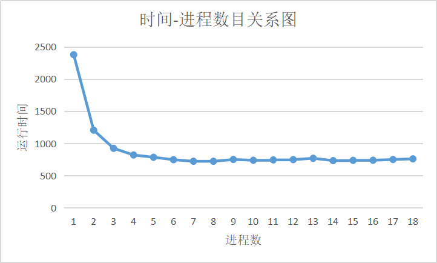
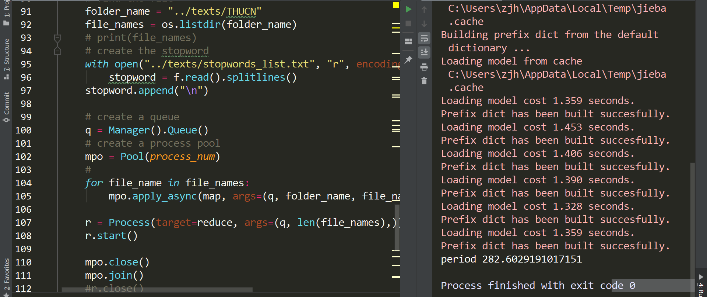
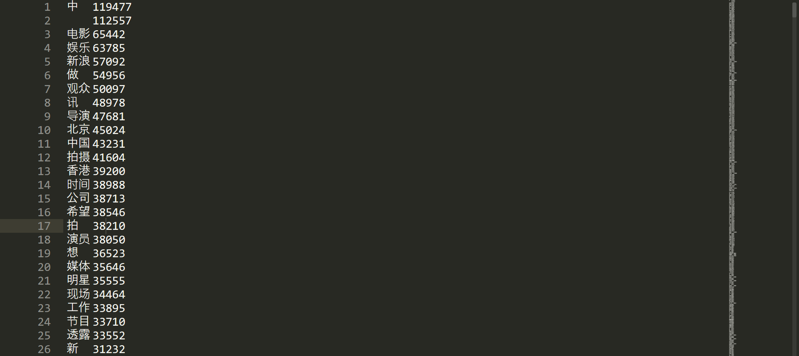

## Week12 MyMapReduce

### 1 作业内容

MapReduce是利用多进程并行处理文件数据的典型场景。作为一种编程模型，其甚至被称为Google的”三驾马车“之一(尽管目前由于内存计算等的普及已经被逐渐淘汰)。在编程模型中，Map进行任务处理，Reduce进行结果归约。本周作业要求利用Python多进程实现MapReduce模型下的文档库（课程中心的THUNews.rar中包含了88724篇文档）词频统计功能。具体地：

1. Map进程读取文档并进行词频统计，返回该文本的词频统计结果。

2. Reduce进程收集所有Map进程提供的文档词频统计，更新总的文档库词频。

3. 主进程可提前读入所有的文档的路径列表，供多个Map进程竞争获取文档路径；或由主进程根据Map进程的数目进行分发；或者单独实现一个分发进程，与多个MAP进程通信。

4. 实现一个Map进程执行完毕返回数据后，传递给Reduce进行更新文档库的词频表。

5. 观察Reduce模块接收文档数据的顺序，是否和输入顺序一致。

6. 记录程序运行时间，比较不同Map进程数量对运行时间的影响，可以做出运行时间-进程数目的曲线并进行简要分析。

### 2 具体实现

+ 文本处理

```python
# -*- coding=utf-8 -*-
# @Time:
# @Author: zjh
# @File: MyMapReduce.py
# @Software: PyCharm

import os,time
import jieba
import json
import collections
from multiprocessing import Pool,Manager,Process


def frequency(word_list):
    """
    cal the frequency for each word from a word list
    :param word_list: a list contains each word in the text
    :return: an ordered dictionary with word and its frequency
            by desc in a text
    """
    WordDict = {}
    for c in word_list:
        if c in WordDict.keys():
            WordDict[c] += 1
        else:
            WordDict[c] = 1
    WordFreq = collections.OrderedDict(sorted(WordDict.items(), key=lambda dc:dc[1],
                                              reverse=True))
    return WordFreq
```

+ map进程池的target函数

```python

def map(q,folder_name,file_name,stopword):
    '''
    word frequency analysis, turn a path into an ordered dictionary
    the first step of MapReduce work: split
    :param folder_name: the folder name of the texts
    :param file_name: the text name (a text)
    :param stopword: import from a txt file
    :return: put the ordered dictionary with word frequency into the queue
    '''
    #print(f"{folder_name}/{file_name}")
    with open(os.path.join(folder_name, file_name), "r", encoding="utf-8") as f:
        text = f.read()
    txt_list = jieba.lcut(text)
    # 过滤停用词
    text_list = list()
    for word in txt_list:
        if word not in stopword:
            text_list.append(word)
    word_freq = frequency(txt_list)
    q.put(word_freq)

    #print(f"[{file_name}] mapped! -- by {os.getpid()}")
```

`q.put(word_freq)`：把单个文本的word_freq上传到queue中，供进程间通信

+ reduce进程的target函数

```python
def reduce(q,length):
    '''
	get the freq_dict from the map process
    :param q: a queue for delivering information
    :param length: the number of texts
    :return: a dictionary
    '''
    dictionary = {}
    count_ok_text = 0
    while True:
        #print("now:",count_ok_text,"  already done:{:.2f}%".format(count_ok_text/length*100))
        td = q.get()
        for key, value in td.items():
            if key in dictionary.keys():
                dictionary[key] += value
            else:
                dictionary[key] = value
        count_ok_text += 1
        if count_ok_text >= length:
            break

    dictionary = collections.OrderedDict(sorted(dictionary.items(), key=lambda dc: dc[1],
                                                reverse=True))

    '''print the dictionary to the disk'''
    wd = ""
    for key,value in dictionary.items():
        wd = wd + str(key) + "\t" + str(value) + "\n"
    
    with open("word_frequency.txt","w",encoding="utf-8") as f:
        f.write(wd)

    #print(dictionary)
```

`td = q.get()`从队列中获取数据

+ 进程关系

```python
def main(process_num):
    # find the file
    folder_name = "../texts/THUCN"
    file_names = os.listdir(folder_name)
    # create the stopword
    with open("../texts/stopwords_list.txt", "r", encoding="utf-8") as f:
        stopword = f.read().splitlines()
    stopword.append("\n")

    # create a queue
    q = Manager().Queue()
    # create a process pool
    mpo = Pool(process_num)
    for file_name in file_names:
        mpo.apply_async(map, args=(q, folder_name, file_name, stopword,))

    r = Process(target=reduce, args=(q, len(file_names),))
    r.start()

    mpo.close()
    mpo.join()
    #r.close()
    r.join()

if __name__ == "__main__":
    start = time.time()
    main(5)
    period = time.time() - start
    print("period",period)
```

+ `q = Manager().Queue()`通过manager暴露Queue，

+ `mpo = Pool(process_num)`创建Map进程池，每个文件遍历输入，选择空闲的进程使用，从而实现供多个Map进程竞争获取文档路径

+ ```python
  for file_name in file_names:
          mpo.apply_async(map, args=(q, folder_name, file_name, stopword,))
  ```

  **回调函数**：任意任务完成会通知主进程，主进程调用另一个map函数

+ `r = Process(target=reduce, args=(q, len(file_names),))`创建Reduce进程

+ `r.start()`创建reduce进程

+ `mpo.close()`关闭进程池

+ `mpo.join()`,`r.join()`让子进程等待主进程

### 3 结果分析

保留一个print语句，进行停用词处理，各个进程数随时间的变化关系如下

| 进程数 | 运行时间    | 进程数 | 运行时间    | 进程数 | 运行时间    |
| ------ | ----------- | ------ | ----------- | ------ | ----------- |
| 1      | 2377.328962 | 7      | 721.7349632 | 13     | 768.2294867 |
| 2      | 1204.904902 | 8      | 721.8808563 | 14     | 732.0407689 |
| 3      | 922.9586208 | 9      | 749.429702  | 15     | 735.9098136 |
| 4      | 819.518266  | 10     | 737.1559186 | 16     | 737.6912248 |
| 5      | 784.1106601 | 11     | 743.1214669 | 17     | 749.0388205 |
| 6      | 746.46192   | 12     | 747.4230361 | 18     | 759.1900346 |



当进程数小于4时，运行时间随着进程数的增加显著减少；当进程数大于4后，运行时间随着进程数的增加降低不明显，当进程数到达7之后，再提高进程数基本对运行时间没有什么影响，最终运行时间保持在大约750s的水平上

+ 关闭print语句和停用词处理，开启6个进程池，再次运行，大致可以看出处理的最短时间大致为282.60s



+ 词频字典如下所示

