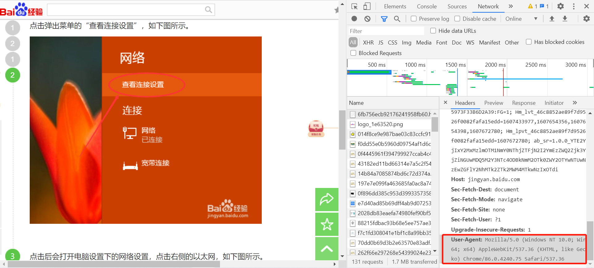
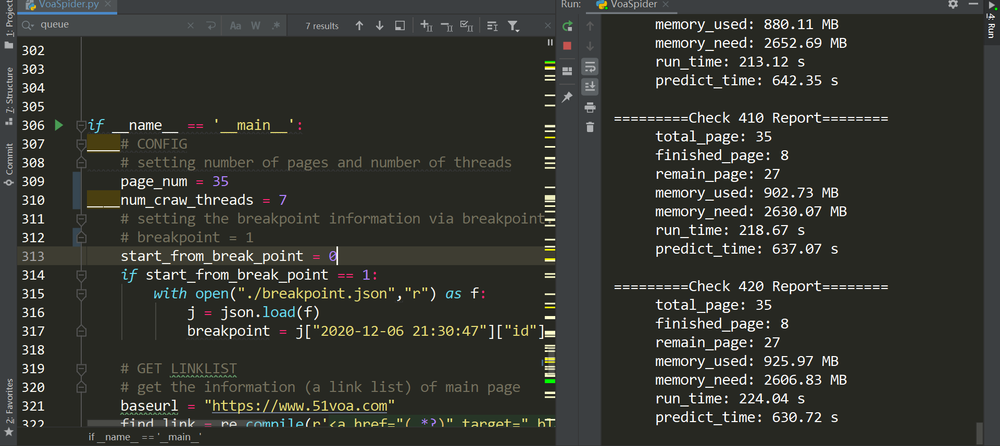
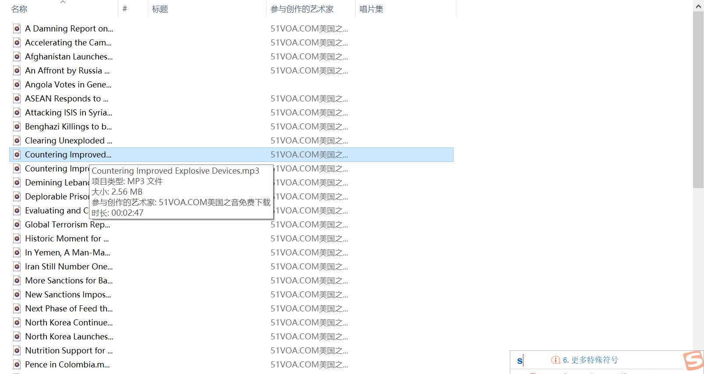

## Week13 VOA数据获取

### 13.1 作业内容

利用Python的多线程实现简单的网络爬虫。以51VOA美国之音网站为例，要求实现爬虫，获取其中mp3音频以及对应的文本并进行存储。具体要求如下：

1. 通过音频列表链接：https://www.51voa.com/VOA_Standard_1.html (其中"1"可被替换为其他数字，对应翻页操作), 要求从中获取要爬取的数据页面链接。

2. 根据获取的数据页面链接列表，基于多线程实现数据下载与存储。要求获取页面中的.mp3音频文件以及对应的文本信息（其中mp3链接可在数据页面中直接找到）。

3. 爬取规模自定义，建议多运行几天，采集的数据或许下学期可以用于别的课程作为训练数据集。

4. （附加）：爬虫程序往往需要稳定运行较长的时间，因此如果你的程序突然中断或异常（比如网络或被封），如何能够快速从断点重启？

5. （附加）：爬虫程序往往需要比较友好的状态输出，因此可否专门有一个线程动态地进行输出更新，来显示当前的状态，比如程序连续运行的时长，要完成的总页面数，其中有多少已被爬取，已收集的文件占用了多少空间，大概还需要多少时间才能完成，预计需要耗费多少硬盘空间等。

提示：

1. 数据页面以及mp3文件链接可以通过观察原html网页的形式，利用beautifulsoup对页面进行解析，提取相关标签获得

2. 存储时如果使用文件系统，同一目录下的文件数避免过多，要自动构建子文件夹来进行切割。


### 13.2 爬虫实现

```python
import os
import re
import sys
import time
import json
import urllib.request
import queue
from tqdm import tqdm
from bs4 import BeautifulSoup
import xlwt
from threading import Thread
import concurrent.futures
```


#### 13.2.1 爬虫线程

函数介绍，指定相应的匹配模式

```python
def craw(link_list,data_list,start_ind=0):
    """
    the working function for the work thread
    :param link_list: the link_list get by the get_link data
    :param data_list: the content to save the data parse from the mp3url, share with 		 different thread,each thread extend its own data into it
    :param start_ind: remark where to start, work only if there is a breakpoint
    :return:
    """
    find_mp3 = re.compile(r'<a href="(.*?)" id="mp3">')
    replace_tag = r'</?\w+[^>]*>'
```

循环从q中获取数据（因为每次输入的链接并不一定按顺序，q需要爬取链接的下标，从0到总长度-1），通过`page_num = start_ind + link_ind + 1`转换成页面的代号，在主页面获取的`link_list`索引得到该页面下的35个数据的`url`

q：send the link id

```python
    while True:
        link_ind = q.get()
        if link_ind is None:
            break

        datas = []
        page_num = start_ind + link_ind + 1
        page = link_list[link_ind]
```

循环遍历数据页面中的每一个`url`，利用`get_data`和其中的`ask_url`访问链接，并解析网页获取其标题，音乐下载链接，文档，大小信息，存放到`datas`中，随后`extend`到所有存放数据的`data_list`的大列表中

对数据的操作需要进行异常处理，如果出现URL异常需要记录信息（如代号和原因），通过`qe`队列给`monitor`线程发送信息，以供`monitor`处理，关于`monitor`监控线程详见13.3

```python
    for url in page:
        # for url in page:
        try:
            # bar.set_description(f"Batch {page_num}")
            data = get_data(url, find_mp3, replace_tag)
            title, music_url, text = data[0], data[1], data[2]
            size = download_music(title, music_url, page_num)
            data.insert(2,size)
            datas.append(data)
            qs.put(size)
        except urllib.error.HTTPError as ueh:
            # print("HTTP")
            info = {"id": page_num, "error": "HTTPError"}
            if hasattr(ueh, "code"):
                print(ueh.code)
            if hasattr(ueh, "reason"):
                print(ueh.reason)
            qe.put(info)
            break
        except urllib.error.URLError as ueu:
            # print("URL")
            info = {"id":page_num,"error":"URLError"}
            if hasattr(ueu, "code"):
                print(ueu.code)
            if hasattr(ueu, "reason"):
                print(ueu.reason)
            qe.put(info)

            break
```
在一个页面处理完成后，需要通过`q.task_done`来告诉队列这个页面的数据已经处理完成，通过`qe.put(1)`告诉`monitor`该线程已经处理完毕

```python
# return datas
data_list.extend(datas)
q.task_done()
qe.put(1)  # use 1 to mark the thread has done its work
print(f"close : {page_num} !" )
```


#### 13.2.2 请求网络

```python
def askurl(url):
    """
    get the content of a web page by its url
    :param url: the specific url name
    :return: the html content of the url
    """
    headers = {
        "User-Agent": "Mozilla/5.0 (Windows NT 10.0; Win64; x64) AppleWebKit/537.36 (KHTML, like Gecko) Chrome/86.0.4240.75 Safari/537.36"
    }
    # 用封装好的request对象去访问,伪装
    req = urllib.request.Request(url=url, headers=headers)
    html = ""
    response = urllib.request.urlopen(req)
    html = response.read().decode("utf-8")
    # try:
    #     response = urllib.request.urlopen(req)
    #     html = response.read().decode("utf-8")
    # except urllib.error.URLError as ue:
    #     if hasattr(ue, "code"):
    #         print(ue.code)
    #     if hasattr(ue, "reason"):
    #         print(ue.reason)

    return html
```

tips：

1. 需要通过headers来伪装



2. 将异常处理放到外面，方便进行断点的恢复

#### 13.2.3 解析主页面

```python
def get_link(page_num,baseurl, findlink, page_start_ind=0):
    """
    get the link data on the web page at one time
    :param baseurl: "https://www.51voa.com"
    :findLink: an mode of re.complie used for finding href
    :param page_start_ind: the first page need to craw
    :return: linklist contains links in 35 pages which are linked to mp3 data
    """
    linklist = []
    # page_start = page_start - 1 # change num2ind
    for i in range(page_start_ind,page_start_ind+page_num):
        print(f"collect page{i + 1}")
        url = baseurl + f'/VOA_Standard_{i + 1}.html'
        html = askurl(url)
        # print(html)

        soup = BeautifulSoup(html, "html.parser")

        links = []  # save the links in one pages
        for item in soup.find_all("a", target="_blank"):  
            # find the string with [target = "_blank"]return a list
            item = str(item)  # change the bs4 to string
            # find the link we need to download
            link = baseurl + re.findall(findlink, item)[0]  
            links.append(link)
        linklist.append(links)
    return linklist
```

#### 13.2.4 解析数据页面

```python
def get_data(url, findmp3, replace_tag):
    """
	get the one music data on the web page by url at one time
    :param url: the url of the mp3
    :param findmp3: a mode of re.complie used for searching mp3 href
    :param replace_tag: a mode of re.compile used for striping the html tag
    :return: a datalist consist of music_name,music_url,music_text
    """
    data_list = []  # save the return data
    html_data = askurl(url)
    soup = BeautifulSoup(html_data, "html.parser")

    title = soup.find_all("h1")[0]
    title = re.sub(replace_tag, '', str(title))
    title = re.sub('[\/*:?"<>|]', '', title)
    data_list.append(title)

    mp3_item = soup.find_all("a", id="mp3")[0]
    mp3_item = str(mp3_item)  # bs4 tag -> str
    music_url = re.findall(findmp3, mp3_item)[0]
    data_list.append(music_url)

    text_item = soup.find_all("p")
    for i in range(len(text_item)):
        text_item[i] = str(text_item[i])
        text_item[i] = re.sub(replace_tag, '', text_item[i])
    text = '\n'.join(text_item)
    data_list.append(text)

    return data_list
```

根据一个特定的url，解析出相关的数据，返回到data_list中。其中findmp3和replace_tag为指定的两个正则表达式的模式，分别用于找到mp3下载链接、找到html标签来替换

#### 13.2.5 存储相关

```python
def save_file(filename, content):
    """
	save the content 
    :param filename: the name saved on the disk
    :param content: the content of the music
    :return:
    """
    dir = os.path.dirname(filename)
    # print(f"filename={filename}\ndir={dir}")
    if not os.path.exists(dir):
        os.makedirs(dir)
    # 放到else里会少一次
    with open(file=filename, mode="wb") as f:
        f.write(content)


def download_music(music_name, music_url, package_num):
    """
    download the music
    :param music_name: the name saved on the disk
    :param music_url: the download url of the music
    :param package_num: the number of package the file will be put
    :return: the size of the content
    """

    response = urllib.request.urlopen(music_url)
    content = response.read()

    save_file(rf'../mp3/{package_num}/' + music_name + '.mp3', content)
    return sys.getsizeof(content)/(1024*1024)

def save_data(datalist, savepath):
    """
    save (name,url of mp3,text) to an excel sheet
    :param datalist: a 2d list with the imformation above
    :param savepath: the path where the data will be saved
    :return: an excel data
    """
    book = xlwt.Workbook(encoding="utf-8")
    sheet = book.add_sheet("VOA", cell_overwrite_ok=True)
    col = ("name", "url","size(MB)","text")
    for i in range(4):
        sheet.write(0, i, col[i])  # 列名
    for i in range(len(datalist)):
        data = datalist[i]
        for j in range(0, 4):
            sheet.write(i + 1, j, data[j])
    book.save(savepath)
```

`save_file`用于写文件，`download_music`调用`save_file`可以存储音乐，而`save_data`用于写下载的数据表

### 13.3 监控线程实现

显示当前状态，包括检查的唯一索引`check_id`，总页面数`total_page_num`，已经收到的页面数`cnt_to_stop`，因为网络异常下载失败的页数`break_page`，monitor线程启动时间`start`，当前已采集的数据大小`temp_size`

并可以据此推测还需要运行的时间`period`，还剩下的数据大小`remain_size`

计算`remain_size`时进行了异常处理，是为了防止网速太慢使得到了汇报时间还没有下载成功一个音频

```python
def show_status(check_id,total_page_num,cnt_to_stop,break_page,start,temp_size):
    """
    :param check_id: the key of the information
    :param total_page_num: the page number need to be processed
    :param cnt_to_stop: the number of page already processed
    :param break_page: the number of page which didn't download successfully due to the urlerror etc
    :param start: the start time of the monitor
    :param temp_size: the total size of the file which has been download
    :return:
    """
    print(f"\n=========Check {check_id} Report========")
    print(f"\t total_page: {total_page_num}")
    print(f"\t finished_page: {cnt_to_stop}")
    remain_page = total_page_num - cnt_to_stop
    print(f"\t remain_page: {remain_page}")
    print("\t memory_used: {:.2f} MB".format(temp_size))
    page_size = 3.45*1024/34
    remain_size = max(0,page_size * (total_page_num - break_page) - temp_size)
    print("\t memory_need: {:.2f} MB".format(remain_size))
    period = time.time() - start
    print("\t run_time: {:.2f} s".format(period))
    try:
        print("\t predict_time: {:.2f} s".format(period / temp_size * remain_size))
    except ZeroDivisionError:
        print("\t predict_time: 99999 s")   # if the net is too slow to load ,the temp_size will be zero
```

每0.5秒进行一次监控，已达到实时监控，每10s汇报一次当前状态

每当一个线程完成任务，则发送1给`monitor`线程，`monitor`对其累加，当达到`total_page_num`时关闭

利用`qs`来和爬虫线程进行通信，将每个文件的大小传给`monitor`线程

关闭前最后显示一次状态

```python
def monitor(total_page_num):
    """
    monitor the craw thread, it will be closed until the information sent
    by the threads is equal to the page_num, and print a success information
    :param page_num: the number of page needs to be processed this time
    :return:
    """
    start = time.time()
    check_id = 0
    break_page = 0
    cnt_to_stop = 0
    temp_size = 0
    json_file = "./breakpoint.json"
    with open(json_file, "w") as f:
        json.dump(dict(), f)
    # prevent local variable use before define
    with open(json_file, "r") as f:
        info_dict = json.load(f)
    # key = 1
    while True:
        check_id += 1
        time.sleep(0.5)
        if not qe.empty():
            info = qe.get()
            if info != 1:  # find error
                key = time.strftime("%Y-%m-%d %H:%M:%S",
                                    time.localtime())

                info_dict[f"{key}"] = info
                with open(json_file, "w") as f:
                    json.dump(info_dict,f)
                break_page += 1
                # key += 1
            else: # successfully
                cnt_to_stop += 1
                if cnt_to_stop == total_page_num:
                    print("successfully download the data!")
                    break
        if not qs.empty():
            temp_size += qs.get()
        if check_id % 10 == 0:
            # print(break_page)
            show_status(check_id,total_page_num,cnt_to_stop,break_page,start,temp_size)
    qe.task_done()
    with open(json_file, 'w') as f:
        json.dump(info_dict, f)
    # print(break_page)
    show_status(check_id,total_page_num,cnt_to_stop,break_page,start,temp_size)
    print("close: monitor ! ")
```

### 13.4 多线程主函数

先定义一些参数，（若`start_from_break_point=0`，则从头下载，若`start_from_break_point=1`，则根据`breakpoint.json`中的断点信息进行恢复）然后通过13.2.3得到`link_list`，对`link_list`进行多线程爬虫

`q,qe,qs`分别用于线程间通信，从而实现线程之间竞争获取资源和系列操作

```python
if __name__ == '__main__':
	# CONFIG
    
    # setting number of pages and number of threads
    page_num = 2
    num_craw_threads = 2
    # setting the breakpoint information via breakpoint.json
    breakpoint = 1
    start_from_break_point = 0
    if start_from_break_point == 1:
        with open("./breakpoint.json","r") as f:
            j = json.load(f)
            breakpoint = j["2020-12-06 21:30:47"]["id"]

    # GET LINKLIST
    
    # get the information (a link list) of main page
    baseurl = "https://www.51voa.com"
    find_link = re.compile(r'<a href="(.*?)" target="_blank">')  # create a object of regular expression to show the rules of matching
    link_list = get_link(page_num,baseurl, find_link,
                         page_start_ind = breakpoint - 1)  
    # if start index is 8, then will fisrt collect 9

    # GET DATA
    
    # Spider with multi-threads, plus a monitor thread to examing the working status 
    q = queue.Queue()   # send the raw id
    qe = queue.Queue()  # send the error to monitor
    qs = queue.Queue()  # send the file size to monitor

    data_list = []      # prepare for all work threads to write
    craw_threads = []   # the list of work threads

    # put all the resoureses to the q, which can be get by the threads competedly
    for link_ind in range(len(link_list)):   
        q.put(link_ind)
    # define the threads
    for i in range(num_craw_threads):
        t = Thread(target=craw,args=(link_list,data_list),
                   kwargs=({"start_ind":breakpoint-1}))
        craw_threads.append(t)
        t.start()
    # start the monitor threads
    tm = Thread(target=monitor,args=(page_num,))
    tm.start()

    # use None to show the threads is over which can help stop the while Ture in the craw threads
    for i in range(num_craw_threads):
        q.put(None)
    for t in craw_threads:
        t.join()
    # tm.join()

    print(sys.getsizeof(data_list))
    try:
        save_data(data_list, "../results/voa.xls")
    except PermissionError:
        save_data(data_list, "../results/voa(1).xls")
```

### 13.5 爬取结果

+ 爬虫过程中的监控信息返回结果

  完整的信息见附录

  

+ 爬取前两个页面的文本汇总结果

  

+ VOA网站的音频列表




+ 断点数据记录

> {"2020-12-07 19:45:51": {"id": 10, "error": "HTTPError"}}

发现下载第十页数据时抛出HTTPError异常，经检验为网站提供的下载链接有误

+ 监控数据及网络异常测试

> =========Check 30 Report========
> 	 total_page: 14
> 	 finished_page: 0
> 	 remain_page: 14
> 	 memory_used: 28.50 MB
> 	 memory_need: 1433.77 MB
> 	 run_time: 15.79 s
> 	 predict_time: 794.44 s
> [WinError 10065] 套接字操作尝试一个无法连接的主机。
> close : 7 !
> [Errno 11001] getaddrinfo failed
> close : 8 !
> [Errno 11001] getaddrinfo failed
> close : 9 !
> [Errno 11001] getaddrinfo failed
> close : 10 !
> [Errno 11001] getaddrinfo failed
> close : 11 !
> [Errno 11001] getaddrinfo failed
> close : 12 !
> [Errno 11001] getaddrinfo failed
> close : 13 !
> [Errno 11001] getaddrinfo failed
> close : 14 !
> 4
>
> =========Check 40 Report========
> 	 total_page: 14
> 	 finished_page: 4
> 	 remain_page: 10
> 	 memory_used: 28.50 MB
> 	 memory_need: 1015.98 MB
> 	 run_time: 21.07 s
> 	 predict_time: 751.16 s

breakpoint.json如下所示

> {"2020-12-07 19:14:05": {"id": 7, "error": "URLError"}, "2020-12-07 19:14:06": {"id": 8, "error": "URLError"}, "2020-12-07 19:14:07": {"id": 9, "error": "URLError"}, "2020-12-07 19:14:08": {"id": 10, "error": "URLError"}, "2020-12-07 19:14:09": {"id": 11, "error": "URLError"}, "2020-12-07 19:14:10": {"id": 12, "error": "URLError"}, "2020-12-07 19:14:11": {"id": 13, "error": "URLError"}, "2020-12-07 19:14:12": {"id": 14, "error": "URLError"}}

此时修改部分参数即可重新下载断点处的内容

```python
if __name__ == '__main__':
	# CONFIG
    page_num = 7  # 总共需要恢复7页数据 
    num_craw_threads = 4
    start_from_break_point = 1      
    if start_from_break_point == 1:  # 开启断点重载模式，指定开始位置和需要恢复的页面数
        with open("./breakpoint.json","r") as f:
            j = json.load(f)
            breakpoint = j["2020-12-07 19:14:05"]["id"]  # 从断点开始
```


### 13.6 一些表达

+ 多个线程轮流对一个数据结构进行操作

```python
if __name__ == '__main__':
    q = queue.Queue()   # send the raw id

    data_list = []      # prepare for all work threads to write
    craw_threads = []   # the list of work threads

    for link_ind in range(len(link_list)):   
        q.put(link_ind) 
    # craw函数中需要while True和q.get，并向每一个线程传输None，在craw中合理设置break来退出
    # define the threads
    for i in range(num_craw_threads):
        t = Thread(target=craw,args=(link_list,data_list),
                   kwargs=({"start_ind":breakpoint-1}))
        craw_threads.append(t)
        t.start()
```

+ 爬取网页及异常处理

```python
req = urllib.request.Request(url=url, headers=headers)
    html = ""
    response = urllib.request.urlopen(req)
    html = response.read().decode("utf-8")
    try:
        response = urllib.request.urlopen(req)
        html = response.read().decode("utf-8")
    except urllib.error.URLError as ue:
        if hasattr(ue, "code"):
            print(ue.code)
        if hasattr(ue, "reason"):
            print(ue.reason)
```

### 13.7 附录

+ 成功下载35页的完整的反馈信息

> D:\Downloads\Anaconda\anaconda\python.exe "E:/大三上2020秋/1 现代程序设计技术/Homework/Week13/codes/VoaSpider.py"
> collect page1
> collect page2
> collect page3
> collect page4
> collect page5
> collect page6
> collect page7
> collect page8
> collect page9
> collect page10
> collect page11
> collect page12
> collect page13
> collect page14
> collect page15
> collect page16
> collect page17
> collect page18
> collect page19
> collect page20
> collect page21
> collect page22
> collect page23
> collect page24
> collect page25
> collect page26
> collect page27
> collect page28
> collect page29
> collect page30
> collect page31
> collect page32
> collect page33
> collect page34
> collect page35
>
> =========Check 10 Report========
> 	 total_page: 35
> 	 finished_page: 0
> 	 remain_page: 35
> 	 memory_used: 0.00 MB
> 	 memory_need: 3636.71 MB
> 	 run_time: 5.10 s
> 	 predict_time: 99999 s
>
> =========Check 20 Report========
> 	 total_page: 35
> 	 finished_page: 0
> 	 remain_page: 35
> 	 memory_used: 21.29 MB
> 	 memory_need: 3615.41 MB
> 	 run_time: 10.30 s
> 	 predict_time: 1748.26 s
>
> =========Check 30 Report========
> 	 total_page: 35
> 	 finished_page: 0
> 	 remain_page: 35
> 	 memory_used: 37.17 MB
> 	 memory_need: 3599.54 MB
> 	 run_time: 15.38 s
> 	 predict_time: 1489.01 s
>
> =========Check 40 Report========
> 	 total_page: 35
> 	 finished_page: 0
> 	 remain_page: 35
> 	 memory_used: 60.62 MB
> 	 memory_need: 3576.09 MB
> 	 run_time: 20.70 s
> 	 predict_time: 1221.38 s
>
> =========Check 50 Report========
> 	 total_page: 35
> 	 finished_page: 0
> 	 remain_page: 35
> 	 memory_used: 86.20 MB
> 	 memory_need: 3550.50 MB
> 	 run_time: 26.09 s
> 	 predict_time: 1074.58 s
>
> =========Check 60 Report========
> 	 total_page: 35
> 	 finished_page: 0
> 	 remain_page: 35
> 	 memory_used: 107.66 MB
> 	 memory_need: 3529.05 MB
> 	 run_time: 31.31 s
> 	 predict_time: 1026.52 s
>
> =========Check 70 Report========
> 	 total_page: 35
> 	 finished_page: 0
> 	 remain_page: 35
> 	 memory_used: 131.39 MB
> 	 memory_need: 3505.32 MB
> 	 run_time: 36.46 s
> 	 predict_time: 972.74 s
>
> =========Check 80 Report========
> 	 total_page: 35
> 	 finished_page: 0
> 	 remain_page: 35
> 	 memory_used: 154.55 MB
> 	 memory_need: 3482.15 MB
> 	 run_time: 41.58 s
> 	 predict_time: 936.89 s
>
> =========Check 90 Report========
> 	 total_page: 35
> 	 finished_page: 0
> 	 remain_page: 35
> 	 memory_used: 176.01 MB
> 	 memory_need: 3460.70 MB
> 	 run_time: 46.84 s
> 	 predict_time: 920.87 s
>
> =========Check 100 Report========
> 	 total_page: 35
> 	 finished_page: 0
> 	 remain_page: 35
> 	 memory_used: 197.30 MB
> 	 memory_need: 3439.41 MB
> 	 run_time: 51.95 s
> 	 predict_time: 905.67 s
>
> =========Check 110 Report========
> 	 total_page: 35
> 	 finished_page: 0
> 	 remain_page: 35
> 	 memory_used: 215.83 MB
> 	 memory_need: 3420.87 MB
> 	 run_time: 57.03 s
> 	 predict_time: 903.89 s
>
> =========Check 120 Report========
> 	 total_page: 35
> 	 finished_page: 0
> 	 remain_page: 35
> 	 memory_used: 241.07 MB
> 	 memory_need: 3395.63 MB
> 	 run_time: 62.15 s
> 	 predict_time: 875.36 s
>
> =========Check 130 Report========
> 	 total_page: 35
> 	 finished_page: 0
> 	 remain_page: 35
> 	 memory_used: 261.38 MB
> 	 memory_need: 3375.32 MB
> 	 run_time: 67.87 s
> 	 predict_time: 876.45 s
>
> =========Check 140 Report========
> 	 total_page: 35
> 	 finished_page: 0
> 	 remain_page: 35
> 	 memory_used: 283.27 MB
> 	 memory_need: 3353.44 MB
> 	 run_time: 73.39 s
> 	 predict_time: 868.78 s
>
> =========Check 150 Report========
> 	 total_page: 35
> 	 finished_page: 0
> 	 remain_page: 35
> 	 memory_used: 306.51 MB
> 	 memory_need: 3330.20 MB
> 	 run_time: 78.85 s
> 	 predict_time: 856.66 s
>
> =========Check 160 Report========
> 	 total_page: 35
> 	 finished_page: 0
> 	 remain_page: 35
> 	 memory_used: 328.01 MB
> 	 memory_need: 3308.70 MB
> 	 run_time: 84.38 s
> 	 predict_time: 851.15 s
>
> =========Check 170 Report========
> 	 total_page: 35
> 	 finished_page: 0
> 	 remain_page: 35
> 	 memory_used: 349.30 MB
> 	 memory_need: 3287.41 MB
> 	 run_time: 90.04 s
> 	 predict_time: 847.42 s
>
> =========Check 180 Report========
> 	 total_page: 35
> 	 finished_page: 0
> 	 remain_page: 35
> 	 memory_used: 373.97 MB
> 	 memory_need: 3262.73 MB
> 	 run_time: 95.32 s
> 	 predict_time: 831.59 s
>
> =========Check 190 Report========
> 	 total_page: 35
> 	 finished_page: 0
> 	 remain_page: 35
> 	 memory_used: 396.23 MB
> 	 memory_need: 3240.48 MB
> 	 run_time: 100.66 s
> 	 predict_time: 823.20 s
>
> =========Check 200 Report========
> 	 total_page: 35
> 	 finished_page: 0
> 	 remain_page: 35
> 	 memory_used: 417.17 MB
> 	 memory_need: 3219.54 MB
> 	 run_time: 105.89 s
> 	 predict_time: 817.22 s
>
> =========Check 210 Report========
> 	 total_page: 35
> 	 finished_page: 0
> 	 remain_page: 35
> 	 memory_used: 439.63 MB
> 	 memory_need: 3197.08 MB
> 	 run_time: 111.09 s
> 	 predict_time: 807.85 s
>
> =========Check 220 Report========
> 	 total_page: 35
> 	 finished_page: 0
> 	 remain_page: 35
> 	 memory_used: 461.29 MB
> 	 memory_need: 3175.42 MB
> 	 run_time: 116.54 s
> 	 predict_time: 802.22 s
>
> =========Check 230 Report========
> 	 total_page: 35
> 	 finished_page: 0
> 	 remain_page: 35
> 	 memory_used: 485.83 MB
> 	 memory_need: 3150.87 MB
> 	 run_time: 121.69 s
> 	 predict_time: 789.23 s
>
> =========Check 240 Report========
> 	 total_page: 35
> 	 finished_page: 0
> 	 remain_page: 35
> 	 memory_used: 510.91 MB
> 	 memory_need: 3125.80 MB
> 	 run_time: 127.03 s
> 	 predict_time: 777.18 s
>
> =========Check 250 Report========
> 	 total_page: 35
> 	 finished_page: 0
> 	 remain_page: 35
> 	 memory_used: 533.83 MB
> 	 memory_need: 3102.88 MB
> 	 run_time: 132.07 s
> 	 predict_time: 767.63 s
>
> =========Check 260 Report========
> 	 total_page: 35
> 	 finished_page: 0
> 	 remain_page: 35
> 	 memory_used: 555.33 MB
> 	 memory_need: 3081.38 MB
> 	 run_time: 137.41 s
> 	 predict_time: 762.45 s
>
> =========Check 270 Report========
> 	 total_page: 35
> 	 finished_page: 0
> 	 remain_page: 35
> 	 memory_used: 578.61 MB
> 	 memory_need: 3058.09 MB
> 	 run_time: 143.02 s
> 	 predict_time: 755.89 s
>
> =========Check 280 Report========
> 	 total_page: 35
> 	 finished_page: 0
> 	 remain_page: 35
> 	 memory_used: 602.42 MB
> 	 memory_need: 3034.29 MB
> 	 run_time: 148.60 s
> 	 predict_time: 748.48 s
> close : 3 !
> close : 1 !
> close : 6 !
> close : 7 !
> close : 4 !
> close : 5 !
> close : 2 !
>
> =========Check 290 Report========
> 	 total_page: 35
> 	 finished_page: 7
> 	 remain_page: 28
> 	 memory_used: 627.94 MB
> 	 memory_need: 3008.76 MB
> 	 run_time: 154.10 s
> 	 predict_time: 738.36 s
>
> =========Check 300 Report========
> 	 total_page: 35
> 	 finished_page: 7
> 	 remain_page: 28
> 	 memory_used: 650.80 MB
> 	 memory_need: 2985.90 MB
> 	 run_time: 159.49 s
> 	 predict_time: 731.74 s
>
> =========Check 310 Report========
> 	 total_page: 35
> 	 finished_page: 7
> 	 remain_page: 28
> 	 memory_used: 672.68 MB
> 	 memory_need: 2964.02 MB
> 	 run_time: 164.70 s
> 	 predict_time: 725.73 s
>
> =========Check 320 Report========
> 	 total_page: 35
> 	 finished_page: 7
> 	 remain_page: 28
> 	 memory_used: 697.18 MB
> 	 memory_need: 2939.52 MB
> 	 run_time: 170.10 s
> 	 predict_time: 717.19 s
>
> =========Check 330 Report========
> 	 total_page: 35
> 	 finished_page: 7
> 	 remain_page: 28
> 	 memory_used: 718.05 MB
> 	 memory_need: 2918.65 MB
> 	 run_time: 175.21 s
> 	 predict_time: 712.18 s
>
> =========Check 340 Report========
> 	 total_page: 35
> 	 finished_page: 7
> 	 remain_page: 28
> 	 memory_used: 740.46 MB
> 	 memory_need: 2896.25 MB
> 	 run_time: 180.84 s
> 	 predict_time: 707.35 s
>
> =========Check 350 Report========
> 	 total_page: 35
> 	 finished_page: 7
> 	 remain_page: 28
> 	 memory_used: 762.70 MB
> 	 memory_need: 2874.01 MB
> 	 run_time: 186.32 s
> 	 predict_time: 702.11 s
> 404
> Not Found
> close : 10 !
>
> =========Check 360 Report========
> 	 total_page: 35
> 	 finished_page: 8
> 	 remain_page: 27
> 	 memory_used: 784.88 MB
> 	 memory_need: 2747.92 MB
> 	 run_time: 191.62 s
> 	 predict_time: 670.87 s
>
> =========Check 370 Report========
> 	 total_page: 35
> 	 finished_page: 8
> 	 remain_page: 27
> 	 memory_used: 805.71 MB
> 	 memory_need: 2727.09 MB
> 	 run_time: 196.95 s
> 	 predict_time: 666.61 s
>
> =========Check 380 Report========
> 	 total_page: 35
> 	 finished_page: 8
> 	 remain_page: 27
> 	 memory_used: 828.44 MB
> 	 memory_need: 2704.36 MB
> 	 run_time: 202.38 s
> 	 predict_time: 660.64 s
>
> =========Check 390 Report========
> 	 total_page: 35
> 	 finished_page: 8
> 	 remain_page: 27
> 	 memory_used: 855.47 MB
> 	 memory_need: 2677.33 MB
> 	 run_time: 207.69 s
> 	 predict_time: 650.01 s
>
> =========Check 400 Report========
> 	 total_page: 35
> 	 finished_page: 8
> 	 remain_page: 27
> 	 memory_used: 880.11 MB
> 	 memory_need: 2652.69 MB
> 	 run_time: 213.12 s
> 	 predict_time: 642.35 s
>
> =========Check 410 Report========
> 	 total_page: 35
> 	 finished_page: 8
> 	 remain_page: 27
> 	 memory_used: 902.73 MB
> 	 memory_need: 2630.07 MB
> 	 run_time: 218.67 s
> 	 predict_time: 637.07 s
>
> =========Check 420 Report========
> 	 total_page: 35
> 	 finished_page: 8
> 	 remain_page: 27
> 	 memory_used: 925.97 MB
> 	 memory_need: 2606.83 MB
> 	 run_time: 224.04 s
> 	 predict_time: 630.72 s
>
> =========Check 430 Report========
> 	 total_page: 35
> 	 finished_page: 8
> 	 remain_page: 27
> 	 memory_used: 952.16 MB
> 	 memory_need: 2580.64 MB
> 	 run_time: 230.19 s
> 	 predict_time: 623.87 s
>
> =========Check 440 Report========
> 	 total_page: 35
> 	 finished_page: 8
> 	 remain_page: 27
> 	 memory_used: 975.36 MB
> 	 memory_need: 2557.44 MB
> 	 run_time: 235.67 s
> 	 predict_time: 617.93 s
>
> =========Check 450 Report========
> 	 total_page: 35
> 	 finished_page: 8
> 	 remain_page: 27
> 	 memory_used: 996.21 MB
> 	 memory_need: 2536.59 MB
> 	 run_time: 241.11 s
> 	 predict_time: 613.92 s
>
> =========Check 460 Report========
> 	 total_page: 35
> 	 finished_page: 8
> 	 remain_page: 27
> 	 memory_used: 1021.27 MB
> 	 memory_need: 2511.53 MB
> 	 run_time: 246.51 s
> 	 predict_time: 606.21 s
>
> =========Check 470 Report========
> 	 total_page: 35
> 	 finished_page: 8
> 	 remain_page: 27
> 	 memory_used: 1045.75 MB
> 	 memory_need: 2487.05 MB
> 	 run_time: 251.68 s
> 	 predict_time: 598.54 s
>
> =========Check 480 Report========
> 	 total_page: 35
> 	 finished_page: 8
> 	 remain_page: 27
> 	 memory_used: 1066.78 MB
> 	 memory_need: 2466.02 MB
> 	 run_time: 256.96 s
> 	 predict_time: 594.00 s
>
> =========Check 490 Report========
> 	 total_page: 35
> 	 finished_page: 8
> 	 remain_page: 27
> 	 memory_used: 1094.67 MB
> 	 memory_need: 2438.13 MB
> 	 run_time: 262.32 s
> 	 predict_time: 584.25 s
>
> =========Check 500 Report========
> 	 total_page: 35
> 	 finished_page: 8
> 	 remain_page: 27
> 	 memory_used: 1122.40 MB
> 	 memory_need: 2410.40 MB
> 	 run_time: 267.54 s
> 	 predict_time: 574.55 s
> close : 11 !
>
> =========Check 510 Report========
> 	 total_page: 35
> 	 finished_page: 9
> 	 remain_page: 26
> 	 memory_used: 1148.33 MB
> 	 memory_need: 2384.47 MB
> 	 run_time: 272.92 s
> 	 predict_time: 566.70 s
> close : 8 !
> close : 12 !
> close : 14 !
>
> =========Check 520 Report========
> 	 total_page: 35
> 	 finished_page: 12
> 	 remain_page: 23
> 	 memory_used: 1176.00 MB
> 	 memory_need: 2356.80 MB
> 	 run_time: 278.16 s
> 	 predict_time: 557.46 s
> close : 13 !
> close : 9 !
>
> =========Check 530 Report========
> 	 total_page: 35
> 	 finished_page: 14
> 	 remain_page: 21
> 	 memory_used: 1200.54 MB
> 	 memory_need: 2332.26 MB
> 	 run_time: 283.31 s
> 	 predict_time: 550.39 s
>
> =========Check 540 Report========
> 	 total_page: 35
> 	 finished_page: 14
> 	 remain_page: 21
> 	 memory_used: 1224.83 MB
> 	 memory_need: 2307.97 MB
> 	 run_time: 288.54 s
> 	 predict_time: 543.70 s
>
> =========Check 550 Report========
> 	 total_page: 35
> 	 finished_page: 14
> 	 remain_page: 21
> 	 memory_used: 1250.38 MB
> 	 memory_need: 2282.42 MB
> 	 run_time: 294.24 s
> 	 predict_time: 537.10 s
>
> =========Check 560 Report========
> 	 total_page: 35
> 	 finished_page: 14
> 	 remain_page: 21
> 	 memory_used: 1272.06 MB
> 	 memory_need: 2260.74 MB
> 	 run_time: 299.57 s
> 	 predict_time: 532.40 s
>
> =========Check 570 Report========
> 	 total_page: 35
> 	 finished_page: 14
> 	 remain_page: 21
> 	 memory_used: 1297.12 MB
> 	 memory_need: 2235.68 MB
> 	 run_time: 304.97 s
> 	 predict_time: 525.64 s
> close : 15 !
>
> =========Check 580 Report========
> 	 total_page: 35
> 	 finished_page: 15
> 	 remain_page: 20
> 	 memory_used: 1320.53 MB
> 	 memory_need: 2212.27 MB
> 	 run_time: 310.30 s
> 	 predict_time: 519.84 s
>
> =========Check 590 Report========
> 	 total_page: 35
> 	 finished_page: 15
> 	 remain_page: 20
> 	 memory_used: 1346.62 MB
> 	 memory_need: 2186.18 MB
> 	 run_time: 315.35 s
> 	 predict_time: 511.95 s
>
> =========Check 600 Report========
> 	 total_page: 35
> 	 finished_page: 15
> 	 remain_page: 20
> 	 memory_used: 1371.61 MB
> 	 memory_need: 2161.19 MB
> 	 run_time: 320.53 s
> 	 predict_time: 505.04 s
>
> =========Check 610 Report========
> 	 total_page: 35
> 	 finished_page: 15
> 	 remain_page: 20
> 	 memory_used: 1393.90 MB
> 	 memory_need: 2138.90 MB
> 	 run_time: 325.58 s
> 	 predict_time: 499.60 s
>
> =========Check 620 Report========
> 	 total_page: 35
> 	 finished_page: 15
> 	 remain_page: 20
> 	 memory_used: 1414.78 MB
> 	 memory_need: 2118.02 MB
> 	 run_time: 330.66 s
> 	 predict_time: 495.02 s
>
> =========Check 630 Report========
> 	 total_page: 35
> 	 finished_page: 15
> 	 remain_page: 20
> 	 memory_used: 1442.47 MB
> 	 memory_need: 2090.33 MB
> 	 run_time: 335.83 s
> 	 predict_time: 486.66 s
>
> =========Check 640 Report========
> 	 total_page: 35
> 	 finished_page: 15
> 	 remain_page: 20
> 	 memory_used: 1464.15 MB
> 	 memory_need: 2068.65 MB
> 	 run_time: 341.01 s
> 	 predict_time: 481.80 s
>
> =========Check 650 Report========
> 	 total_page: 35
> 	 finished_page: 15
> 	 remain_page: 20
> 	 memory_used: 1489.94 MB
> 	 memory_need: 2042.86 MB
> 	 run_time: 346.04 s
> 	 predict_time: 474.45 s
>
> =========Check 660 Report========
> 	 total_page: 35
> 	 finished_page: 15
> 	 remain_page: 20
> 	 memory_used: 1511.99 MB
> 	 memory_need: 2020.81 MB
> 	 run_time: 351.34 s
> 	 predict_time: 469.58 s
>
> =========Check 670 Report========
> 	 total_page: 35
> 	 finished_page: 15
> 	 remain_page: 20
> 	 memory_used: 1534.88 MB
> 	 memory_need: 1997.92 MB
> 	 run_time: 356.65 s
> 	 predict_time: 464.24 s
> **[WinError 10060] 由于连接方在一段时间后没有正确答复或连接的主机没有反应，连接尝试失败。**
> **close : 16 !**
>
> =========Check 680 Report========
> 	 total_page: 35
> 	 finished_page: 16
> 	 remain_page: 19
> 	 memory_used: 1562.73 MB
> 	 memory_need: 1866.16 MB
> 	 run_time: 361.75 s
> 	 predict_time: 431.99 s
>
> =========Check 690 Report========
> 	 total_page: 35
> 	 finished_page: 16
> 	 remain_page: 19
> 	 memory_used: 1586.70 MB
> 	 memory_need: 1842.20 MB
> 	 run_time: 366.87 s
> 	 predict_time: 425.95 s
>
> =========Check 700 Report========
> 	 total_page: 35
> 	 finished_page: 16
> 	 remain_page: 19
> 	 memory_used: 1611.15 MB
> 	 memory_need: 1817.74 MB
> 	 run_time: 372.02 s
> 	 predict_time: 419.73 s
>
> =========Check 710 Report========
> 	 total_page: 35
> 	 finished_page: 16
> 	 remain_page: 19
> 	 memory_used: 1633.61 MB
> 	 memory_need: 1795.28 MB
> 	 run_time: 377.15 s
> 	 predict_time: 414.48 s
>
> =========Check 720 Report========
> 	 total_page: 35
> 	 finished_page: 16
> 	 remain_page: 19
> 	 memory_used: 1662.04 MB
> 	 memory_need: 1766.86 MB
> 	 run_time: 382.31 s
> 	 predict_time: 406.42 s
>
> =========Check 730 Report========
> 	 total_page: 35
> 	 finished_page: 16
> 	 remain_page: 19
> 	 memory_used: 1685.98 MB
> 	 memory_need: 1742.92 MB
> 	 run_time: 387.61 s
> 	 predict_time: 400.70 s
>
> =========Check 740 Report========
> 	 total_page: 35
> 	 finished_page: 16
> 	 remain_page: 19
> 	 memory_used: 1711.54 MB
> 	 memory_need: 1717.36 MB
> 	 run_time: 392.85 s
> 	 predict_time: 394.18 s
>
> =========Check 750 Report========
> 	 total_page: 35
> 	 finished_page: 16
> 	 remain_page: 19
> 	 memory_used: 1734.93 MB
> 	 memory_need: 1693.97 MB
> 	 run_time: 398.19 s
> 	 predict_time: 388.79 s
>
> =========Check 760 Report========
> 	 total_page: 35
> 	 finished_page: 16
> 	 remain_page: 19
> 	 memory_used: 1756.50 MB
> 	 memory_need: 1672.39 MB
> 	 run_time: 403.53 s
> 	 predict_time: 384.21 s
>
> =========Check 770 Report========
> 	 total_page: 35
> 	 finished_page: 16
> 	 remain_page: 19
> 	 memory_used: 1775.78 MB
> 	 memory_need: 1653.11 MB
> 	 run_time: 408.63 s
> 	 predict_time: 380.40 s
>
> =========Check 780 Report========
> 	 total_page: 35
> 	 finished_page: 16
> 	 remain_page: 19
> 	 memory_used: 1796.62 MB
> 	 memory_need: 1632.28 MB
> 	 run_time: 413.83 s
> 	 predict_time: 375.98 s
>
> =========Check 790 Report========
> 	 total_page: 35
> 	 finished_page: 16
> 	 remain_page: 19
> 	 memory_used: 1819.97 MB
> 	 memory_need: 1608.92 MB
> 	 run_time: 419.05 s
> 	 predict_time: 370.45 s
>
> =========Check 800 Report========
> 	 total_page: 35
> 	 finished_page: 16
> 	 remain_page: 19
> 	 memory_used: 1845.62 MB
> 	 memory_need: 1583.27 MB
> 	 run_time: 424.40 s
> 	 predict_time: 364.07 s
>
> =========Check 810 Report========
> 	 total_page: 35
> 	 finished_page: 16
> 	 remain_page: 19
> 	 memory_used: 1864.92 MB
> 	 memory_need: 1563.98 MB
> 	 run_time: 429.80 s
> 	 predict_time: 360.44 s
> close : 19 !
>
> =========Check 820 Report========
> 	 total_page: 35
> 	 finished_page: 17
> 	 remain_page: 18
> 	 memory_used: 1884.60 MB
> 	 memory_need: 1544.29 MB
> 	 run_time: 435.14 s
> 	 predict_time: 356.56 s
> close : 17 !
> close : 21 !
>
> =========Check 830 Report========
> 	 total_page: 35
> 	 finished_page: 19
> 	 remain_page: 16
> 	 memory_used: 1903.11 MB
> 	 memory_need: 1525.78 MB
> 	 run_time: 440.65 s
> 	 predict_time: 353.28 s
>
> =========Check 840 Report========
> 	 total_page: 35
> 	 finished_page: 19
> 	 remain_page: 16
> 	 memory_used: 1926.32 MB
> 	 memory_need: 1502.57 MB
> 	 run_time: 446.20 s
> 	 predict_time: 348.05 s
> close : 18 !
> close : 20 !
>
> =========Check 850 Report========
> 	 total_page: 35
> 	 finished_page: 21
> 	 remain_page: 14
> 	 memory_used: 1944.09 MB
> 	 memory_need: 1484.81 MB
> 	 run_time: 451.58 s
> 	 predict_time: 344.89 s
>
> =========Check 860 Report========
> 	 total_page: 35
> 	 finished_page: 21
> 	 remain_page: 14
> 	 memory_used: 1970.73 MB
> 	 memory_need: 1458.17 MB
> 	 run_time: 457.04 s
> 	 predict_time: 338.17 s
>
> =========Check 870 Report========
> 	 total_page: 35
> 	 finished_page: 21
> 	 remain_page: 14
> 	 memory_used: 1990.26 MB
> 	 memory_need: 1438.63 MB
> 	 run_time: 462.28 s
> 	 predict_time: 334.15 s
>
> =========Check 880 Report========
> 	 total_page: 35
> 	 finished_page: 21
> 	 remain_page: 14
> 	 memory_used: 2010.68 MB
> 	 memory_need: 1418.21 MB
> 	 run_time: 467.61 s
> 	 predict_time: 329.82 s
> close : 22 !
>
> =========Check 890 Report========
> 	 total_page: 35
> 	 finished_page: 22
> 	 remain_page: 13
> 	 memory_used: 2032.56 MB
> 	 memory_need: 1396.34 MB
> 	 run_time: 473.11 s
> 	 predict_time: 325.02 s
>
> =========Check 900 Report========
> 	 total_page: 35
> 	 finished_page: 22
> 	 remain_page: 13
> 	 memory_used: 2046.62 MB
> 	 memory_need: 1382.27 MB
> 	 run_time: 478.62 s
> 	 predict_time: 323.25 s
> close : 23 !
>
> =========Check 910 Report========
> 	 total_page: 35
> 	 finished_page: 23
> 	 remain_page: 12
> 	 memory_used: 2062.55 MB
> 	 memory_need: 1366.34 MB
> 	 run_time: 484.19 s
> 	 predict_time: 320.75 s
>
> =========Check 920 Report========
> 	 total_page: 35
> 	 finished_page: 23
> 	 remain_page: 12
> 	 memory_used: 2086.49 MB
> 	 memory_need: 1342.40 MB
> 	 run_time: 490.27 s
> 	 predict_time: 315.43 s
>
> =========Check 930 Report========
> 	 total_page: 35
> 	 finished_page: 23
> 	 remain_page: 12
> 	 memory_used: 2103.80 MB
> 	 memory_need: 1325.10 MB
> 	 run_time: 495.43 s
> 	 predict_time: 312.05 s
>
> =========Check 940 Report========
> 	 total_page: 35
> 	 finished_page: 23
> 	 remain_page: 12
> 	 memory_used: 2123.44 MB
> 	 memory_need: 1305.46 MB
> 	 run_time: 500.64 s
> 	 predict_time: 307.79 s
>
> =========Check 950 Report========
> 	 total_page: 35
> 	 finished_page: 23
> 	 remain_page: 12
> 	 memory_used: 2142.80 MB
> 	 memory_need: 1286.09 MB
> 	 run_time: 506.00 s
> 	 predict_time: 303.69 s
>
> =========Check 960 Report========
> 	 total_page: 35
> 	 finished_page: 23
> 	 remain_page: 12
> 	 memory_used: 2165.77 MB
> 	 memory_need: 1263.12 MB
> 	 run_time: 511.16 s
> 	 predict_time: 298.12 s
>
> =========Check 970 Report========
> 	 total_page: 35
> 	 finished_page: 23
> 	 remain_page: 12
> 	 memory_used: 2193.07 MB
> 	 memory_need: 1235.82 MB
> 	 run_time: 516.33 s
> 	 predict_time: 290.96 s
>
> =========Check 980 Report========
> 	 total_page: 35
> 	 finished_page: 23
> 	 remain_page: 12
> 	 memory_used: 2211.63 MB
> 	 memory_need: 1217.27 MB
> 	 run_time: 521.47 s
> 	 predict_time: 287.01 s
>
> =========Check 990 Report========
> 	 total_page: 35
> 	 finished_page: 23
> 	 remain_page: 12
> 	 memory_used: 2232.09 MB
> 	 memory_need: 1196.80 MB
> 	 run_time: 526.73 s
> 	 predict_time: 282.42 s
>
> =========Check 1000 Report========
> 	 total_page: 35
> 	 finished_page: 23
> 	 remain_page: 12
> 	 memory_used: 2258.46 MB
> 	 memory_need: 1170.44 MB
> 	 run_time: 532.04 s
> 	 predict_time: 275.73 s
>
> =========Check 1010 Report========
> 	 total_page: 35
> 	 finished_page: 23
> 	 remain_page: 12
> 	 memory_used: 2273.77 MB
> 	 memory_need: 1155.12 MB
> 	 run_time: 537.58 s
> 	 predict_time: 273.10 s
>
> =========Check 1020 Report========
> 	 total_page: 35
> 	 finished_page: 23
> 	 remain_page: 12
> 	 memory_used: 2294.28 MB
> 	 memory_need: 1134.61 MB
> 	 run_time: 542.88 s
> 	 predict_time: 268.47 s
> close : 24 !
>
> =========Check 1030 Report========
> 	 total_page: 35
> 	 finished_page: 24
> 	 remain_page: 11
> 	 memory_used: 2310.26 MB
> 	 memory_need: 1118.63 MB
> 	 run_time: 548.37 s
> 	 predict_time: 265.52 s
> close : 25 !
>
> =========Check 1040 Report========
> 	 total_page: 35
> 	 finished_page: 25
> 	 remain_page: 10
> 	 memory_used: 2329.05 MB
> 	 memory_need: 1099.84 MB
> 	 run_time: 553.59 s
> 	 predict_time: 261.42 s
> close : 26 !
>
> =========Check 1050 Report========
> 	 total_page: 35
> 	 finished_page: 26
> 	 remain_page: 9
> 	 memory_used: 2346.64 MB
> 	 memory_need: 1082.25 MB
> 	 run_time: 559.01 s
> 	 predict_time: 257.81 s
>
> =========Check 1060 Report========
> 	 total_page: 35
> 	 finished_page: 26
> 	 remain_page: 9
> 	 memory_used: 2364.54 MB
> 	 memory_need: 1064.35 MB
> 	 run_time: 564.31 s
> 	 predict_time: 254.01 s
>
> =========Check 1070 Report========
> 	 total_page: 35
> 	 finished_page: 26
> 	 remain_page: 9
> 	 memory_used: 2382.87 MB
> 	 memory_need: 1046.02 MB
> 	 run_time: 569.72 s
> 	 predict_time: 250.09 s
> close : 27 !
>
> =========Check 1080 Report========
> 	 total_page: 35
> 	 finished_page: 27
> 	 remain_page: 8
> 	 memory_used: 2396.69 MB
> 	 memory_need: 1032.20 MB
> 	 run_time: 574.89 s
> 	 predict_time: 247.59 s
>
> =========Check 1090 Report========
> 	 total_page: 35
> 	 finished_page: 27
> 	 remain_page: 8
> 	 memory_used: 2416.52 MB
> 	 memory_need: 1012.37 MB
> 	 run_time: 580.05 s
> 	 predict_time: 243.00 s
> close : 28 !
>
> =========Check 1100 Report========
> 	 total_page: 35
> 	 finished_page: 28
> 	 remain_page: 7
> 	 memory_used: 2429.13 MB
> 	 memory_need: 999.76 MB
> 	 run_time: 585.64 s
> 	 predict_time: 241.03 s
> close : 29 !
>
> =========Check 1110 Report========
> 	 total_page: 35
> 	 finished_page: 29
> 	 remain_page: 6
> 	 memory_used: 2466.37 MB
> 	 memory_need: 962.53 MB
> 	 run_time: 591.10 s
> 	 predict_time: 230.68 s
>
> =========Check 1120 Report========
> 	 total_page: 35
> 	 finished_page: 29
> 	 remain_page: 6
> 	 memory_used: 2487.54 MB
> 	 memory_need: 941.35 MB
> 	 run_time: 596.54 s
> 	 predict_time: 225.75 s
> close : 30 !
>
> =========Check 1130 Report========
> 	 total_page: 35
> 	 finished_page: 30
> 	 remain_page: 5
> 	 memory_used: 2501.82 MB
> 	 memory_need: 927.08 MB
> 	 run_time: 602.18 s
> 	 predict_time: 223.14 s
>
> =========Check 1140 Report========
> 	 total_page: 35
> 	 finished_page: 30
> 	 remain_page: 5
> 	 memory_used: 2517.42 MB
> 	 memory_need: 911.47 MB
> 	 run_time: 607.38 s
> 	 predict_time: 219.91 s
>
> =========Check 1150 Report========
> 	 total_page: 35
> 	 finished_page: 30
> 	 remain_page: 5
> 	 memory_used: 2536.82 MB
> 	 memory_need: 892.08 MB
> 	 run_time: 612.48 s
> 	 predict_time: 215.38 s
>
> =========Check 1160 Report========
> 	 total_page: 35
> 	 finished_page: 30
> 	 remain_page: 5
> 	 memory_used: 2551.08 MB
> 	 memory_need: 877.81 MB
> 	 run_time: 617.82 s
> 	 predict_time: 212.59 s
>
> =========Check 1170 Report========
> 	 total_page: 35
> 	 finished_page: 30
> 	 remain_page: 5
> 	 memory_used: 2563.28 MB
> 	 memory_need: 865.61 MB
> 	 run_time: 623.15 s
> 	 predict_time: 210.44 s
>
> =========Check 1180 Report========
> 	 total_page: 35
> 	 finished_page: 30
> 	 remain_page: 5
> 	 memory_used: 2586.79 MB
> 	 memory_need: 842.10 MB
> 	 run_time: 628.37 s
> 	 predict_time: 204.56 s
>
> =========Check 1190 Report========
> 	 total_page: 35
> 	 finished_page: 30
> 	 remain_page: 5
> 	 memory_used: 2597.29 MB
> 	 memory_need: 831.60 MB
> 	 run_time: 633.66 s
> 	 predict_time: 202.88 s
>
> =========Check 1200 Report========
> 	 total_page: 35
> 	 finished_page: 30
> 	 remain_page: 5
> 	 memory_used: 2617.02 MB
> 	 memory_need: 811.87 MB
> 	 run_time: 639.11 s
> 	 predict_time: 198.27 s
>
> =========Check 1210 Report========
> 	 total_page: 35
> 	 finished_page: 30
> 	 remain_page: 5
> 	 memory_used: 2629.17 MB
> 	 memory_need: 799.72 MB
> 	 run_time: 644.34 s
> 	 predict_time: 195.99 s
>
> =========Check 1220 Report========
> 	 total_page: 35
> 	 finished_page: 30
> 	 remain_page: 5
> 	 memory_used: 2643.41 MB
> 	 memory_need: 785.48 MB
> 	 run_time: 649.58 s
> 	 predict_time: 193.02 s
>
> =========Check 1230 Report========
> 	 total_page: 35
> 	 finished_page: 30
> 	 remain_page: 5
> 	 memory_used: 2655.68 MB
> 	 memory_need: 773.21 MB
> 	 run_time: 654.76 s
> 	 predict_time: 190.64 s
> close : 31 !
> close : 35 !
>
> =========Check 1240 Report========
> 	 total_page: 35
> 	 finished_page: 32
> 	 remain_page: 3
> 	 memory_used: 2666.21 MB
> 	 memory_need: 762.69 MB
> 	 run_time: 659.86 s
> 	 predict_time: 188.76 s
> close : 32 !
>
> =========Check 1250 Report========
> 	 total_page: 35
> 	 finished_page: 33
> 	 remain_page: 2
> 	 memory_used: 2692.30 MB
> 	 memory_need: 736.59 MB
> 	 run_time: 664.97 s
> 	 predict_time: 181.93 s
> close : 33 !
>
> =========Check 1260 Report========
> 	 total_page: 35
> 	 finished_page: 34
> 	 remain_page: 1
> 	 memory_used: 2709.35 MB
> 	 memory_need: 719.54 MB
> 	 run_time: 670.08 s
> 	 predict_time: 177.96 s
> close : 34 !
> 13480
> **successfully download the data!**
> 2
>
> =========Check 1266 Report========
> 	 total_page: 35
> 	 finished_page: 35
> 	 remain_page: 0
> 	 memory_used: 2725.94 MB
> 	 memory_need: 702.96 MB
> 	 run_time: 673.13 s
> 	 predict_time: 173.59 s
> **close: monitor !** 
>
> Process finished with exit code 0

breakpoint.json信息

> {"2020-12-17 20:03:25": {"id": 10, "error": "HTTPError"}, "2020-12-17 20:06:15": {"id": 16, "error": "URLError"}}