## Week2 文本分析人物

### 1 作业内容

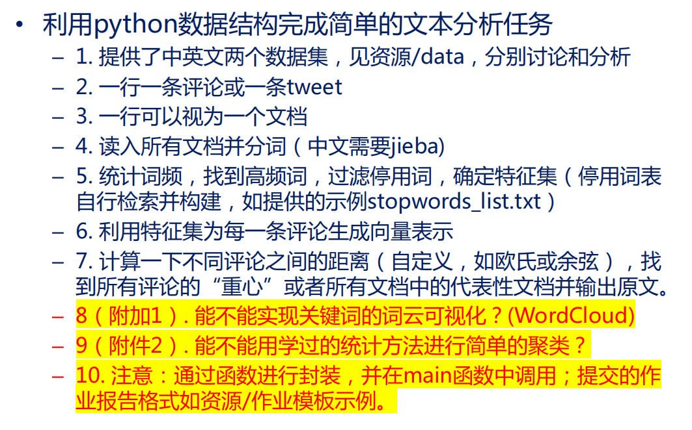

### 2 具体步骤（英文文本）

+ 自定义函数

| **函数名**           | **函数功能**               | **函数输入**           | **函数输出**              |
| -------------------- | -------------------------- | ---------------------- | ------------------------- |
| **getText**          | 获取单行语句，并转换为小写 | 数据的路径`filepath`   | `txt`每一句为列表的一元素 |
| **Tokenization**     | 将句子分词，并删除停用词   | 一行字符串,语言类型    | 去除停用词后的单词列表    |
| **Frequency**        | 统计词频                   | 二维列表内层为每句分词 | 返回词频字典              |
| **Frequency_cut**    | 筛选单词                   | 词频字典               | 出现次数大于20次的词      |
| **BarFreq**          | 绘制柱状图                 | 词频字典               | 词频前6个单词柱状图       |
| **CloudFreq2**       | 绘制词云图                 | 词频字典               | 绘制词云图（英文）        |
| **Word2Vec**         | 将文本转换为词向量         | 二维列表，词频字典     | 词向量矩阵                |
| **cal_one_distance** | 计算向量之间的欧氏距离     | 两个向量               | 欧氏距离                  |
| **cal_distance**     | 计算两两之间的距离         | 词向量矩阵             | 向量的距离邻接矩阵`DisM`  |
| **findCenter**       | 寻找文本中心               | 距离矩阵`DisM`         | 文本重心句                |
| **Cluster**          | 对文本进行聚类             | 距离矩阵`DisM`         | 分类标记字典              |

#### 2.0 run函数

+ 主要串联各个函数

  ```python
  def run(filepath,language):
      text=getText(filepath)
      Word_list = []
      for txt in text:
          Word_list.append(Tokenization(txt,language))
      #print(Word_list)
      WordFreq=Frequency(Word_list)
      WordDict,num_of_word=Frequency_cut(WordFreq)
      print(WordDict.keys())
      #
      # #BarFreq(WordFreq)
      # #CloudFreq2(WordFreq,language)
      WordVector = Word2Vec_Advanced(text,language)
      #print(WordVector)
      # WordVector = Word2Vec(WordDict,Word_list,language)
      
      DisM=cal_distance(WordVector,language)
  
      '''load the DisM'''
      # if language == "English" or language == "english":
      #     DisM = pd.read_excel("../Distance_English.xlsx", header=0)
      # elif language == "Chinese" or language == "chinese":
      #     DisM = pd.read_excel("../Distance_Chinese.xlsx", header=0)
      # DisM = DisM.values
      CenterSen=findCenter(DisM,filepath)
      print(CenterSen)
      ClassifyDict = Cluster(DisM,filepath)
      for key in ClassifyDict.keys():
          print(key,ClassifyDict[key])
  ```

#### 2.1 导入数据并进行分词处理

+ 实现思路：打开文件，多行读入（返回一个列表，每一个元素都是一行），去除每一条语句最后的`\n`换行符

  ```python
  def getText(filepath):
      with open(filepath,'r',encoding='UTF-8') as f:
          txt=f.readlines()
          #strip the '\n' + lower the string
          txt = [line[:-1].lower() for line in txt]
          return txt
  ```

  **注**：当出现`Encoding Error`的时候，考虑在读文件是指定`encoding='UTF-8'`

+ 实现思路：英文文本用`split()`函数进行文本分割，中文文本用`jieba.lcut()`函数进行分词；根据语言导入不同的停用词表，创建新列表`txt_list`用来存储不在停用词表中的单词。对于单句文本的处理具体如下：

  ```python
  def Tokenization(txt,language):
      if language == 'English' or language == 'english':
          StopWord = getText("../stopwords_list_English.txt")
          txt_split = txt.split()
      elif language == 'Chinese' or language == 'chinese':
          StopWord = getText("../stopwords_list.txt")
          txt_split = jieba.lcut(txt)
      else:
          return None          #Language Error
  
      txt_list = []            #After Stopword
      #delete the stop_word
      for c in txt_split:
          if c not in StopWord:
              txt_list.append(c)
  
      return txt_list
  ```

  **注**：采用新建`txt_list`放入合适单词而非直接在`txt.split`中`remove`停用词的方法，是因为在循环中使用`remove`会使得部分单词被跳过

#### 2.2 统计词频及可视化

+ 实现思路：遍历`Word_list`列表（共`num_of_sentence`行，每行为分词结果），通过字典的键值对来存储和记录结果，最后通过`collections`库函数实现字典的有序输出，具体如下：

  ```python
  def Frequency(Word_list):
      WordDict = {}
      for txt_list in Word_list:
          for c in txt_list:
              if c in WordDict.keys():
                  WordDict[c] += 1
              else:
                  WordDict[c] = 1
      WordFreq = collections.OrderedDict()
      WordFreq = collections.OrderedDict(sorted(WordDict.items(), key=lambda dc:dc[1],
                                                reverse=True))
      return WordFreq
  ```

  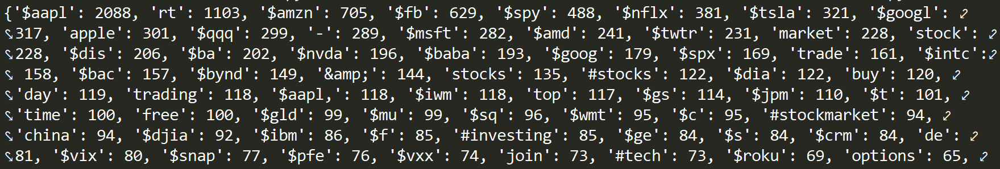

+ 实现思路：词频统计完毕后，输入绘制柱状图的函数如图，代码具体如下：

  ```python
  def BarFreq(WordFreq):
      drawords=[];nums=[]
      items = list(WordFreq.items())
      for i in range(6):
          word, count = items[i]
          drawords.append(word);nums.append(count)
      ind = np.arange(1, 7, 1)
      plt.bar(ind, nums, width=0.75, color='orange',
              alpha=0.9,label='Num of Keyword')
      #mark the number
      for a, b in zip(ind, nums):
          plt.text(a - 0.05, b + 0.1, '%d' % b,
                   ha='center', va='bottom', fontsize=10)
      plt.ylabel('nums')
      plt.xlabel('words')
      plt.title('Word Frequency Bar')
      plt.xticks(ind, drawords)
      plt.legend()
      plt.savefig(r"bar.jpg")
  ```

  **注**：x轴采用ind帮助定位

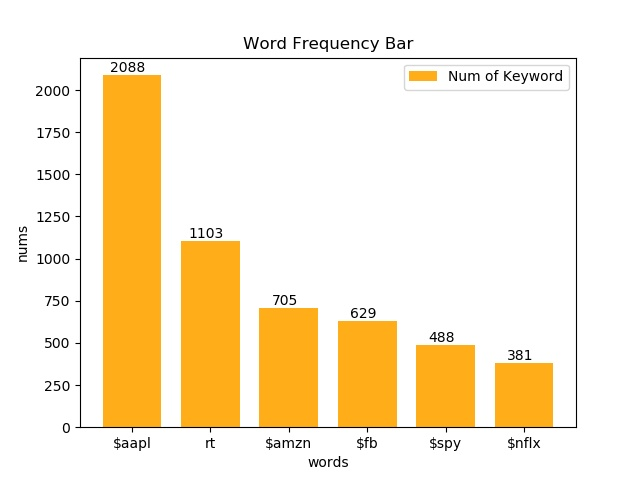

+ 实现思路：词频统计完毕后，输入绘制云图的函数如图，根据文本内容选择合适的`mask`，具体实现如下

  ```python
  def CloudFreq2(WordFreq,language):
      if language == 'English' or language == 'english':
          pic_mask = np.array(Image.open("../image/apple.png"))
      elif language == 'Chinese' or language == 'chinese':
          print("chinese")
          pic_mask = np.array(Image.open("../image/crab.png"))
      wc = WordCloud(background_color="white", max_words=50, mask=pic_mask,
                     font_path="msyh.ttc",width=500,height=500)
      # generate word cloud
      wc.generate_from_frequencies(WordFreq)
  
      # show
      plt.imshow(wc, interpolation="bilinear")
      plt.axis("off")
      plt.show()
  ```

  


#### 2.3 词向量表示

+ 实现思路：首先**构建特征集**。由于有大量的单词只出现少数，我从字典中截取出现频率大于20次的作为特征集，咱主函数中，特征集存储子啊`WordDict`中。具体如下：

  ```python
  def Frequency_cut(WordFreq):
      WordFreq_ ={}
      for key in WordFreq.keys():
          if WordFreq[key] >= 20:
              WordFreq_[key] = WordFreq[key]
      #print(WordFreq_,len(WordFreq_))
      return WordFreq_,len(WordFreq_)
  ```

+ 实现思路：将句子转换成向量，以句子为行，特征集的单词为列，出现为1，否则为0，进行`Word2Vec`转化；矩阵较大，故导出为`xlsx`文件，方便下次读取。

  ```python
  def Word2Vec(WordFreq,Word_list,language):
      Words = list(WordFreq.keys())
      Sentence_length = len(Word_list)
      Words_length = len(Words)
      WordVector = np.zeros((Sentence_length, Words_length))
      for i in range(Sentence_length):
          WordVector[i] = [1 if c in Word_list[i] else 0
                           for c in Words]
      # test for WordVector
      # for i in range(len(WordVector[0])):
      #     if WordVector[0][i]:
      #         print(Words[i])
      data = pd.DataFrame(WordVector)
      writer = pd.ExcelWriter('../WordVector{:}.xlsx'.format(language))  # 写入Excel文件
      data.to_excel(writer, 'page_1')  # ‘page_1’是写入excel的sheet名
      writer.save()
      writer.close()
      print("Vector Already Saved!")
      return WordVector
  ```

  特征集如图所示

  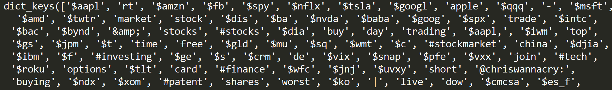

  词向量矩阵如表所示

  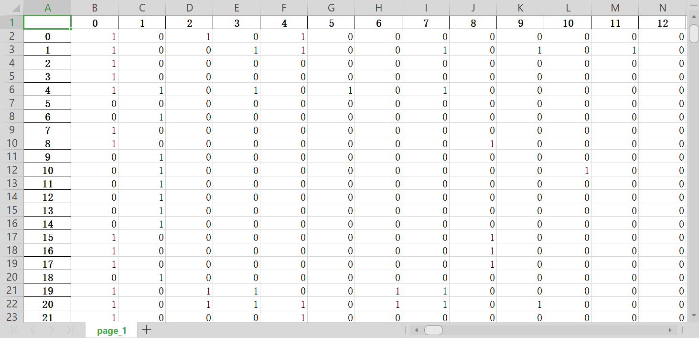

#### 2.4 距离计算

+ 实现思路：定义`cal_one_distance`计算两个句子之间的**欧式**距离，定义`cal_distance`构建距离的邻接矩阵，矩阵较大，故存储到`xlsx`文件中

  ```python
  def cal_one_distance(x,y):
      #dist = pdist(np.vstack([x, y]), 'cosine')
      dist = np.linalg.norm(x - y)
      return dist
  
  def cal_distance(WordVector,language):
      num_of_sen = len(WordVector)
      #num_of_word = len(WordVector[0])
      DisM = np.zeros((num_of_sen,num_of_sen))
      for i in range(num_of_sen):
          for j in range(num_of_sen):
              if i!=j:
                  DisM[i][j]=cal_one_distance(WordVector[i],WordVector[j])
              else:
                  DisM[i][j]=0
          if i%100 == 0 :
              print("{:} row done!".format(i))
      data = pd.DataFrame(DisM)
      writer = pd.ExcelWriter('../Distance_{:}.xlsx'.format(language))  # 写入Excel文件
      data.to_excel(writer, 'page_1')  # ‘page_1’是写入excel的sheet名
      writer.save()
      writer.close()
      print("Distance Already Saved!")
      return DisM
  ```

  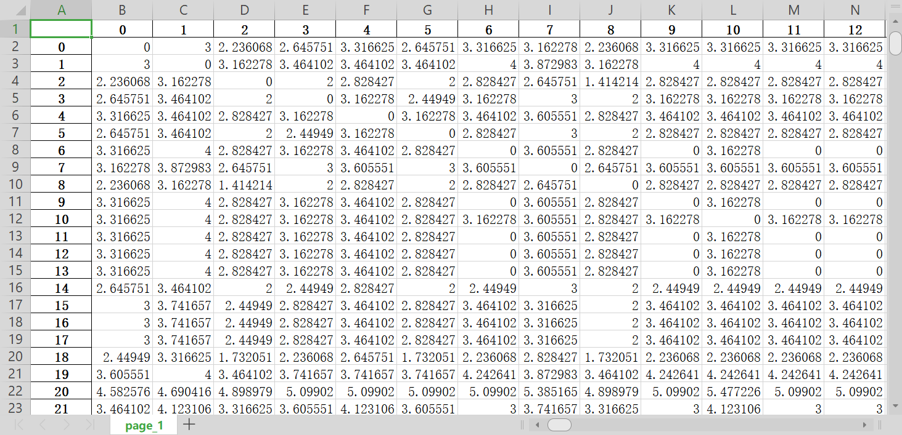

#### 2.5 重心句子

+ 实现思路：在`DisM`中存储了每一条句子到各个句子的距离，构造指标`cosine_sum`（代码最终修改为欧氏距离计算，命名未改，特此说明）。选取该指标最小的说明改句子和所有句子之间的相似度最高，最能反映整个文本的内容，即“文本重心”

  ```python
  ef findCenter(DisM,filepath):
      num_of_sentence = len(DisM)
      cosine_sum = []
      # add by row
      for i in range(num_of_sentence):
          cosine_sum.append(np.nanmean(DisM[i]))
      cosine_sum = np.array(cosine_sum)
      #print(cosine_sum)
      # find the min num and its ind
      ind = np.argmin(cosine_sum)
      print(ind,cosine_sum[ind])
      with open(filepath,'r',encoding='UTF-8') as f:
          txt_ =f.readlines()[ind]
      return txt_
  ```

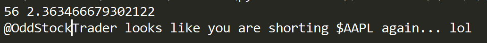

从中可以看出中心句子是第57句，具体内容如图所示

#### 2.6 聚类分析

+ 实现思路：调用

  ```python
  def Cluster(DisM,filepath):
      # 假如我要构造一个聚类数为3的聚类器
      estimator = KMeans(n_clusters=3)  # 构造聚类器
      estimator.fit(DisM)  # 聚类
      label_pred = estimator.labels_  # 获取聚类标签
      centroids = estimator.cluster_centers_  # 获取聚类中心
      inertia = estimator.inertia_  # 获取聚类准则的总和
      txt = getText(filepath)
      #print(txt,inertia)
      ClassifyDict = dict(zip(txt,label_pred))
      return ClassifyDict
  ```

  聚类结果如下所示，给每条信息之后都打上标签（通过碎石图可以看出选择3类较为合适）

  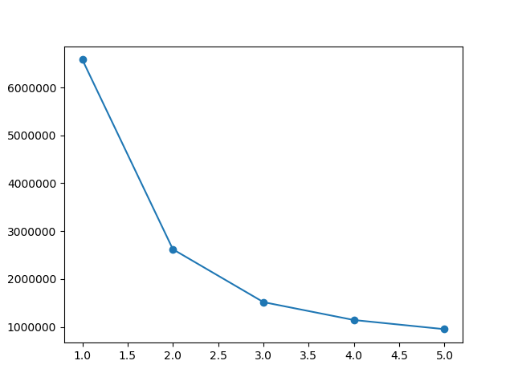

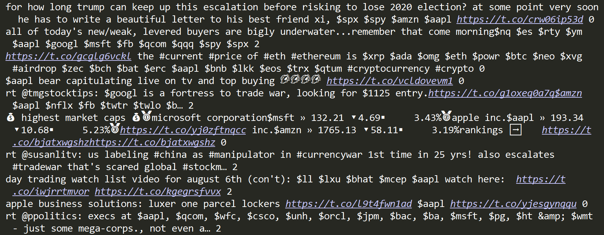

### 3 结果展示（中文文本）

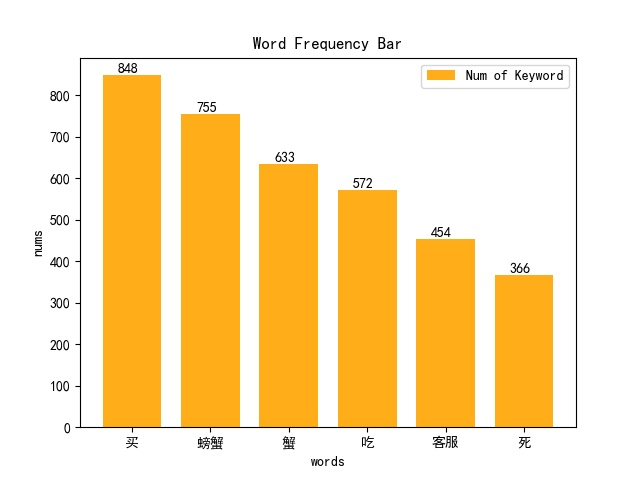


+ 由于上述`Word2Vec`只考虑了单词是否出现，没有考虑单词出现的频率，所以在中文文本中我采用一种更为常用的分词方式`TF-IDF`，不仅考虑单词在文本中的出现次数，还考虑单词在语料库中的出现次数

  ```python
  def Word2Vec_Advanced(txt_list,language):
      tfidf_vectorizer = TfidfVectorizer(tokenizer=jieba_tokenize, \
                                         lowercase=False)
      tfidf_matrix = tfidf_vectorizer.fit_transform(txt_list)
      #print(tfidf_vectorizer.get_feature_names())
  
      data = pd.DataFrame(tfidf_matrix.toarray())
      writer = pd.ExcelWriter('../WordVector{:}.xlsx'.format(language))  # 写入Excel文件
      data.to_excel(writer, 'page_1')  # ‘page_1’是写入excel的sheet名
      writer.save()
      writer.close()
      print("Vector Already Saved!")
      return tfidf_matrix.toarray()
  ```

+ 重心句子为第786句，具体内容如下所示

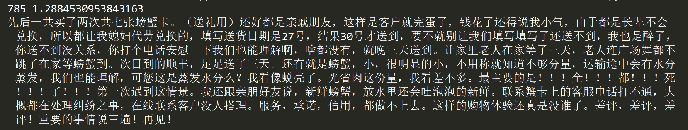

+ 聚类分析结果如下所示：

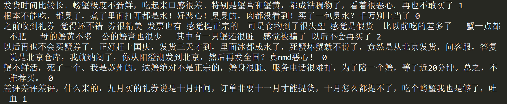

### 4 一些表达

#### 4.1 字典按值排序

```python
WordFreq = collections.OrderedDict()
WordFreq = collections.OrderedDict(sorted(WordDict.items(), key=lambda dc:dc[1],
                                              reverse=True))
```

#### 4.2 从词频字典中生成词云图

```python
    #choose mask
    if language == 'English' or language == 'english':
        pic_mask = np.array(Image.open("../image/apple.png"))
    elif language == 'Chinese' or language == 'chinese':
        print("chinese")
        pic_mask = np.array(Image.open("../image/crab.png"))
        
    # def wordcloud
    wc = WordCloud(background_color="white", max_words=50, mask=pic_mask,
                   font_path="msyh.ttc",width=500,height=500)
    # generate word cloud
    wc.generate_from_frequencies(WordFreq)

    # show
    plt.imshow(wc, interpolation="bilinear")
    plt.axis("off")
    plt.show()
```

#### 4.3 根据条件生成列表推导式

```python
for i in range(Sentence_length):
    WordVector[i] = [1 if c in Word_list[i] else 0
                     for c in Words]
```

#### 4.4 TF-IDF & K-means

```python
#-*- coding=utf-8 -*-
#@Time:  
#@Author: zjh
#@File: demo.py
#@Software: PyCharm
# !/usr/bin/env python
# -*- coding: utf-8 -*-

import jieba
from sklearn.feature_extraction.text import TfidfVectorizer
from sklearn.cluster import KMeans


def jieba_tokenize(text):
    return jieba.lcut(text)


tfidf_vectorizer = TfidfVectorizer(tokenizer=jieba_tokenize, \
                                   lowercase=False)
'''
tokenizer: 指定分词函数
lowercase: 在分词之前将所有的文本转换成小写，因为涉及到中文文本处理，
所以最好是False
'''
text_list = ["今天天气真好啊啊啊啊", "小明上了清华大学", \
             "我今天拿到了Google的Offer", "清华大学在自然语言处理方面真厉害"]
# 需要进行聚类的文本集
tfidf_matrix = tfidf_vectorizer.fit_transform(text_list)
print(tfidf_vectorizer.get_feature_names())

print(tfidf_matrix)			
print(tfidf_matrix.toarray())
num_clusters = 3
km_cluster = KMeans(n_clusters=num_clusters, max_iter=300, n_init=40, \
                    init='k-means++', n_jobs=-1)
'''
n_clusters: 指定K的值
max_iter: 对于单次初始值计算的最大迭代次数
n_init: 重新选择初始值的次数
init: 制定初始值选择的算法
n_jobs: 进程个数，为-1的时候是指默认跑满CPU
注意，这个对于单个初始值的计算始终只会使用单进程计算，
并行计算只是针对与不同初始值的计算。比如n_init=10，n_jobs=40, 
服务器上面有20个CPU可以开40个进程，最终只会开10个进程
'''
# 返回各自文本的所被分配到的类索引
result = km_cluster.fit_predict(tfidf_matrix)

print("Predicting result: ", result)
```

+ 定义分词方式

  `tfidf_vectorizer = TfidfVectorizer(tokenizer=jieba_tokenize,lowercase=False)` 

+ 进行分词，得到结果是邻接表表示方法（通过``tfidf_matrix.toarray()`转换为邻接矩阵）

  `tfidf_matrix = tfidf_vectorizer.fit_transform(text_list)` 

+ 显示分词得到的单词集

  `print(tfidf_vectorizer.get_feature_names())`

+ K-means算法函数

  `km_cluster = KMeans(n_clusters=num_clusters, max_iter=300, n_init=40,init='k-means++', n_jobs=-1)`

+ 返回各自文本所分配的类标签，与文本数相同维度的列表

  `result = km_cluster.fit_predict(tfidf_matrix)`
  
+ 聚类的其他用法

  ```python
  #假如我要构造一个聚类数为3的聚类器
  estimator = KMeans(n_clusters=3)#构造聚类器
  estimator.fit(data)#聚类
  label_pred = estimator.labels_ #获取聚类标签
  centroids = estimator.cluster_centers_ #获取聚类中心
  inertia = estimator.inertia_ # 获取聚类准则的总和
  ```


### 5 代码附录

```python
#-*- coding=utf-8 -*-
#@Time:  
#@Author: zjh
#@File: WordEmbedding.py
#@Software: PyCharm


import collections
import numpy as np
import pandas as pd
import jieba
import matplotlib.pyplot as plt
from wordcloud import WordCloud
from PIL import Image
from sklearn.cluster import KMeans
from sklearn.feature_extraction.text import TfidfVectorizer
#from scipy.spatial.distance import pdist   #cosine-dis

np.set_printoptions(threshold=np.inf)

plt.rcParams['font.sans-serif'] = ['SimHei']  # 用来正常显示中文标签
plt.rcParams['axes.unicode_minus'] = False  # 用来正常显示负号

'''
input:a list,each line is an element in the list
output:a dictionary with word frequency
'''
def getText(filepath):
    with open(filepath,'r',encoding='UTF-8') as f:
        txt=f.readlines()
        #strip the '\n' + lower the string
        txt = [line[:-1].lower() for line in txt]
        return txt

'''
input:a string
output:a list after tokenization
'''
def Tokenization(txt,language):
    if language == 'English' or language == 'english':
        StopWord = getText("../stopwords_list_English.txt")
        txt_split = txt.split()
    elif language == 'Chinese' or language == 'chinese':
        StopWord = getText("../stopwords_list.txt")
        txt_split = jieba.lcut(txt)
    else:
        return None          #Language Error

    txt_list = []            #After Stopword
    #delete the stop_word
    for c in txt_split:
        if c not in StopWord:
            txt_list.append(c)

    return txt_list

'''
input:several list after tokenization
output:an ordered dictionary of word list
'''
def Frequency(Word_list):
    WordDict = {}
    for txt_list in Word_list:
        for c in txt_list:
            if c in WordDict.keys():
                WordDict[c] += 1
            else:
                WordDict[c] = 1
    WordFreq = collections.OrderedDict()
    WordFreq = collections.OrderedDict(sorted(WordDict.items(), key=lambda dc:dc[1],
                                              reverse=True))
    return WordFreq

'''
input:an ordered dictionary of word list
output:bar plot
'''
def BarFreq(WordFreq):
    drawords=[];nums=[]
    items = list(WordFreq.items())
    for i in range(6):
        word, count = items[i]
        drawords.append(word);nums.append(count)
    ind = np.arange(1, 7, 1)
    plt.bar(ind, nums, width=0.75, color='orange',
            alpha=0.9,label='Num of Keyword')
    #mark the number
    for a, b in zip(ind, nums):
        plt.text(a - 0.05, b + 0.1, '%d' % b,
                 ha='center', va='bottom', fontsize=10)
    plt.ylabel('nums')
    plt.xlabel('words')
    plt.title('Word Frequency Bar')
    plt.xticks(ind, drawords)
    plt.legend()
    plt.savefig(r"bar.jpg")

'''
input:a 2d word list:(several sentence, sentence word)
output:Cloud plot
'''
# def CloudFreq(WordList):
#     #Create text based on WordList
#     WordList_f = [word for sentence in WordList for word in sentence]
#     text=" ".join(WordList_f)
#     print(text)
#
#     w=wordcloud.WordCloud(font_path="msyh.ttc",
#                           max_words=25,
#                           width=500,height=500,
#                           background_color="white")
#     w.generate(text)
#     w.to_file("wordcloud.jpg")

'''
input:Word_freq dictionary
output:Cloud plot
'''
def CloudFreq2(WordFreq,language):
    if language == 'English' or language == 'english':
        pic_mask = np.array(Image.open("../image/apple.png"))
    elif language == 'Chinese' or language == 'chinese':
        print("chinese")
        pic_mask = np.array(Image.open("../image/crab.png"))
    wc = WordCloud(background_color="white", max_words=50, mask=pic_mask,
                   font_path="msyh.ttc",width=500,height=500)
    # generate word cloud
    wc.generate_from_frequencies(WordFreq)

    # show
    plt.imshow(wc, interpolation="bilinear")
    plt.axis("off")
    plt.show()


'''
input:Full WordFreq
output:WordFreq with count more than 20
'''
def Frequency_cut(WordFreq):
    WordFreq_ ={}
    for key in WordFreq.keys():
        if WordFreq[key] >= 20:
            WordFreq_[key] = WordFreq[key]
    print(WordFreq_,len(WordFreq_))
    return WordFreq_,len(WordFreq_)

'''
input:WordFreq_dict & 2d Word_list
output:2d WordVector
'''
def Word2Vec(WordFreq,Word_list,language):
    Words = list(WordFreq.keys())
    Sentence_length = len(Word_list)
    Words_length = len(Words)
    WordVector = np.zeros((Sentence_length, Words_length))
    for i in range(Sentence_length):
        WordVector[i] = [1 if c in Word_list[i] else 0
                         for c in Words]
    # test for WordVector
    # for i in range(len(WordVector[0])):
    #     if WordVector[0][i]:
    #         print(Words[i])
    data = pd.DataFrame(WordVector)
    writer = pd.ExcelWriter('../WordVector{:}.xlsx'.format(language))  # 写入Excel文件
    data.to_excel(writer, 'page_1')  # ‘page_1’是写入excel的sheet名
    writer.save()
    writer.close()
    print("Vector Already Saved!")
    return WordVector

def jieba_tokenize(text):
    return jieba.lcut(text)
def Word2Vec_Advanced(txt_list,language):
    tfidf_vectorizer = TfidfVectorizer(tokenizer=jieba_tokenize, \
                                       lowercase=False)
    tfidf_matrix = tfidf_vectorizer.fit_transform(txt_list)
    #print(tfidf_vectorizer.get_feature_names())

    data = pd.DataFrame(tfidf_matrix.toarray())
    writer = pd.ExcelWriter('../WordVector{:}.xlsx'.format(language))  # 写入Excel文件
    data.to_excel(writer, 'page_1')  # ‘page_1’是写入excel的sheet名
    writer.save()
    writer.close()
    print("Vector Already Saved!")
    return tfidf_matrix.toarray()

'''
input:two vector
output:distance
'''
# def cal_one_distance(x,y):
#     if np.linalg.norm(x)*np.linalg.norm(y) == 0:
#         dist = 1
#     else:
#         dist = 1 - np.dot(x,y)/(np.linalg.norm(x)*np.linalg.norm(y))
#
#     return dist


def cal_one_distance(x,y):
    #dist = pdist(np.vstack([x, y]), 'cosine')
    dist = np.linalg.norm(x - y)
    return dist

'''
input:WordList:each row is a vector of the sentence
output:a 2d matrix,Adjacency Matrix
'''
def cal_distance(WordVector,language):
    num_of_sen = len(WordVector)
    #num_of_word = len(WordVector[0])
    DisM = np.zeros((num_of_sen,num_of_sen))
    for i in range(num_of_sen):
        for j in range(num_of_sen):
            if i!=j:
                DisM[i][j]=cal_one_distance(WordVector[i],WordVector[j])
            else:
                DisM[i][j]=0
        if i%100 == 0 :
            print("{:} row done!".format(i))
    data = pd.DataFrame(DisM)
    writer = pd.ExcelWriter('../Distance_{:}.xlsx'.format(language))  # 写入Excel文件
    data.to_excel(writer, 'page_1')  # ‘page_1’是写入excel的sheet名
    writer.save()
    writer.close()
    print("Distance Already Saved!")
    return DisM


'''
input:DisM
output:index of vector, the text of index
'''
def findCenter(DisM,filepath):
    num_of_sentence = len(DisM)
    cosine_sum = []
    # add by row
    for i in range(num_of_sentence):
        cosine_sum.append(np.nanmean(DisM[i]))
    cosine_sum = np.array(cosine_sum)
    #print(cosine_sum)
    # find the min num and its ind
    ind = np.argmin(cosine_sum)
    print(ind,cosine_sum[ind])
    with open(filepath,'r',encoding='UTF-8') as f:
        txt_ =f.readlines()[ind]
    return txt_


def Cluster(DisM,filepath):
    # 假如我要构造一个聚类数为3的聚类器
    estimator = KMeans(n_clusters=3)  # 构造聚类器
    estimator.fit(DisM)  # 聚类
    label_pred = estimator.labels_  # 获取聚类标签
    centroids = estimator.cluster_centers_  # 获取聚类中心
    inertia = estimator.inertia_  # 获取聚类准则的总和
    txt = getText(filepath)
    #print(txt,inertia)
    ClassifyDict = dict(zip(txt,label_pred))
    return ClassifyDict


def run(filepath,language):
    text=getText(filepath)
    Word_list = []
    for txt in text:
        Word_list.append(Tokenization(txt,language))
    #print(Word_list)
    WordFreq=Frequency(Word_list)
    WordDict,num_of_word=Frequency_cut(WordFreq)
    
    #BarFreq(WordFreq)
    #CloudFreq2(WordFreq,language)
    WordVector = Word2Vec_Advanced(text,language)
    #print(WordVector)
    # WordVector = Word2Vec(WordDict,Word_list,language)
    
    DisM=cal_distance(WordVector,language)

    '''load the DisM'''
    #if language == "English" or language == "english":
    #    DisM = pd.read_excel("../Distance_English.xlsx", header=0)
    #elif language == "Chinese" or language == "chinese":
    #    DisM = pd.read_excel("../Distance_Chinese.xlsx", header=0)
    #DisM = DisM.values
    CenterSen=findCenter(DisM,filepath)
    print(CenterSen)
    ClassifyDict = Cluster(DisM,filepath)
    for key in ClassifyDict.keys():
        print(key,ClassifyDict[key])


#run("../tweets_apple_stock.txt","English")
run("../online_reviews_texts.txt","Chinese")
```

> 本文数据及代码已开源至 https://github.com/zhuangjiaheng/2020_Python_Homework.git
>
> 运行main.py函数即可，
>
> 在通过修改路径可以选择导入的文本，在run函数中可以指定是否需要绘制云图、柱状图；
>
> 也可以直接通过读取`Distance<...>.xlsx`文件来导入`DisM`，从而进行重心句子的寻找及聚类操作


