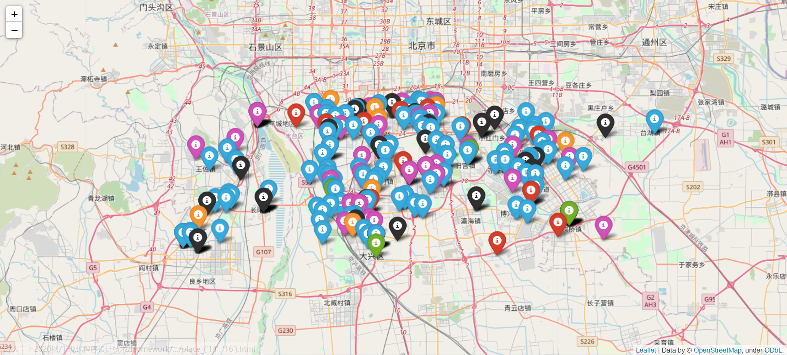

## Week3 微博情绪分析

### 1 作业内容


### 2 作业概述

#### 2.1 文本预处理

| 函数名        | 函数功能               | 函数输入          | 函数输出       |
| ------------- | ---------------------- | ----------------- | -------------- |
| **tokenize**  | 文本分词；去掉网络链接 | 文本+链接字符串   | 处理后的字符串 |
| **load_dict** | 加载情绪字典           | 5个可用的情绪文档 | 5个字典        |

#### 2.2 情感分析工具

| 函数名           | 函数功能                   | 函数输入         | 函数输出                  |
| ---------------- | -------------------------- | ---------------- | ------------------------- |
| **emo_num**      | 统计句子中各情绪出现次数   | 原数据框         | +各个情绪出现次数         |
| **load_func**    | 闭包的外函数               | 数据框           | `emo_classify`函数        |
| **emo_classify** | 闭包内函数，统计各情绪频率 | 选择分析方法     | +各个情绪的频率/+唯一情绪 |
| **save_df**      | 保存数据框                 | 需要保存的数据框 |                           |

#### 2.3 情绪的时间分布

| 函数名          | 函数功能             | 函数输入       | 函数输出                                  |
| --------------- | -------------------- | -------------- | ----------------------------------------- |
| **time**        | 按时间划分文本并统计 | 扩展数据框     | 2位数组，每个时间段内个情绪出现次数和频率 |
| **build_stack** | 计算堆叠图的`bottom` | 各时段情绪次数 | 列表：含有5中情绪的其实绘图处             |
| **time_plot**   | 绘制时间分布堆叠图   | 各时段情绪次数 | 各时段情绪数据随着时间变化的堆叠图        |

+ tips：此处采用的分析工具认为情绪是混合的

#### 2.4 情绪的空间分布

| 函数名           | 函数功能                       | 函数输入              | 函数输出         |
| ---------------- | ------------------------------ | --------------------- | ---------------- |
| **place_plot_1** | 绘制情绪空间分布               | 扩展数据框            | 情绪频率地图     |
| **transformalt** | 纬度转换                       | 不定长位置参数        | 计算中间参数     |
| **transformlng** | 经度转换                       | 不定长位置参数        | 计算中间参数     |
| **judge_china**  | 判断经纬度范围                 | 不定长位置参数        | T表示不在中国    |
| **place_trans**  | 实现G->W的转换                 | 不定长位置参数        | wgs84经纬度      |
| **place_subdf**  | 对数据表进行投影，添加修改位置 | 原始数据框            | 扩展数据框2      |
| **place_plot_2** | 在`folium`上可视化情绪坐标     | 扩展数据框2，时间区域 | 定时情绪频率地图 |

+ tips：第一幅图采用的是混合的分析工具；第二幅图采用的是唯一的分析工具

#### 2.5 空间动态可视化

| 函数名            | 函数功能           | 函数输入                | 函数输出     |
| ----------------- | ------------------ | ----------------------- | ------------ |
| **cluster**       | 对地理位置进行聚类 | 数据框，聚类数（默认5） | +聚类标签    |
| **place_plot_3**  | 聚类结果示意图     | 扩展数据框（+聚类标签） | 地理分区图   |
| **dynamic_place** | 空间动态可视化     | 扩展数据框              | 动态可视化图 |

### 3 函数实现

#### 3.1 文本预处理

```python
jieba.load_userdict("../data/emotion_lexicon/anger.txt")
```

+ 将情绪字典加入`Jieba`自定义字典中

```python
def tokenize(text_string):
    '''
    strip the url and split the text

    :param text_string: A string with url
    :return: A split_list
    '''
    results = re.compile(r'http://[a-zA-Z0-9.?/&=:]*', re.S)
    text_string = results.sub("", text_string)
    token_list = jieba.lcut(text_string)
    return token_list
```

+ `results = re.compile(r'http://[a-zA-Z0-9.?/&=:]*', re.S)` 匹配文本中的网址，并在下一行中利用`sub`函数替换为空格，从而实现把网址去除的目的

```python
def load_dict():
    '''
    load the dictionary of the emotion_word

    :return:5 dictionary saving angry;disgust;fear;joy;sadness
    '''
    with open("../data/emotion_lexicon/anger.txt",encoding="UTF-8") as d1:
        d1 = d1.read().splitlines()   #is a way to read the word without '\n'
```

+ 通过 `f.read` 函数读取全部文本，再通过 `splitlines` 函数按行分割，这样可以让每个文本元素不含最后的换行符

#### 3.2 情感分析工具

```python
def emo_num(df):
    '''
    classify the emotion based on the dict and the split_text in df

    :param df: A dataframe including text,place,time
    :return: A dataframe with new attributes [emotion tag]
    '''
    d1, d2, d3, d4, d5 = load_dict()
    df['angry']=0;df['disgust']=0;df['fear']=0;
    df['joy']=0;df['sadness']=0
    for index,row in df.iterrows():
        # print(row)
        #print(getattr(row, 'Text'))  # get the element by the column
        tempCnt = [0,0,0,0,0]
        for word in getattr(row,'Text'):
            if word in d1:tempCnt[0] += 1
            elif word in d2:tempCnt[1] += 1
			……

        # 0:Text 1:Long 2:Lati 3:Time
        # 4:angry 5:disgust 6:fear 7:joy 8:sadness
        df.iloc[index, 4] = tempCnt[0]
        df.iloc[index, 5] = tempCnt[1]
		……
    return df
```

+ `for index,row in df.iterrows():` 按行遍历数据框
  + `getattr(row,'Text')`：**取出**该行元组在`Text`属性下的取值
  + `df.iloc[index, 5] = tempCnt[1]`：**修改**该行元组在第5个属性下的取值

```python
def load_func(df):
    '''
    load the emo_classify function

    :param df: A dataframe with count of each emotion
    :return: emo_classify function
    '''
    df['pangry']=0;df['pdisgust']=0;df['pfear']=0;
    df['pjoy']=0;df['psadness']=0;df['tag']=''
    def emo_classify(pattern):
        '''
        classify the emotions and label it with tag

        :param pattern:choose the way of tools: mixed ot unique
        :return: A dataframe with full information
        '''
        nonlocal df
        for index, row in df.iterrows():
            tempCnt = list(row[['angry', 'disgust','fear','joy','sadness']])
            # print(tempCnt)
            if pattern == 'mixed':
                percent = lambda tempCnt: [tempCnt[i]/sum(tempCnt) if sum(tempCnt)>0
                                           else 0 for i in range(5)]
                pct_list = percent(tempCnt)
                # 9:pangry 10:pdisgust 11:pfear 12:pjoy 13:psadness
                df.iloc[index, 9] = pct_list[0]
                df.iloc[index, 10] = pct_list[1]
                df.iloc[index, 11] = pct_list[2]
                df.iloc[index, 12] = pct_list[3]
                df.iloc[index, 13] = pct_list[4]
            elif pattern == 'unique':
                # 14:tag
                emo_list = ['angry', 'disgust','fear','joy','sadness','others','mixed']
                tempM = max(tempCnt)
                if tempM == 0 : Id=5
                elif tempCnt.count(tempM) >= 2: Id=6
                else : Id = tempCnt.index(tempM)
                df.iloc[index,14] = emo_list[Id]
        return df
    return emo_classify
```

```python
#主函数
df = pd.DataFrame(text,columns=['Text','Longtitude','Latitude','Time']) 
#合并特定的属性值生成数据框
df = emo_num(df)
emo_classify = load_func(df)
emo_classify('mixed')
df_tag = emo_classify('unique')
save_df(df_tag,"emo_tag_data")
```

+ 闭包实现原始数据框导入一次但可以多次对其进行补充

  + `nonlocal`数据框，使内函数可以利用外函数的变量

+ ```python
  percent = lambda tempCnt: [tempCnt[i]/sum(tempCnt) if sum(tempCnt)>0
                                         else 0 for i in range(5)]
  pct_list = percent(tempCnt)
  ```
  使用`lambda`匿名函数，以及带条件的列表推导式

+ 扩展数据框·`df_tag`如图所示


#### 3.3 情绪的时间分布

```python
def time(df):
    '''
    analyize the text~time

    :param df:a dataframe
    :return:2d list Percent with Counts of emotion split by hours
    '''
    df_tag_time = df[['Time','angry', 'disgust','fear','joy','sadness',
                      'tag']].sort_values("Time",inplace=False)
                    #inplace=False表示不修改df,仅返回
    #print(df_tag_time)
    time_interval = ['08 {:}:00:00'.format(str(i).zfill(2)) for i in range(24)]
    time_interval.append('09 00:00:00')
    Counts = [[0 for i in range(5)] for i in range(len(time_interval))]
    Freqs = [[0 for i in range(5)] for i in range(len(time_interval))]
```

+ `'08 {:}:00:00'.format(str(i).zfill(2))` 字符串格式化，`zfill(n)` 左补零n位

```python
def time_plot(Counts):
    '''
    plot the result of text~time

    :param Counts: 2d list Frequency of emotion split by hours
    :return:
    '''
    Counts_trans = [[row[i] for row in Counts] for i in range(5)]
    print(Counts_trans)
    #set the plot
    fig = plt.figure(figsize=(12, 5))

    #set the title
    plt.title('Five Emotions on Weibo During a Day')

    #set the axis-x
    N = 25
    ind = np.arange(N)
    x_tpl = ['08d-{:}h'.format(str(i).zfill(2)) for i in range(N)]
    x_tpl=tuple(x_tpl)
    plt.xticks(ind, x_tpl,rotation=30)

    #set the axis-y
    plt.yticks(np.arange(0, 1, 0.1))  # 0到81 间隔20
    plt.ylabel('percentage')

    #build the stack
    d=build_stack(Counts_trans)

    #plot
    width = 0.35
    p1 = plt.bar(ind, Counts_trans[0], width, color='red')
    p2 = plt.bar(ind, Counts_trans[1], width, bottom=d[1] , color='orange')
    p3 = plt.bar(ind, Counts_trans[2], width, bottom=d[2],color = 'green')
    p4 = plt.bar(ind, Counts_trans[3], width, bottom=d[3],color = 'blue')
    p5 = plt.bar(ind, Counts_trans[4], width, bottom=d[4],color = 'purple')
    #legend
    plt.legend((p1[0], p2[0],p3[0],p4[0],p5[0]), \
               ('Angry', 'Disgust','Fear','Joy','Sadness'), loc=3)
    # loc=3 表示lower left 也就是底部最左
    plt.show()
```

+ 绘堆叠图。包含：堆叠图的画法（条形图设置`bottom`）及标签位置，x轴的处理，设置图形大小等操作

+ count_trans具体如下：

  

#### 3.4 时间分布结果分析


从结果中可以看出，在8号凌晨至9号凌晨的微博数据中：

+ joy的情绪出现的频率是最大的，其次为sadness和angry，fear的比例是最小的
+ 半夜时joy的比例有所下降，尤其在黎明4-5点时间段sadness的情绪明显增多，在5-6点时间段angry的情绪明显增多
+ 在白天整体的微博用户情绪状态（各情绪状态的出现频率）处于相对稳定的

#### 3.5 情绪的空间分布

```python
def place_plot_1(df):
    '''
    Plot the Map Based on the frequency of each text

    :param df: The full information dataframe
    :return:Abstract Plot reflecting emotion
    '''
    #plot
    color_dict = {2:"Red",3:"Orange",4:"Green",5:"Blue",6:"Purple"}
    shape_dict = {2:"*",3:"^",4:"s",5:".",6:"o"}  #五角星;上三角;正方;圆;圈
    label_dict = {2:"Angry",3:"Disgust",4:"Fear",5:"Joy",6:"Sadness"}
    has_label = [0,0,0,0,0]   #用来协助legend的绘制 [2,7]->[0,5] has_label[i-2]
    for index,row in df_place_tag.iterrows():
        row_data = list(row)
        # 0:Longtitude 1:Latitude 2:angry 3:disgust
        # 4:fear 5:joy 6:sadness
        for i in range(2,7):
            if row_data[i]!=0:
                plt.scatter(Long[index],Lati[index],marker=shape_dict[i],
                            s=20*row_data[i],alpha=0.5*row_data[i],c=color_dict[i],
                            cmap=color_dict[i]+'s')
```

+ 绘制散点图及其系列参数
  + `marker`指定点的形状
  + `s`指定点的大小
  + `c`指定点的颜色
  + `cmap`指定颜色的深度（官网给出不同颜色条，依据不同值深度有所变化）


> 下文称该图为基于混合情绪观点的情感空间分布图

```python
    for item in Places:
        lon_wgs84,lat_wgs84 = place_trans(*list(item))
        Lon_wgs84.append(lon_wgs84)
        Lat_wgs84.append(lat_wgs84)
```

+ 通过`*`运算符实现**列表分拆**

```python
def place_plot_2(df,*vartuple):
    '''
    plot the emotion distribution given a certain time

    :param df: dataframe with (time,place,tag)
    :param vartuple: time period
    :return: a html file at the certain time
    '''
    t_start,t_end = vartuple
    t_start = "08 {:}:00:00".format(t_start.zfill(2))
    t_end = "08 {:}:00:00".format(t_end.zfill(2))

    color_dict = {"angry":"red","disgust":"orange","fear":"green",
                  "joy":"blue","sadness":"purple","mixed":"black"}
    Map = folium.Map(location=[39.791999,  116.359925],
                     zoom_start=12,
                     attr='default'
                     )
    # i=0
    print(t_start, t_end)
    for row in df.itertuples():
        # i += 1
        #print(getattr(row,'Time')[-11:])
        if t_start <= getattr(row,'Time')[-11:] < t_end  \
        and getattr(row,'tag') != 'others':
            location = [getattr(row,'Lat_wgs84'),getattr(row,'Lon_wgs84')]
            folium.Marker(location,
                          popup=folium.Popup(getattr(row,'tag'), max_width=1000),
                          tooltip='click here',
                          icon = folium.Icon(color= color_dict[getattr(row,'tag')])
                          ).add_to(Map)
            # if i > 10: break
    Map.save('../image/place_{:}.html'.format(vartuple))
```

+ folium的使用
  + `folium.Map`绘制地图，选定`location`中心位置和`zoom_start`初始放大倍数
  + `folium.Marker`用于标点，`location`纬经度列表，`icon`设定交互显示结果

注：颜色分布表如表所示

| 颜色 | 情绪 | 颜色 | 情绪 | 颜色 | 情绪     |
| ---- | ---- | ---- | ---- | ---- | -------- |
| 红   | 升起 | 橙   | 恶心 | 绿   | 害怕     |
| 蓝   | 高兴 | 紫   | 伤心 | 黑   | 多种情绪 |

| 时间段                | 空间分布图                                                   |
| --------------------- | ------------------------------------------------------------ |
| **00:00:00-02:00:00** |  |
| **02:00:00-04:00:00** |  |
| **04:00:00-06:00:00** | **** |
| **06:00:00-08:00:00** | **** |
| **08:00:00-10:00:00** | **** |
| **10:00:00-12:00:00** | **** |
| **12:00:00-14:00:00** | **** |
| **14:00:00-16:00:00** | **** |
| **16:00:00-18:00:00** | **** |
| **18:00:00-20:00:00** | **** |
| **20:00:00-22:00:00** | **** |
| **22:00:00-24:00:00** |  |

> 下文称该图为基于唯一情绪观点的情感空间分布组图

#### 3.6 空间分布结果分析

+ 从基于混合情绪观点的情感空间分布图中可以看出，整个发送微博的地区有较强的地域集中性。各个情感、各中情感分布较为平均，没有明显规律
+ 从基于唯一情绪观点的情感空间分布组图中可以看出一天之中2:00-6:00时间段上微博人数最少，而20:00-24:00时间段上微博的人最多
+ 为了进一步探究不同时间段的空间分布特征，需要对数据进行适当的描述性统计和可视化，详见空间动态可视化部分

#### 3.7 空间动态可视化

```python
def cluster(df,k=5):
    '''
    cluster the place with longtitude and latitude

    :param df: dataframe with (index,place,time,tag,place_wgs84)
    :return: dataframe with (index,place,time,tag,place_wgs84,place_class)
    '''
    data = df[['Longtitude','Latitude']]
    print(data)

    # 假如我要构造一个聚类数为3的聚类器
    estimator = KMeans(n_clusters=k)  # 构造聚类器
    estimator.fit(data)  # 聚类
    label_pred = estimator.labels_  # 获取聚类标签
    inertia = estimator.inertia_  # 获取聚类准则的总和
    #print(label_pred, inertia)
    df_plc_tag = pd.DataFrame(label_pred,columns=['Class'])
    df_emo_plc_tag = pd.concat([df , df_plc_tag], axis=1)
    return df_emo_plc_tag
```

+ 聚类，结果如下


```python
def dynamic_place(df):
    '''
    Plot some place by the time, add a timeline to decorate them

    :param df: dataframe with (index,place,time,tag,place_wgs84,place_class)
    :return:A timeline plot
    '''
    cluster_name = ["丰台","通州","房山","大兴西","大兴东"]
    emo_dict = {"angry":0, "disgust":1, "fear":2,
                "joy":3, "sadness":4, "mixed":5}
    df = df[['Time','tag','Class']]
    #print(df)
    time_interval = ['{:}:00:00'.format(str(i).zfill(2)) for i in range(0,24,2)]
    #初始化字典d={"时间段":2维列表，"5地区x6种感情"}
    d = {}
    for i in range(len(time_interval)):
        Counts = np.zeros((5,6))
        #Counts = [[0 for j in range(6)] for j in range(len(cluster_name))]
        d[time_interval[i]] = Counts
    
    #计算一天中不同地域不同情绪的分布情况
    for index,row in df.iterrows():
        temp_time = row['Time'][-8:]
        #print(temp_time)
        if getattr(row,"tag") != "others":
            for i in range(len(time_interval)-1):
                if time_interval[i] <= temp_time < time_interval[i + 1]:
                    print(getattr(row,"Class"),getattr(row,"tag"))
                    d[time_interval[i]][getattr(row,"Class")][emo_dict[getattr(row,"tag")]] += 1
            if temp_time >= time_interval[len(time_interval) - 1]:
                d[time_interval[-1]][getattr(row, "Class")][emo_dict[getattr(row, "tag")]] += 1
	#d[time_interval[i]] -->字典值（二维列表）

    x = cluster_name
    tl = Timeline()
    for i in time_interval:
        Y = d[i]
        #print(Y)
        bar = (
            Bar()
                .add_xaxis(x)
                .add_yaxis("angry", list(Y[:,0]))
                .add_yaxis("disgust", list(Y[:,1]))
                .add_yaxis("fear", list(Y[:, 2]))
                .add_yaxis("joy", list(Y[:, 3]))
                .add_yaxis("sadness", list(Y[:, 4]))
                .add_yaxis("mixed", list(Y[:, 5]))
                .set_global_opts(title_opts=opts.TitleOpts("{}情绪空间分布".format(i)))
        )
        tl.add(bar, "{}".format(i))
    tl.render("../image/timeline_bar.html")
    print("Picture Saved!")
```

+ 绘制动态可视化条形图代码（通过`timeline`和`for`循环）


+ 完整示意图见image中的**timeline_bar.html**，通过动态可视化分析如下

  + 大兴东周边的微博文本数较多，其情绪为joy的比例也较高，通过前文结果可以发现这部分人主要集中分布于南苑乡附近

  + 通州人群中混合情感的比例在一天中相对较高，着在一定程度上说明这部分人群的文本情感更加复杂
  + 各个时间段之间个人群的比例相对稳定，如若出现异常则可能按时有事件的发生（例如早上8:00的丰台中，情感为disgust的文本比例显著高于其他时间段，说明这段时间丰台附近可能临时发生某些让人恶心的事件）

### 4 附录

#### 4.1 其他问题

+ 处理无情绪词和不同情绪词数目一样：对于采用混合情绪的观点，可以有效的回避该问题；若采用唯一情绪的观点，则通过设置others情绪表示非上述5中情绪或无情绪的文字，通过mixed情绪来表示混合的情绪
+ 字典方法进行情绪识别
+ 优点：简单易行，只需遍历文本和字典进行对照即可，对算力要求不高
  + 缺点：只考虑了单词在其中的作用，而无法考虑到整个句子的语气、语境等整体因素
  + 改进可能性：增加单词在一定程度上可以增加识别的准确率，但如果单词增加太多，融入太多的冗余词或者情感特征并不明显的词语，则反而会出现过拟合的情况，使得准确率降低
+ 应用场景：
  + 能让决策者在短时间内知道整个非结构化的文本的一些份分类特性；
  + 给微博评论打上标签，从而更方便进行智能推荐、排序等算法

#### 4.2 一些表达

1. DataFrame相关

   + 创建数据框：`df = pd.DataFrame(text,columns=['Text','Longtitude','Latitude','Time'])`

     text是一个二维列表

   + 按行遍历数据框：

     ```python
     for row in df.itertuples():
         print(getattr(row, 'c1'), getattr(row, 'c2')) # 输出每一行
     ```

     ```python
     for index, row in df.iterrows():
         print(index) # 输出每行的索引值,此时row是一个元组,不可直接索引
         tempCnt = list(row[['angry', 'disgust','fear','joy','sadness']])  #投影运算
     ```

   + 按行遍历后根据条件修改数据框：

     ```python
     for index, row in df.iterrows():
         if index == 2:
             df.iloc[2,1] = 2      #根据坐标位置定位
         elif index == 1:
             df.iloc[1,1] =3
     ```

2. Matplotlib，Folium，Pyecharts相关详见函数实现部分和官网

   https://gallery.pyecharts.org/#/README （Pyecharts样例）

3. Jieba相关参考`Jieba_learning`文件夹中的例子

   ```python
   #encoding=utf-8
   from __future__ import print_function, unicode_literals
   import sys
   sys.path.append("../")
   import jieba
   jieba.load_userdict("userdict.txt")
   import jieba.posseg as pseg
   
   jieba.add_word('石墨烯')
   jieba.add_word('凱特琳')
   jieba.del_word('自定义词')
   
   test_sent = (
   "李小福是创新办主任也是云计算方面的专家; 什么是八一双鹿\n"
   "例如我输入一个带“韩玉赏鉴”的标题，在自定义词库中也增加了此词为N类\n"
   "「台中」正確應該不會被切開。mac上可分出「石墨烯」；此時又可以分出來凱特琳了。"
   )
   words = jieba.cut(test_sent)
   print('/'.join(words))
   
   print("="*40)
   
   result = pseg.cut(test_sent)
   
   for w in result:
       print(w.word, "/", w.flag, ", ", end=' ')
   
   print("\n" + "="*40)
   
   terms = jieba.cut('easy_install is great')
   print('/'.join(terms))
   terms = jieba.cut('python 的正则表达式是好用的')
   print('/'.join(terms))
   
   print("="*40)
   # test frequency tune
   testlist = [
   ('今天天气不错', ('今天', '天气')),
   ('如果放到post中将出错。', ('中', '将')),
   ('我们中出了一个叛徒', ('中', '出')),
   ]
   
   for sent, seg in testlist:
       print('/'.join(jieba.cut(sent, HMM=False)))
       word = ''.join(seg)
       print('%s Before: %s, After: %s' % (word, jieba.get_FREQ(word), jieba.suggest_freq(seg, True)))
       print('/'.join(jieba.cut(sent, HMM=False)))
       print("-"*40)
   ```

#### 4.3 代码附录

```python
#-*- coding=utf-8 -*-
#@Time:  
#@Author: zjh
#@File: main.py
#@Software: PyCharm


import numpy as np
import pandas as pd
import jieba
import re
import matplotlib.pyplot as plt
import math
import folium
from sklearn.cluster import KMeans
from pyecharts import options as opts
from pyecharts.charts import Bar, Timeline

# 显示所有列
pd.set_option('display.max_columns', None)
# 显示所有行
pd.set_option('display.max_rows', None)
# 设置value的显示长度为100，默认为50
pd.set_option('max_colwidth', 100)


def tokenize(text_string):
    '''
    strip the url and split the text

    :param text_string: A string with url
    :return: A split_list
    '''
    results = re.compile(r'http://[a-zA-Z0-9.?/&=:]*', re.S)
    text_string = results.sub("", text_string)
    token_list = jieba.lcut(text_string)
    return token_list

def load_dict():
    '''
    load the dictionary of the emotion_word

    :return:5 dictionary saving angry;disgust;fear;joy;sadness
    '''
    with open("../data/emotion_lexicon/anger.txt",encoding="UTF-8") as d1:
        d1 = d1.read().splitlines()   #is a way to read the word without '\n'
    with open("../data/emotion_lexicon/disgust.txt",encoding="UTF-8") as d2:
        d2 = d2.read().splitlines()
    with open("../data/emotion_lexicon/fear.txt",encoding="UTF-8") as d3:
        d3 = d3.read().splitlines()
    with open("../data/emotion_lexicon/joy.txt",encoding="UTF-8") as d4:
        d4 = d4.read().splitlines()
    with open("../data/emotion_lexicon/sadness.txt",encoding="UTF-8") as d5:
        d5 = d5.read().splitlines()
    return d1,d2,d3,d4,d5

def emo_num(df):
    '''
    classify the emotion based on the dict and the split_text in df

    :param df: A dataframe including text,place,time
    :return: A dataframe with new attributes [emotion tag]
    '''
    d1, d2, d3, d4, d5 = load_dict()
    df['angry']=0;df['disgust']=0;df['fear']=0;
    df['joy']=0;df['sadness']=0
    #df['tag'] = []
    for index,row in df.iterrows():
        # print(row)
        #print(getattr(row, 'Text'))  # get the element by the column
        tempCnt = [0,0,0,0,0]
        for word in getattr(row,'Text'):
            if word in d1:tempCnt[0] += 1
            elif word in d2:tempCnt[1] += 1
            elif word in d3:tempCnt[2] += 1
            elif word in d4:tempCnt[3] += 1
            elif word in d5:tempCnt[4] += 1

        # 0:Text 1:Long 2:Lati 3:Time
        # 4:angry 5:disgust 6:fear 7:joy 8:sadness
        df.iloc[index, 4] = tempCnt[0]
        df.iloc[index, 5] = tempCnt[1]
        df.iloc[index, 6] = tempCnt[2]
        df.iloc[index, 7] = tempCnt[3]
        df.iloc[index, 8] = tempCnt[4]

    return df

def load_func(df):
    '''
    load the emo_classify function

    :param df: A dataframe with count of each emotion
    :return: emo_classify function
    '''
    df['pangry']=0;df['pdisgust']=0;df['pfear']=0;
    df['pjoy']=0;df['psadness']=0;df['tag']=''
    def emo_classify(pattern):
        '''
        classify the emotions and label it with tag

        :param pattern:choose the way of tools: mixed ot unique
        :return: A dataframe with full information
        '''
        nonlocal df
        for index, row in df.iterrows():
            tempCnt = list(row[['angry', 'disgust','fear','joy','sadness']])
            # print(tempCnt)
            if pattern == 'mixed':
                percent = lambda tempCnt: [tempCnt[i]/sum(tempCnt) if sum(tempCnt)>0
                                           else 0 for i in range(5)]
                pct_list = percent(tempCnt)
                # 9:pangry 10:pdisgust 11:pfear 12:pjoy 13:psadness
                df.iloc[index, 9] = pct_list[0]
                df.iloc[index, 10] = pct_list[1]
                df.iloc[index, 11] = pct_list[2]
                df.iloc[index, 12] = pct_list[3]
                df.iloc[index, 13] = pct_list[4]
            elif pattern == 'unique':
                # 14:tag
                emo_list = ['angry', 'disgust','fear','joy','sadness','others','mixed']
                tempM = max(tempCnt)
                if tempM == 0 : Id=5
                elif tempCnt.count(tempM) >= 2: Id=6
                else : Id = tempCnt.index(tempM)
                df.iloc[index,14] = emo_list[Id]
        return df
    return emo_classify

def save_df(df,name="default_name"):
    '''
    save the dataframe

    :param df: a dataframe
    :return: a xlsx in "../data"
    '''
    writer = pd.ExcelWriter('../data/{:}.xlsx'.format(name))  # 写入Excel文件
    df.to_excel(writer, 'page_1')              # ‘page_1’是写入excel的sheet名
    writer.save()
    writer.close()
    print("DataFrame Already Saved!")

def time(df):
    '''
    analyize the text~time

    :param df:a dataframe
    :return:2d list Percent with Counts of emotion split by hours
    '''
    df_tag_time = df[['Time','angry', 'disgust','fear','joy','sadness',
                      'tag']].sort_values("Time",inplace=False)
                    #inplace=False表示不修改df,仅返回
    #print(df_tag_time)
    time_interval = ['08 {:}:00:00'.format(str(i).zfill(2)) for i in range(24)]
    time_interval.append('09 00:00:00')
    Counts = [[0 for i in range(5)] for i in range(len(time_interval))]
    Freqs = [[0 for i in range(5)] for i in range(len(time_interval))]
    #print(time_interval)

    for index,row in df_tag_time.iterrows():
        temp_time = row['Time'][-11:]   #string of time,which can be compared directly
        temp_emo = list(row[['angry', 'disgust','fear','joy','sadness']])

        for i in range(len(time_interval)-1):
            if time_interval[i] <= temp_time < time_interval[i+1]:
                for j in range(5):
                    Counts[i][j] += temp_emo[j]
        if temp_time >= time_interval[len(time_interval)-1]:
            for j in range(5):
                Counts[len(time_interval)-1][j] += temp_emo[j]

    percent = lambda tempCnt: [round(tempCnt[i] / sum(tempCnt),4) if sum(tempCnt) > 0
                               else 0 for i in range(5)]
    for i in range(len(Counts)):
        Freqs[i] = percent(Counts[i])
    return Counts,Freqs

def build_stack(Counts_trans):
    '''
    calculate the bottom of each layer of the stack

    :param Freqs: transposed,5x25
    :return:A 2d list, used by layer2-4
    '''
    d=np.zeros((5,25))
    for i in range(len(Counts_trans)):
        for j in range(len(Counts_trans[0])):
            if i != 0:
                d[i][j] = d[i-1][j] + Counts_trans[i-1][j]
        print("i=",i,d)
    return d

def time_plot(Counts):
    '''
    plot the result of text~time

    :param Counts: 2d list Frequency of emotion split by hours
    :return:
    '''
    Counts_trans = [[row[i] for row in Counts] for i in range(5)]
    print(Counts_trans)
    #set the plot
    fig = plt.figure(figsize=(12, 5))

    #set the title
    plt.title('Five Emotions on Weibo During a Day')

    #set the axis-x
    N = 25
    ind = np.arange(N)
    x_tpl = ['08d-{:}h'.format(str(i).zfill(2)) for i in range(N)]
    x_tpl=tuple(x_tpl)
    plt.xticks(ind, x_tpl,rotation=30)

    #set the axis-y
    plt.yticks(np.arange(0, 1, 0.1))  # 0到81 间隔20
    plt.ylabel('percentage')

    #build the stack
    d=build_stack(Counts_trans)

    #plot
    width = 0.35
    p1 = plt.bar(ind, Counts_trans[0], width, color='red')
    p2 = plt.bar(ind, Counts_trans[1], width, bottom=d[1] , color='orange')
    p3 = plt.bar(ind, Counts_trans[2], width, bottom=d[2],color = 'green')
    p4 = plt.bar(ind, Counts_trans[3], width, bottom=d[3],color = 'blue')
    p5 = plt.bar(ind, Counts_trans[4], width, bottom=d[4],color = 'purple')
    #legend
    plt.legend((p1[0], p2[0],p3[0],p4[0],p5[0]), \
               ('Angry', 'Disgust','Fear','Joy','Sadness'), loc=3)
    # loc=3 表示lower left 也就是底部最左
    plt.show()


def place_plot_1(df):
    '''
    Plot the Map Based on the frequency of each text

    :param df: The full information dataframe
    :return:Abstract Plot reflecting emotion
    '''
    df_place_tag = df[['Longtitude','Latitude','pangry', 'pdisgust','pfear','pjoy','psadness']]
    Long = df_place_tag['Longtitude'].tolist()
    Lati = df_place_tag['Latitude'].tolist()
    #print(Long,Lati)   #flo
    #set the title
    plt.title('Emotion Distribution Based on Frequency')
    #set the axis-X
    # plt.xticks(np.linspace(116.11,116.68,11))
    plt.xlabel('Longtitude(°E)')
    #set the axis-Y
    # plt.yticks(np.arange(39.71, 39.86, 0.015))
    plt.ylabel('Latitude(°N)')
    #plot
    color_dict = {2:"Red",3:"Orange",4:"Green",5:"Blue",6:"Purple"}
    shape_dict = {2:"*",3:"^",4:"s",5:".",6:"o"}  #五角星;上三角;正方;圆;圈
    label_dict = {2:"Angry",3:"Disgust",4:"Fear",5:"Joy",6:"Sadness"}
    has_label = [0,0,0,0,0]   #用来协助legend的绘制 [2,7]->[0,5] has_label[i-2]
    for index,row in df_place_tag.iterrows():
        row_data = list(row)
        # 0:Longtitude 1:Latitude 2:angry 3:disgust
        # 4:fear 5:joy 6:sadness
        for i in range(2,7):
            if row_data[i]!=0:
                plt.scatter(Long[index],Lati[index],marker=shape_dict[i],
                            s=20*row_data[i],alpha=0.5*row_data[i],c=color_dict[i],
                            cmap=color_dict[i]+'s')
                if row_data[i] == 1 and has_label[i-2] == 0:   #for the legend
                    plt.scatter(Long[index], Lati[index], marker=shape_dict[i],
                                s=15, alpha=0.5,c=color_dict[i],
                                cmap=color_dict[i] + 's', label=label_dict[i])
                    has_label[i-2]=1
    #legend
    plt.legend(loc=4)
    #grid
    plt.grid()
    plt.show()

def transformalt(*vartuple):
    '''
    a function for calculatin the latitude

    :param vartuple:
    :return:
    '''
    long, lati = vartuple
    r = -100 + 2.0*long + 3.0 *lati + 0.2 * lati * lati + 0.1 * long * lati + 0.2 * math.sqrt(math.fabs(long))
    r += (20.0 * math.sin(6.0 * long * math.pi) + 20.0 * math.sin(2.0 * long * math.pi)) * 2.0 / 3.0
    r += (20.0 * math.sin(lati * math.pi) + 40.0 * math.sin(lati / 3.0 * math.pi)) * 2.0 / 3.0
    r += (160.0 * math.sin(lati / 12.0 * math.pi) + 320 * math.sin(lati * math.pi / 30.0)) * 2.0 / 3.0
    return r

def transformlng(*vartuple):
    '''
    a function for calculatin the longtitude

    :param vartuple:
    :return:
    '''
    long, lati = vartuple
    r = 300.0 + long + 2.0 * lati + 0.1 * long * long + 0.1 * long * lati + 0.1 * math.sqrt(math.fabs(long))
    r += (20.0 * math.sin(6.0 * long * math.pi) + 20.0 * math.sin(2.0 * long * math.pi)) * 2.0 / 3.0
    r += (20.0 * math.sin(long * math.pi) + 40.0 * math.sin(long / 3.0 * math.pi)) * 2.0 / 3.0
    r += (150.0 * math.sin(long / 12.0 * math.pi) + 300.0 * math.sin(long / 30.0 * math.pi)) * 2.0 / 3.0
    return r

def judge_china(*vartuple):
    '''
    judge whether the tuple of (long,lati) is located in China

    :param vartuple:parameters
    :return: False refers to Located, while True refers to not located
    '''
    long, lati = vartuple
    if long<70 or long>140:
        return True
    if lati<0 or lati>55:
        return True
    return False

def place_trans(*vartuple):
    '''
    trans the long and lati from gcj02 to wgs84

    :param vartuple: long and lati (gcj02)
    :return: long and lati (wgs84)
    '''
    la = 6378245.0                #长半轴
    ob = 0.00669342162296594323   #离心率
    long, lati = vartuple
    if judge_china(long,lati):
        return [long,lati]
    tlat = transformalt(long - 105.0 ,lati - 35.0)
    tlng = transformalt(long - 105.0 ,lati - 35.0)
    rlat = lati / 180.0 * math.pi
    m = math.sin(rlat)
    m = 1 - ob * m * m
    sm = math.sqrt(m)
    tlat = (tlat * 180.0) / ((la * (1-ob)) / (m*sm) * math.pi)
    tlng = (tlng * 180.0) / (la / sm * math.cos(rlat) * math.pi)
    lat_wgs84 = 2 * lati - (lati + tlat)
    lon_wgs84 = 2 * long - (long + tlng)
    return lon_wgs84,lat_wgs84

def place_subdf(df):
    '''
    replace the long and lati in df, in order to plot by folium

    :param df: dataframe with long and lati(gcj02)
    :return: dataframe(place & tag only) with long and lati(wgs84)
    '''
    df_place_tag = df[['Longtitude','Latitude','Time','tag']]
    # df_place_tag['Lon_wgs84'] = 0
    # df_place_tag['Lat_wgs84'] = 0
    Long = df_place_tag['Longtitude'].tolist()
    Lati = df_place_tag['Latitude'].tolist()
    Places = zip(Long,Lati)
    Lon_wgs84=[];Lat_wgs84=[]
    for item in Places:
        lon_wgs84,lat_wgs84 = place_trans(*list(item))
        Lon_wgs84.append(lon_wgs84)
        Lat_wgs84.append(lat_wgs84)
    #print("Long:",Long,"Lon_wgs84",Lon_wgs84)
    #print("Lati:",Lati,"Lat_wgs84",Lat_wgs84)
    temp_df = pd.DataFrame(list(zip(Lon_wgs84,Lat_wgs84)),
                           columns=["Lon_wgs84","Lat_wgs84"])
    #print(temp_df)
    df_place_tag = pd.concat([df_place_tag, temp_df], axis=1)
    return df_place_tag

def place_plot_2(df,*vartuple):
    '''
    plot the emotion distribution given a certain time

    :param df: dataframe with (time,place,tag)
    :param vartuple: time period
    :return: a html file at the certain time
    '''
    t_start,t_end = vartuple
    t_start = "08 {:}:00:00".format(t_start.zfill(2))
    t_end = "08 {:}:00:00".format(t_end.zfill(2))

    color_dict = {"angry":"red","disgust":"orange","fear":"green",
                  "joy":"blue","sadness":"purple","mixed":"black"}
    Map = folium.Map(location=[39.791999,  116.359925],
                     zoom_start=12,
                     attr='default'
                     )
    # i=0
    print(t_start, t_end)
    for row in df.itertuples():
        # i += 1
        #print(getattr(row,'Time')[-11:])
        if t_start <= getattr(row,'Time')[-11:] < t_end  \
        and getattr(row,'tag') != 'others':
            location = [getattr(row,'Lat_wgs84'),getattr(row,'Lon_wgs84')]
            folium.Marker(location,
                          popup=folium.Popup(getattr(row,'tag'), max_width=1000),
                          tooltip='click here',
                          icon = folium.Icon(color= color_dict[getattr(row,'tag')])
                          ).add_to(Map)
            # if i > 10: break
    Map.save('../image/place_{:}.html'.format(vartuple))


def cluster(df,k=5):
    '''
    cluster the place with longtitude and latitude

    :param df: dataframe with (index,place,time,tag,place_wgs84)
    :return: dataframe with (index,place,time,tag,place_wgs84,place_class)
    '''
    data = df[['Longtitude','Latitude']]
    print(data)

    # 假如我要构造一个聚类数为3的聚类器
    estimator = KMeans(n_clusters=k)  # 构造聚类器
    estimator.fit(data)  # 聚类
    label_pred = estimator.labels_  # 获取聚类标签
    inertia = estimator.inertia_  # 获取聚类准则的总和
    #print(label_pred, inertia)
    df_plc_tag = pd.DataFrame(label_pred,columns=['Class'])
    df_emo_plc_tag = pd.concat([df , df_plc_tag], axis=1)
    return df_emo_plc_tag


def place_plot_3(df):
    '''
    Show the cluser result

    :param df: A dataframe with (index,place,time,tag,place_wgs84,place_class)
    :return: a scatter plot painted by the place_class
    '''
    Long = df['Longtitude'].tolist()
    Lati = df['Latitude'].tolist()
    # print(Long,Lati)   #flo
    # set the title
    plt.title('Classification Based on Place')
    # set the axis-X
    # plt.xticks(np.linspace(116.11,116.68,11))
    plt.xlabel('Longtitude(°E)')
    # set the axis-Y
    # plt.yticks(np.arange(39.71, 39.86, 0.015))
    plt.ylabel('Latitude(°N)')
    # plot
    color_dict = {0: "Red", 1: "Orange", 2: "Green", 3: "Blue", 4: "Purple"}
    #Color is based on Place in this Fuction
    for index, row in df.iterrows():
        row_data = list(row)
        # 0:Longtitude   1:Latitude  2:Time  3:tag
        # 4:Lon_wgs84    5:Lat_wgs84 6:Class
        plt.scatter(Long[index],Lati[index],c=color_dict[df['Class'][index]])
    # grid
    plt.grid()
    plt.show()


def dynamic_place(df):
    '''
    Plot some place by the time, add a timeline to decorate them

    :param df: dataframe with (index,place,time,tag,place_wgs84,place_class)
    :return:A timeline plot
    '''
    cluster_name = ["丰台","通州","房山","大兴西","大兴东"]
    emo_dict = {"angry":0, "disgust":1, "fear":2,
                "joy":3, "sadness":4, "mixed":5}
    df = df[['Time','tag','Class']]
    #print(df)
    time_interval = ['{:}:00:00'.format(str(i).zfill(2)) for i in range(0,24,2)]
    #初始化字典
    d = {}
    for i in range(len(time_interval)):
        Counts = np.zeros((5,6))
        #Counts = [[0 for j in range(6)] for j in range(len(cluster_name))]
        d[time_interval[i]] = Counts
    #print(d)
    #计算一天中不同地域不同情绪的分布情况
    for index,row in df.iterrows():
        temp_time = row['Time'][-8:]
        #print(temp_time)
        if getattr(row,"tag") != "others":
            for i in range(len(time_interval)-1):
                if time_interval[i] <= temp_time < time_interval[i + 1]:
                    print(getattr(row,"Class"),getattr(row,"tag"))
                    d[time_interval[i]][getattr(row,"Class")][emo_dict[getattr(row,"tag")]] += 1
            if temp_time >= time_interval[len(time_interval) - 1]:
                d[time_interval[-1]][getattr(row, "Class")][emo_dict[getattr(row, "tag")]] += 1
    # print(d['00:00:00'])
    # print(d['00:00:00'][:,0])

    x = cluster_name
    tl = Timeline()
    for i in time_interval:
        Y = d[i]
        #print(Y)
        bar = (
            Bar()
                .add_xaxis(x)
                .add_yaxis("angry", list(Y[:,0]))
                .add_yaxis("disgust", list(Y[:,1]))
                .add_yaxis("fear", list(Y[:, 2]))
                .add_yaxis("joy", list(Y[:, 3]))
                .add_yaxis("sadness", list(Y[:, 4]))
                .add_yaxis("mixed", list(Y[:, 5]))
                .set_global_opts(title_opts=opts.TitleOpts("{}情绪空间分布".format(i)))
        )
        tl.add(bar, "{}".format(i))
    tl.render("../image/timeline_bar.html")
    print("Picture Saved!")
    
```

```python

def main():
    #构建自定义字典
    jieba.load_userdict("../data/emotion_lexicon/anger.txt")
    jieba.load_userdict("../data/emotion_lexicon/disgust.txt")
    jieba.load_userdict("../data/emotion_lexicon/fear.txt")
    jieba.load_userdict("../data/emotion_lexicon/joy.txt")
    jieba.load_userdict("../data/emotion_lexicon/sadness.txt")

    #文本处理
    with open("../data/weibo.txt",encoding="UTF-8") as f:
        text = f.readlines()
        for i in range(len(text)):
            text[i]=text[i].split("\t")
            text[i][0] = tokenize(text[i][0])   #Process the Text
            text[i][-1] = text[i][-1][:-12]     #strip the time

    df = pd.DataFrame(text,columns=['Text','Longtitude','Latitude','Time'])
    df = emo_num(df)
    emo_classify = load_func(df)
    emo_classify('mixed')
    df_emo_tag = emo_classify('unique')
    save_df(df_emo_tag,"emo_tag_data")

    #时间分析
    #df_emo_tag = pd.read_excel("../data/emo_tag_data.xlsx", header=0)
  	#用该句可注释掉上文全部
    Counts,Freqs = time(df_emo_tag)
    time_plot(Freqs)

    #空间分析
    print(df_emo_tag.describe())
    place_plot_1(df_emo_tag)

    df_emo_tag = place_subdf(df_emo_tag)

    print(df_emo_tag.describe())
    for i in range(0,24,2):
        place_plot_2(df_emo_tag,str(i),str(i+2))

    #动态可视化
    df_emo_plc_tag = cluster(df_emo_tag,5)
    save_df(df_emo_plc_tag,"plc_emo_tag_data")

    #df_emo_plc_tag = pd.read_excel("../data/plc_emo_tag_data.xlsx", header=0)
	#用该句可注释掉上文全部
    place_plot_3(df_emo_plc_tag)
    dynamic_place(df_emo_plc_tag)


if __name__=='__main__':main()
```

