## Week5 演艺圈网络构建

### 1 作业内容

图是非常重要的一种数据结构。本次作业提供了newmovies数据集，希望基于该数据，在程序中读取并存储用户节点信息，建立无向图结构，并进一步实现相关统计和可视化功能。

 1. newmovies.txt保存了相关数据，其中*Vertices 34282 下的每一行为一个节点，表示一位明星、编剧或电影。每一行中属性以\t分割，分别为节点id，名称，节点权重，节点类型，其他信息（其他信息以";"分割)

 2. 建立包GraphStat，实现相关网络的构建和可视化。其中

    1. 包Graph，用以实现点和图结构的创建，以及相关的基础统计功能

       1. 实现node.py模块

          1. 实现函数init_node()，输入相关的节点文件，返回对应的节点列表，其中每个元素为一个节点

          2. 实现函数print_node()，利用format函数，将节点属性输出至屏幕上

       2. 对graph.py模块，同上，同时实现图结构的序列化存储。

       3. 实现stat.py模块，基于图结构，进行基础的统计

          1. 计算图中的平均度并返回

          2. 统计图中节点某个属性的分布情况

    2. 包Visualization， 基于上述构建的图和节点结构，利用pyecharts或matplotlib绘制相关的统计结果

       1. plotgraph.py

          绘制基于图的信息，如图的结构

       2. plotnodes.py

          绘制节点的属性分布，并提供结果保存

3. (附加）了解并学习networkx库，并对提供的数据集进行简单的分析。

### 2 项目结构

#### 2.1 结构示意图

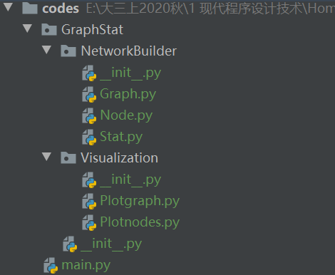

#### 2.2 功能说明

+ GraphStat包

  + `__init__.py`文件

  + NetworkBuilder包

    + `__init__.py`文件（含有`__all__`变量）

    + Graph.py模块

      | **函数名**     | 函数功能       | 函数输入     | 函数输出   |
      | -------------- | -------------- | ------------ | ---------- |
      | **init_graph** | 返回一个图结构 | 节点、边信息 | 图结构     |
      | **save_graph** | 序列化图信息   | 图结构       | 序列化文件 |
      | **load_graph** | 反序列化图信息 | 文件名       | 图结构     |

    + Node.py模块

      | **函数名**       | **函数功能**                        | **函数输入**   | **函数输出** |
      | ---------------- | ----------------------------------- | -------------- | ------------ |
      | **init_node**    | 字典key为节点属性，值为对应的属性值 | 节点信息       | 字典         |
      | **print_node**   | 显示节点信                          | 节点内容，选项 | 格式化信息   |
      | **get_attr**     | 获取某一个属性字段的字典            | 字典列表，属性 | 字典         |
      | **\_get_attr\_** | 获取节点属性                        | 节点，属性     | 属性值       |

    + Stat.py模块

      | **函数名**                    | 函数功能                     | 函数输入           | 函数输出             |
      | ----------------------------- | ---------------------------- | ------------------ | -------------------- |
      | **cal_average_dgree**         | 计算网络的平均度             | 图结构             | 网络平均度           |
      | **get_attr_distribution**     | 统计节点属性的分布           | 属性字典、属性     | 可直接用于绘图的字典 |
      | **cal_dgree_distribution**    | 计算网络度分布               | 图结构             | 度分布字典           |
      | **cal_relation_distribution** | 计算网络关系分布             | 图结构，类型字典   | 关系字典             |
      | **density**                   | 计算不同类型的网络的关系密度 | 关系字典、类型字典 | 关系密度字典         |

  + Visualization包

    + `__init__.py`文件（含有`__all__`变量）

    + Plotgraph.py模块

      | **函数名**                 | **函数功能**   | **函数输入** | **函数输出**       |
      | -------------------------- | -------------- | ------------ | ------------------ |
      | **plotdgree_distribution** | 绘制度分布图   | 图结构，选项 | （对数）度分布图   |
      | **plotedge_distribution**  | 绘制关系分布图 | 关系字典     | 关系（密度）分布图 |

    + Plotnodes.py模块

      | **函数名**          | **函数功能**       | **函数输入**             | **函数输出**     |
      | ------------------- | ------------------ | ------------------------ | ---------------- |
      | **plot_nodes_attr** | 绘制节点的某个属性 | 属性字典、属性、（类型） | 属性的可视化结果 |

### 3 具体实现

#### 3.0 预处理

```python
    with open("../data/newmovies.txt",encoding="UTF-8") as f:
        cursor = int(f.readline().split(" ")[-1])         #读完第一行,游标下移
        txt = f.read().splitlines()
        txt = [t.split("\t") for t in txt]
```

> txt 样例
>
> ['0', '"Ann Blyth"', '6035', 'starring', '1928 births;Living people;American film actors;American musical theatre actors;American child actors;People from Westchester County, New York;']
>
>  ['34280', '13676', '1']

#### 3.1 Node.py

+ 给每一个节点创建属性字典，经过预处理，information是列表的形式，可以直接填入字典

  ```python
  def init_node(information):
      '''
      :param information: One specify line in the txt
      :return: a dictionary with attributes of a node
      '''
      node_dict = {}
      attr_list = ["Vid","Vname","Vweight","Vtype","Vothers"]
      for i in range(len(attr_list)):
          node_dict[attr_list[i]] = information[i]
      return node_dict
  ```

  显示节点信息，注意`format(**node)`的用法

  ```python
  def print_node(node,show_others=True):
      print("Id:{Vid}\tName:{Vname}\tWeight:{Vweight}\tType:{Vtype}"
            .format(**node))
      if show_others == True:
          print("\t\tOthers：",node["Vothers"])
  ```

  + 主函数

  ```python
      for i in range(cursor+1):       #从0开始,到cursor
          nodes_dict.append(Node.init_node(txt[i]))
      Node.print_node(nodes_dict[0],show_others=True)
  ```

+ 获取属性值

  ```python
  def _get_attr_(node, key):                 #获取node的key值
      return node[key]
  
  def get_attr(nodes_dict,attr='Vtype'):     #获取所有node的attr值
      attr_dict = {}
      for node in nodes_dict:
          attr_dict[_get_attr_(node,'Vid')] = _get_attr_(node,attr)
      return attr_dict
  ```

  + 主函数

  ```python
  type_dict = Node.get_attr(nodes_dict, attr='Vtype')
  ```

  **type_dict**：

  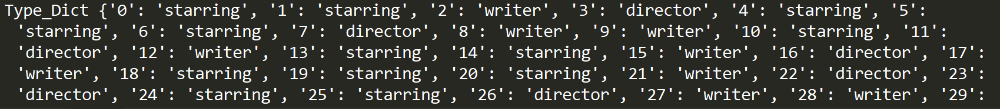

#### 3.2 Graph.py

+ 新建图

  ```python
  def init_graph(node_list, edges):
      G = nx.Graph()                    #创建孔图
      G.add_nodes_from(node_list)       #创建节点
      for edge in edges:
          v1 = edge[0]; v2 = edge[1];
          #weight = eval(edge[2])
          G.add_edge(v1,v2)             #加入边
      return G
  ```

  + 主函数

  ```python
  G = Graph.init_graph(node_list,txt[cursor+2:len(txt)])
  #txt[cursor+2:len(txt)]为从文本中截取出边数据的部分
  ```

+ **序列化与反序列化**

  + 利用`pickle`包

  ```python
  pickle.dump(graph, open("../data/myGraphInfo.p", "wb"))  
  loaded_info = pickle.load(open("../data/"+filename,"rb"))
  ```

  + 利用`nx_witt`

  ```python
  nx.write_gpickle(graph, "E:\\大三上2020秋\\1 现代程序设计技术\\Homework\\Week5\\data\\myGraphInfo.p")
  loaded_info = nx.read_gpickle(filename)
  ```

  + tips：相对路径相对main函数的路径

#### 3.3 Stat.py

+ 度分布相关

  + 平均度
    $$
    \bar{d} =\frac{2 * E}{V}
    $$
    
+ 度分布：
  
  ```python
    dict(nx.degree(graph))
    ```
  
+ **结果**：
  

  
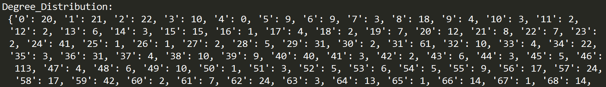
  
+ 节点相关

  ```python
  def get_attr_distribution(attr_dict,feature):
      if feature in ['type','country']:    #定性统计量--进行计算
          count_dict = {}
          for item in attr_dict.values():
              count_dict[item] = count_dict.get(item, 0) + 1
          Dict = count_dict
      elif feature in ['weight']:          #定量统计量--化字符串为数值
          attr_value = list(map(int, attr_dict.values()))
          attr_key = list(map(int, attr_dict.keys()))
          Dict = dict(zip(attr_key,attr_value))
          #print(Dict)
      return Dict
  ```

  tips：`get(item,0)` 可以用于计数，当不存在时将默认值赋为0

  `get()` method takes maximum of two parameters:

  - **key** - key to be searched in the dictionary
  - **value** (optional) - Value to be returned if the key is not found. The default value is `None`.

  **结果**：

  + 若`feature`为Type属性（分类）：

  

  + 若`feature`为Weight属性（数值）

  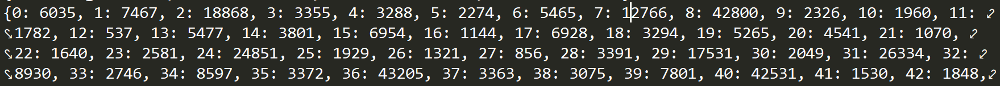

+ 关系相关

  ```python
  def cal_relation_distribution(graph,tpye_dict):
      relation_dict = {"ww":0,"dd":0,"ss":0,"mm":0,
                       "wd":0,"ws":0,"ds":0,"wm":0,"dm":0,"sm":0,
                       "dw":0,"sw":0,"sd":0,"mw":0,"md":0,"ms":0}
      Edges = nx.edges(graph)
      for edge in Edges:      #str
          v1=edge[0];v2=edge[1]
          relation = tpye_dict[v1][0]+tpye_dict[v2][0]
          relation_dict[relation] += 1
      return relation_dict
  ```

  其中“dm"与“md”在绘图时将合并为同一种类型

  

+ 关系密度相关

  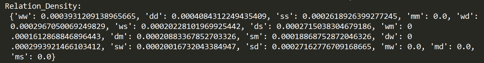

#### 3.4 Plotnodes.py

```python
def plot_nodes_attr(attr_dict,feature,type_dict=None):
    Dict = Stat.get_attr_distribution(attr_dict,feature)
    #辅助画图工具
    color_dict = {"starring":"red","writer":"green",
                  "director":"purple","movie":"blue"}
    haslegend = {"starring":0,"writer":0,
                  "director":0,"movie":0}
    #attr_dict根据类型处理成可直接画图的结构
    if feature in ['type', 'country']:        #定性分类数据
        plt.bar(Dict.keys(), Dict.values())
        print(Dict)
        for a, b in zip(Dict.keys(), Dict.values()):
            plt.text(a, b + 0.05, f"{b}", ha='center', va='bottom', fontsize=10)

        plt.xlabel(feature, fontsize=14)
        plt.ylabel("Counts", fontsize=14)
        plt.title(f"{feature} distribution", fontsize=14)
    elif feature in ['weight']:               #定量数据
        for key in Dict.keys():
            temp_type = type_dict[str(key)]
            print(key,Dict[key],temp_type)
            if haslegend[temp_type] == 0:
                plt.scatter(key, Dict[key],s=5,
                            color=color_dict[temp_type],label=temp_type)
                haslegend[temp_type] = 1
                continue
            plt.scatter(key, Dict[key], s=5,
                        color=color_dict[temp_type])
        #Dict (Vid,Vattr)  typedict ("Vid",Vtype)
        plt.xlabel("Points", fontsize=14)
        plt.ylabel(feature, fontsize=14)
        plt.title(f"{feature} distribution", fontsize=14)
        plt.legend()
    plt.show()
```

+ **结果**：

  + 当属性为weight时的`Dict`（定量数据）

  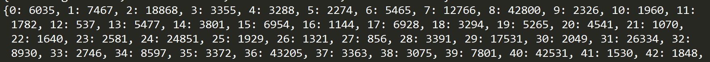

  + 图见【4结果分析】

#### 3.5 Plotgraph.py

+ 度分布图

```python
def plotdgree_distribution(graph,log=True):
    degs = dict(nx.degree(graph))
    degs_list = degs.values()
    if log:
        bin_edges = 10 ** np.arange(0.8, np.log10(max(degs_list)) + 0.1, 0.1)
        plt.hist(degs_list, bins=bin_edges)   #bin控制有几条柱
        plt.xscale('log')                     #将x轴转换为对数坐标
        tick_locs = [10, 30, 100, 300, 1000]  #x轴显示的标记
        plt.xticks(tick_locs, tick_locs)      
        #务必在 xscale 之后指定 xticks，因为该函数具有内置的刻度设置
    else:
        plt.hist(degs_list,bins=range(150))
    plt.show()
```

+ 关系分布图见【4结果分析】

### 4 结果分析

#### 4.1 度分布图

+ x轴未对数化

  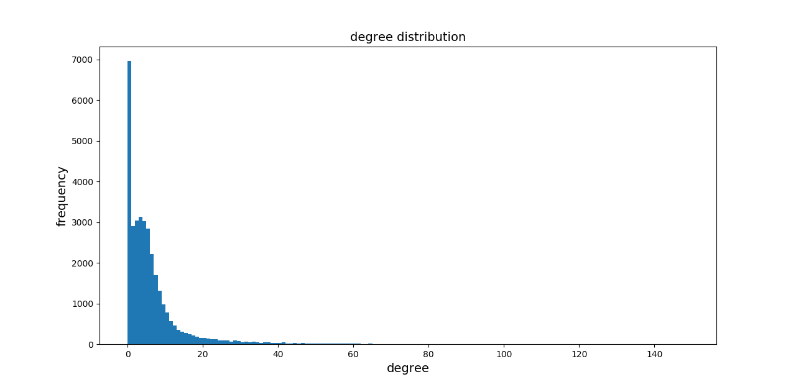

+ x轴对数化

  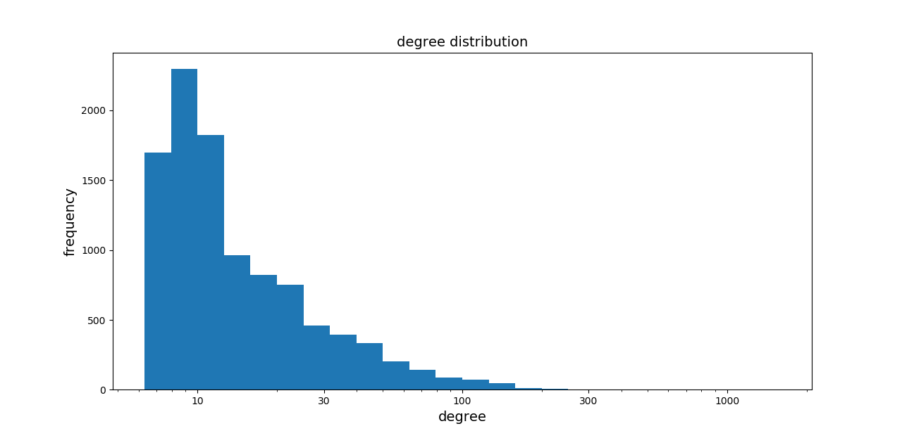

+ 从度分布图的结果上看可以发现整个网络呈现比较明显的幂律分布的特征，即少部分节点拥有很大的度，而绝大多数节点的度数较小

#### 4.2 节点属性分布图

+ Node的类型分布

  根据节点的类型可以分为四类。其中三类为人：starring、writer、director，人数一次减少。还有一类为movie，在样本数据中数量最多

  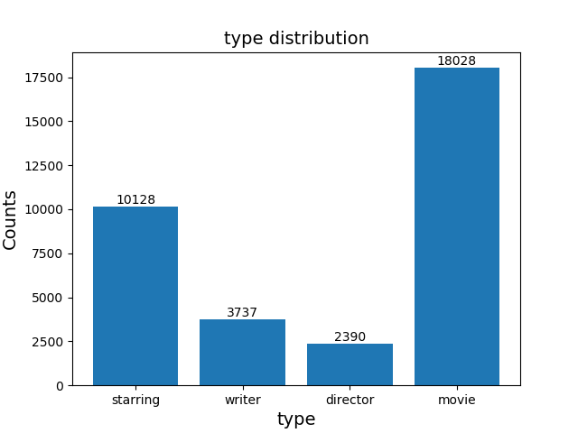

+ Node的权重分布

  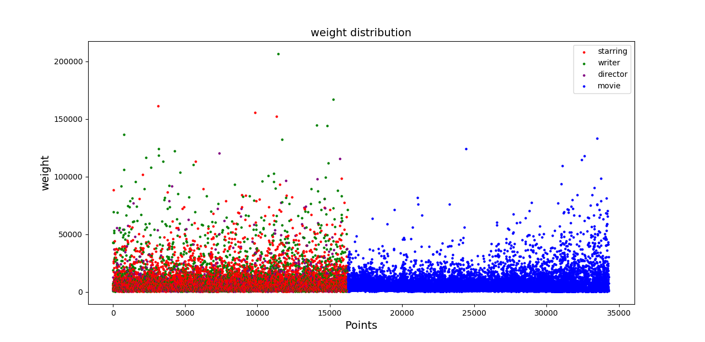

  + 从权重分布图中可以看出权重的分布和度分布相同，呈现出比较明显的幂律特性（大多数节点的权重较小，极少数的节点权重相当大），其中权重最大的来自一个作家。它的个人信息利用`Node`模块中的`print_node`可以打印如下

  

  + 用不同颜色代表不同类型的节点，可以发现相较而言，在权重最大的节点中，明星starring和作家writer的比例较高，而大部分的电影movie节点的权重整体较低
  + 从节点的序号可以看出样本数据是按照人和电影进行区分的，从16255条数据之后都是电影节点的信息

#### 4.3 关系类型分布图

根据不同的节点类型，我们可以将边进行分类。根据边相连的两个节点的不同，我们可以从4个节点中发现10中连边关系，分别有：

| 关系大类 | 具体关系               | 具体含义                 |
| -------- | ---------------------- | ------------------------ |
| 人之间   | ww；dd；ss；wd；ws；ds | 合作关系，朋友关系等     |
| 电影之间 | mm                     | 同系列的续集关系等       |
| 人与电影 | wm；dm；sm             | 电影的演员、导演、编剧等 |

注：具体关系的字母取自英文首字母，如“ds”表示的是连边的两端节点一个属于director，一个属于starring

+ 关系类型

  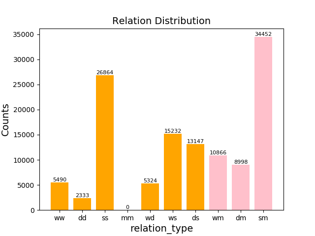

  从关系类型中可以将所有的连边归属于相应的类型。由于连边数量收到节点数量的影响，从节点类型分布图中可以看出Movie和Starring两类节点的人数显著高于其他两类，因此导致了sm类的连边数量最多，为了消除这一影响，我们定义不同关系的关系密度为**关系数量除以关系所涉及的两节点所在类型的数量积**，用密度的概念来反映两类节点之间的联系强度，结果如下所示：

+ 关系密度

  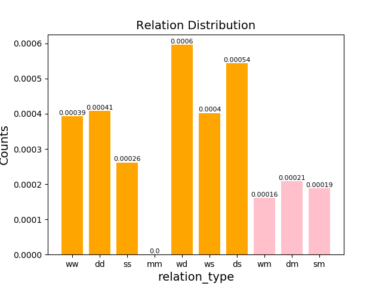

  根据关系密度的含义和定义，我们有以下结论：

  + 从关系密度分布图中可以看出，尽管sm类型的关系绝对数量最大，但由于starring和movie的基数都相当大，综合下来二者之间的联系并不是最紧密的。
  + 人之间的关系比人和电影之间的关系更加紧密，在样例中不存在电影之间的关系
  + 对于演员而言，和他联系最紧密的是导演director
  + 对于电影movie而言，和它联系最紧密的是导演director
  + 编剧writer而言和导演director互为联系最近密的人群
  + 相比之下，导演和其他节点的关系最为密切，而电影和其他节点之间的关系最不密切。换句话说，在该网络中，一个导演可能和较多明星、编剧、电影之间都存在着关系，但是一个电影和其他节点的关系可能少
  + 在自反的几个关系中，可以发现导演之间和编剧之间的联系比演员之间要更紧密，这可能于人数基数有关

### 5 附录

#### 5.1 一些表达

+ 绘制柱状图文字注释

```python
        for a, b in zip(Dict.keys(), Dict.values()):
            plt.text(a, b + 0.05, f"{b}", ha='center', va='bottom', fontsize=10)
```

+ 将坐标轴修改为对数坐标轴

```python
        bin_edges = 10 ** np.arange(0.8, np.log10(max(degs_list)) + 0.1, 0.1)
        plt.hist(degs_list, bins=bin_edges)   #bin控制有几条柱
        plt.xscale('log')                     #将x轴转换为对数坐标
        tick_locs = [10, 30, 100, 300, 1000]  #x轴显示的标记
        plt.xticks(tick_locs, tick_locs)      #
```

+ 批量导入模块

```python
from GraphStat.NetworkBuilder import *
Node.fun();Stat.fun();Graph.fun()
```

与此同时需要在初始化文件`__init__.py`中指定`__all__`变量

```python
__all__ = ('Graph','Node','Stat')
```

#### 5.2 代码附录

+ GraphStat包

  + `__init__.py`文件

  + NetworkBuilder包

    + `__init__.py`文件

    ```python
    __all__ = ('Graph','Node','Stat')
    ```

    + Graph.py模块

    ```python
    #-*- coding=utf-8 -*-
    #@Time:  
    #@Author: zjh
    #@File: graph.py.py
    #@Software: PyCharm
    
    import networkx as nx
    import pickle
    
    def init_graph(node_list, edges):
        '''
        返回一个字典，分别存储节点信息和边信息
    
        :param node_list: all nodes information
        :param edges: all edges information
        :return:
        '''
        G = nx.Graph()                    #创建孔图
        G.add_nodes_from(node_list)       #创建节点
    
        for edge in edges:
            v1 = edge[0]; v2 = edge[1];
            #weight = eval(edge[2])
            G.add_edge(v1,v2)             #加入边
        return G
    
    def save_graph(graph):
        pickle.dump(graph, open("../data/myGraphInfo.p", "wb"))
        #nx.write_gpickle(graph, "E:\\大三上2020秋\\1 现代程序设计技术\\Homework\\Week5\\data\\myGraphInfo.p")
        print("Graph Already Saved!")
    
    def load_graph(filename):
        loaded_info = pickle.load(open("../data/"+filename,"rb"))
        #loaded_info = nx.read_gpickle(filename)
        print("Graph Already Loaded!")
        return loaded_info
    ```

    + Node.py模块

    ```python
    #-*- coding=utf-8 -*-
    #@Time:  
    #@Author: zjh
    #@File: node.py.py
    #@Software: PyCharm
    
    def init_node(information):
        '''
        Return  a dictionary, key is the attribute name of node
        while the item is the data of attribute
        (返回字典，key为节点的属性，值为对应的属性值)
    
        :param information: One specify line in the txt
        :return: a dictionary with attributes of a node
        '''
        node_dict = {}
        attr_list = ["Vid","Vname","Vweight","Vtype","Vothers"]
        for i in range(len(attr_list)):
            node_dict[attr_list[i]] = information[i]
        return node_dict
    
    
    def _get_attr_(node, key):
        '''
        To get the attribute of a word(获取节点的属性)
    
        :param node: the dictionary of the node
        :param key: the attribute of the node
        :return: the node's attribute value
        '''
        return node[key]
    
    def get_attr(nodes_dict,attr='Vtype'):
    #获取对应的节点属性
        attr_dict = {}
        for node in nodes_dict:
            attr_dict[_get_attr_(node,'Vid')] = _get_attr_(node,attr)
        return attr_dict
    
    def print_node(node,show_others=True):
        '''
        #显示节点全部信息（利用format或者f函数）
    
        :param node:
        :param show_others:
        :return:
        '''
        print("Id:{Vid}\tName:{Vname}\tWeight:{Vweight}\tType:{Vtype}"
              .format(**node))
        if show_others == True:
            print("\t\tOthers：",node["Vothers"])
    ```

    + Stat.py模块

    ```python
    #-*- coding=utf-8 -*-
    #@Time:  
    #@Author: zjh
    #@File: stat.py.py
    #@Software: PyCharm
    
    import networkx as nx
    def cal_average_dgree(graph):
        '''
        计算网络中的平均度
    
        :param graph: Networkx Graph
        :return: average_degree
        '''
        Vnum = nx.number_of_nodes(graph)
        Enum = nx.number_of_edges(graph)
        average_degree = Enum * 2 / Vnum  # 2E/V
        return average_degree
    
    
    def get_attr_distribution(attr_dict,feature):
        if feature in ['type','country']:    #定性统计量
            count_dict = {}
            for item in attr_dict.values():
                count_dict[item] = count_dict.get(item, 0) + 1
            Dict = count_dict
        elif feature in ['weight']:          #定量统计量
            attr_value = list(map(int, attr_dict.values()))
            attr_key = list(map(int, attr_dict.keys()))
            Dict = dict(zip(attr_key,attr_value))
            #print(Dict)
        return Dict
    
        pass
    def cal_dgree_distribution(graph):
        '''
        计算网络的度分布
    
        :param graph: Networkx Graph
        :return: degree_distribution
        '''
        return dict(nx.degree(graph))
    
    def cal_relation_distribution(graph,tpye_dict):
        '''
        classify the relationship
    
        :param graph: the networkx graph
        :param tpye_dict: dict(Vid,Vtype)
        :return: dict with 10 relation
        '''
        relation_dict = {"ww":0,"dd":0,"ss":0,"mm":0,
                         "wd":0,"ws":0,"ds":0,"wm":0,"dm":0,"sm":0,
                         "dw":0,"sw":0,"sd":0,"mw":0,"md":0,"ms":0}
        Edges = nx.edges(graph)
        for edge in Edges:      #str
            v1=edge[0];v2=edge[1]
            relation = tpye_dict[v1][0]+tpye_dict[v2][0]
            relation_dict[relation] += 1
        return relation_dict
    
    
    def density(relation_dict,tpye_dict):
        tpye_dict = get_attr_distribution(tpye_dict,"type")
        for rlt in relation_dict:
            div = 1
            for v in rlt:
                if v == "w" : div *= tpye_dict["writer"]
                elif v == "s": div *= tpye_dict["starring"]
                elif v == "d": div *= tpye_dict["director"]
                elif v== "m": div *= tpye_dict["movie"]
            relation_dict[rlt] /= div
        return relation_dict
    ```

  + Visualization包

    + `__init__.py`文件

    ```python
    __all__ = ('Plotgraph','Plotnodes')
    ```

    + Plotgraph.py模块

    ```python
    #-*- coding=utf-8 -*-
    #@Time:  
    #@Author: zjh
    #@File: Plotgraph.py.py
    #@Software: PyCharm
    
    import networkx as nx
    import numpy as np
    import matplotlib.pyplot as plt
    
    def plotdgree_distribution(graph,log=True):
        '''
        度的分布图
        :param graph: Networkx graph
        :param log: whether log(X-axis) or not
        :return:distribution plot
        '''
    
        degs = dict(nx.degree(graph))
        degs_list = degs.values()
        if log:
            bin_edges = 10 ** np.arange(0.8, np.log10(max(degs_list)) + 0.1, 0.1)
            plt.hist(degs_list, bins=bin_edges)  # bin控制有几条柱
            plt.xscale('log')
            tick_locs = [10, 30, 100, 300, 1000]
            plt.xticks(tick_locs, tick_locs)
        else:
            plt.hist(degs_list,bins=range(150))
    
        plt.xlabel("degree", fontsize=14)
        plt.ylabel("frequency", fontsize=14)
        plt.title("degree distribution", fontsize=14)
        plt.show()
    
    def plotedge_distribution(relation_dict):
        redunt = ["dw","sw","sd","mw","md","ms"]
        for s in redunt:
            relation_dict[s[::-1]] += relation_dict[s]
            del relation_dict[s]
        c = lambda relation_list:["pink" if re in ["wm","sm","dm"]
                                  else "orange" for re in relation_list]
        plt.bar(relation_dict.keys(),relation_dict.values(),
                color = c(relation_dict.keys()))
    
        for a, b in zip(relation_dict.keys(), relation_dict.values()):
            plt.text(a, b + 0.05, f"{b}", ha='center', va='bottom', fontsize=8)
    
        plt.xlabel("relation_type", fontsize=14)
        plt.ylabel("Counts", fontsize=14)
        plt.title("Relation Distribution", fontsize=14)
        plt.show()
    ```

    + Plotnodes.py模块

    ```python
    #-*- coding=utf-8 -*-
    #@Time:  
    #@Author: zjh
    #@File: plotnodes.py.py
    #@Software: PyCharm
    
    import matplotlib.pyplot as plt
    from GraphStat.NetworkBuilder import Stat
    
    def plot_nodes_attr(attr_dict,feature,type_dict=None):
        Dict = Stat.get_attr_distribution(attr_dict,feature)
        print(Dict)
        # print(sorted(Dict.values()))
        # plt.plot(list(range(34283)),Dict.values())
        # plt.show()
        color_dict = {"starring":"red","writer":"green",
                      "director":"purple","movie":"blue"}
        haslegend = {"starring":0,"writer":0,
                      "director":0,"movie":0}
        #attr_dict根据类型处理成可直接画图的结构
        if feature in ['type', 'country']:        #定性分类数据
            plt.bar(Dict.keys(), Dict.values())
            for a, b in zip(Dict.keys(), Dict.values()):
                plt.text(a, b + 0.05, f"{b}", ha='center', va='bottom', fontsize=10)
    
            plt.xlabel(feature, fontsize=14)
            plt.ylabel("Counts", fontsize=14)
            plt.title(f"{feature} distribution", fontsize=14)
        elif feature in ['weight']:               #定量数据
            for key in Dict.keys():
                temp_type = type_dict[str(key)]
                print(key,Dict[key],temp_type)
                if haslegend[temp_type] == 0:
                    plt.scatter(key, Dict[key],s=5,
                                color=color_dict[temp_type],label=temp_type)
                    haslegend[temp_type] = 1
                    continue
                plt.scatter(key, Dict[key], s=5,
                            color=color_dict[temp_type])
            #Dict (Vid,Vattr)  typedict ("Vid",Vtype)
            plt.xlabel("Points", fontsize=14)
            plt.ylabel(feature, fontsize=14)
            plt.title(f"{feature} distribution", fontsize=14)
            plt.legend()
        plt.show()
    ```

    