## Week6 通信簿类的创建

### 1 作业内容

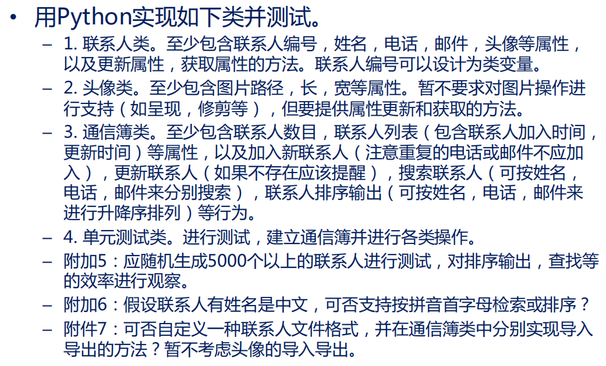

### 2 各类实现

#### 2.1 联系人类

```python
class Person:
    '''
    Person Class
    properties:id,name,tel,mail,port
    methods:renew_properties,get_properties
    '''
    ID = 0
    def __init__(self,name,tel,mail,port):
        Person.ID += 1
        self.id = Person.ID
        self.name = name
        self.tel = tel
        self.mail = mail
        self.port = port

    def renew_properties(self,prop,value):
        if prop == "name":
            self.name = value
        elif prop == "tel":
            self.tel = value
        elif prop == "mail":
            self.mail = value
        elif prop == "port":
            self.port = value

    def get_properties(self,prop):
        return self.__dict__[prop]
```

+ 每个实例有自己的一个实例属性，实例属性`self.id`通过类属性`Person.ID`累加获得
+ 两种方法根据不同的属性值`prop`来**查找**或**修改**实例属性值

+ 测试

  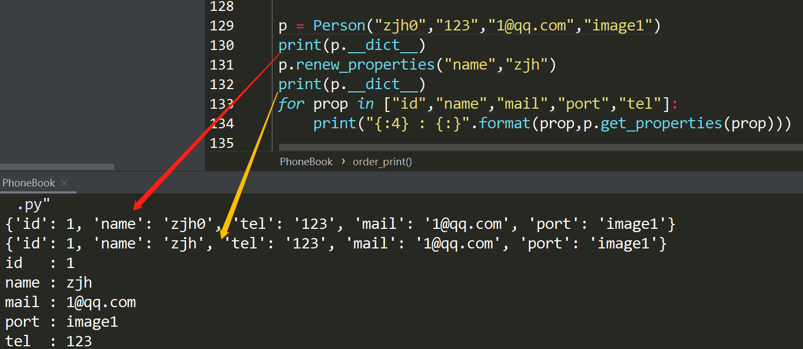

#### 2.2 头像类

```python
class Portrait:
    '''
    Portrait Class
    properties:addr,length,width
    methods:renew_properties,get_properties
    '''
    def __init__(self,addr,length,width):
        self.addr = addr
        self.length = length
        self.width = width

    def renew_properties(self,prop,value):
        self.__dict__[prop] = value

    def get_properties(self,prop):
        return self.__dict__[prop]
```

+ 测试

  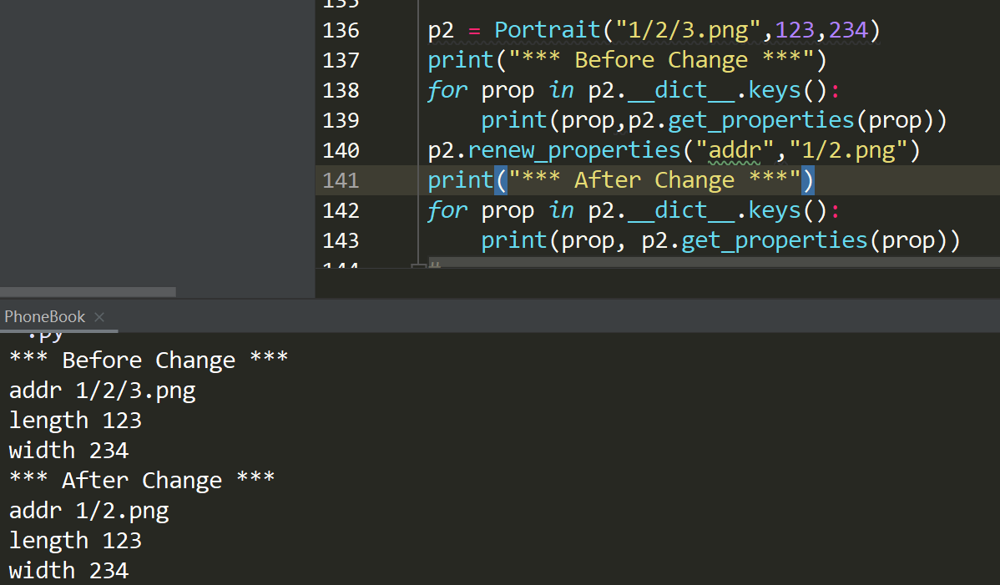

#### 2.3 通信簿类

```python
class PhoneBook(Person):
    '''
    Portrait Class
    properties:person_count,person_list
    methods:renew_properties,get_properties
    '''
    def __init__(self):
        self.person_count = 0
        self.person_list = []
        self.id_list = []

    def append_person(self,p:Person):
        '''
        add the person to the PhoneBook
        :param p: Person Class
        :return: None
        '''
        if p.id not in self.id_list:
            person_dict = {}
            person_dict["person"] = p
            person_dict["add_time"] = time.strftime("%Y-%m-%d %H:%M:%S", time.localtime())
            person_dict["renew_time"] = None
            #add the prop
            self.person_count += 1
            self.person_list.append(person_dict)
            self.id_list.append(p.id)
        else:
            print(f"Warning: Person {p.name} has already existed")

    def renew_person(self,p:Person):
        '''
        renew the person in the PhoneBook
        :param p: Person Class
        :return: None
        '''
        if p.id in self.id_list:
            d = self.person_list[self.id_list.index(p.ID)]
            d["renew_time"] = time.strftime("%Y-%m-%d %H:%M:%S", time.localtime())
        else:
            print(f"Warning: Can't Find Person {p.name}")

    def search(self,data,method="name"):
        '''
        search the person from phonebook by method
        :param method: the way the search the phonebook
        :param data: the content of the search_key
        '''
        start = time.time()
        if method not in ["name","tel","mail"]:
            print(f"Warning: Cannot Use {method} to Search the PhoneBook!")
        for d in self.person_list:
            if method == "name" and d["person"].name == data:
                break
            elif method == "tel" and d["person"].tel == data:
                break
            elif method == "mail" and d["person"].mail == data:
                break
        return d["person"],time.time()-start

    def order_print(self,method="name",desc=False):
        start = time.time()
        if method not in ["name","tel","mail"]:
            print(f"Warning: Cannot Use {method} to Sort the PhoneBook!")
        elif method == "name":
            temp_list = sorted(self.person_list, key=lambda x: x["person"].name, reverse=desc)
        elif method == "tel":
            temp_list = sorted(self.person_list, key=lambda x: x["person"].tel, reverse=desc)
        elif method == "mail":
            temp_list = sorted(self.person_list, key=lambda x: x["person"].mail, reverse=desc)
        for d in temp_list:
            print(d["person"].__dict__)
        return time.time()-start
```

+ 类属性

  + `self.person_count`用于记录当前电话簿人数的实例属性
  + `self.person_list`用于记录当前电话簿的联系人信息，每一个联系人的信息存放在一个字典中，包含`person`对象，添加时间，修改时间三个要素
  + `self.id_list`用于保存当前电话簿中存在的联系人信息代号，用于辅助查询电话簿中是否存在某个`person`对象

+ 类方法

  + `append_person`方法可以向电话簿中新增对象，输入`person`实例，并进行计数和添加时间信息；若对象已存在，则打印提示信息

  + `renew_person`方法可以修改电话簿中存在的对象，输入修改好的`person`实例放入电话簿对象中，并记录修改时间；若对象不存在，则打印提示信息

  + `search`方法可以根据所给信息（包括姓名，电话，邮箱）查找**第一个出现**的完整信息，输入`data`即为所给信息，`method`选项即为所给信息的类别。函数返回查到的对象和查找时间

    （tips：**位置参数在前，默认参数在后**）

  + `order_print`可以根据条件将电话簿排序并输出，输入`method`为排序依据（姓名，电话，邮箱），`desc`控制升降序，默认升序。函数返回排序输出的时间

+ 其他类方法：

  ```python
      def hash_search(self,data,hash_dict,method="name"):
          '''
          search the person from phonebook using hash_search with hash_dict
          :param method: the way the search the phonebook
          :param hash_dict: hash dict based on method
          :param data: the content of the search_key
          '''
          start = time.time()
          idx = hash_dict[data] - 1    #pb.id_list:1-5000
          #print(self.person_list[idx]["person"].__dict__)
          return self.person_list[idx],time.time()-start
          return time.time() - start
  ```

  + `hash_search`方法可以利用哈希查找的思想进行快速查找，输入为`data`查找的内容、`hash_dict`相对应的哈希字典、以及`method`相应的信息类别
  + 由于person类中含有id，天然适合于构造字典记录所查对象的位置，故将属性（姓名，电话，邮箱）依次与id结合，从而实现不同属性的哈希查找

#### 2.4 类测试

+ **实例化通信簿类**

  ```python
  def main():
      random.seed(0)
      phonebook = pb.PhoneBook()
      for i in range(5000):
          file,length,width = random_img(i)
          temp_i = pb.Portrait(file,length,width)
          temp_p = pb.Person(random_name(),random_tel(i),
                             random_mail(i),temp_i)
          phonebook.append_person(temp_p)
          #print(temp_p.__dict__)
      print(phonebook.__dict__)
  ```

  + 显示每一个`person`实例的具体内容

    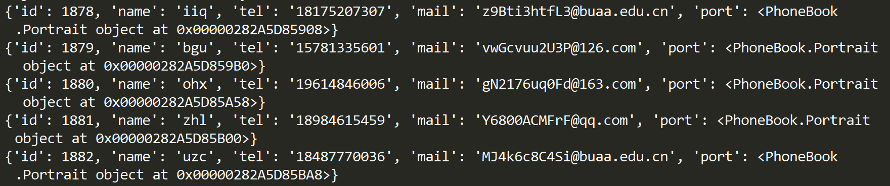

  + 显示`phonebook`实例的具体内容（计数、联系人列表、序号表）

    `person_count` 和 部分`person_list`

    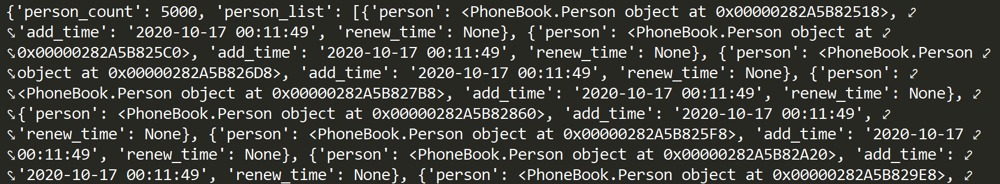

    部分`id_list`

    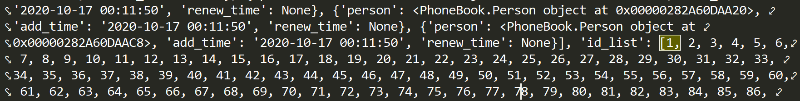

+ **修改通信簿类**

  ```python
  def main():
      p,_ = phonebook.search("lef","name")
      print("person:",p.__dict__)
      
      p.renew_properties("name","zjh")  #modify the instance
      time.sleep(3)
      phonebook.renew_person(p)
      
      print("-----After Modify-----")
      print("person:",p.__dict__)
      print("phonebook:",phonebook.__dict__["person_list"])
  ```

  + `Person`实例的变化（以修改名字为例）

  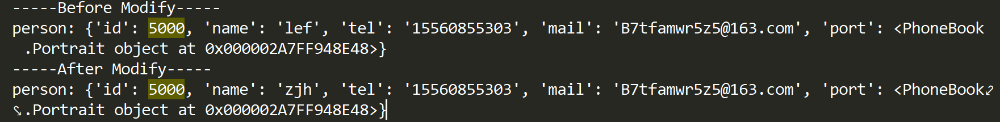

  + `PhoneBook`实例的变化（修改时间）

  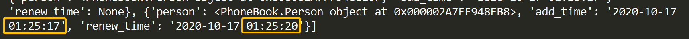

+ **查找通信簿类**

  + 查找结果：

    

  + 查找时间：

    ```python
    def main():
    	print("name:")
        search_all(phonebook,"name")
        print("tel:")
        search_all(phonebook,"tel")
        print("mail:")
        search_all(phonebook,"mail")
    ```

    当联系人有5000个时

    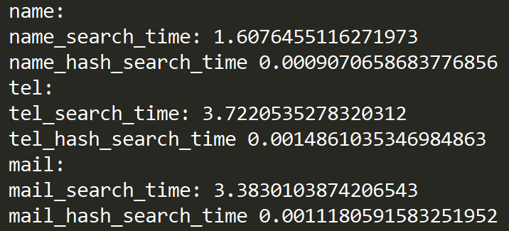

  + 查找效率分析：

    注：下表中所有时间均为将表中所有结果查找一遍后所需要的时间

    + 当联系人个数为1000时，结果如下表所示

    | 实验1            | 姓名查询     | 电话查询     | 邮件查询     |
    | ---------------- | ------------ | ------------ | ------------ |
    | search（s）      | 0.0778       | 0.2343       | 0.1652       |
    | hash_search（s） | 0.0003       | 0.0002       | 0.0005       |
    | **实验2**        | **姓名查询** | **电话查询** | **邮件查询** |
    | search（s）      | 0.0781       | 0.1562       | 0.2187       |
    | hash_search（s） | 0            | 0.0003       | 0.0002       |
    | **实验3**        | **姓名查询** | **电话查询** | **邮件查询** |
    | search（s）      | 0.0937       | 0.1875       | 0.1718       |
    | hash_search（s） | 0.0005       | 0.0002       | 0.0003       |
    | **实验4**        | **姓名查询** | **电话查询** | **邮件查询** |
    | search（s）      | 0.0466       | 0.1562       | 0.2495       |
    | hash_search（s） | 0            | 0.0002       | 0.0003       |
    | **实验5**        | **姓名查询** | **电话查询** | **邮件查询** |
    | search（s）      | 0.0778       | 0.2344       | 0.1874       |
    | hash_search（s） | 0.0002       | 0.0003       | 0.0002       |
    | **平均时间**     | **姓名查询** | **电话查询** | **邮件查询** |
    | search（s）      | 0.0748       | 0.19372      | 0.19852      |
    | search（s）/ N   | 0.00007      | 0.00037      | 0.00063      |
    | hash_search（s） | 0.0002       | 0.00024      | 0.0003       |

    + 当联系人个数取5000时，结果如下表所示

    | 实验1            | 姓名查询     | 电话查询     | 邮件查询     |
    | ---------------- | ------------ | ------------ | ------------ |
    | search（s）      | 1.6076       | 3.7221       | 3.3830       |
    | hash_search（s） | 0.0009       | 0.0015       | 0.0011       |
    | **实验2**        | **姓名查询** | **电话查询** | **邮件查询** |
    | search（s）      | 1.9839       | 3.9210       | 4.5302       |
    | hash_search（s） | 0.0016       | 0.0019       | 0.0009       |
    | **实验3**        | **姓名查询** | **电话查询** | **邮件查询** |
    | search（s）      | 1.7027       | 3.8971       | 3.0759       |
    | hash_search（s） | 0.0011       | 0.0011       | 0.0009       |
    | **实验4**        | **姓名查询** | **电话查询** | **邮件查询** |
    | search（s）      | 1.8744       | 3.7693       | 3.2038       |
    | hash_search（s） | 0.0011       | 0.0011       | 0.0009       |
    | **实验5**        | **姓名查询** | **电话查询** | **邮件查询** |
    | search（s）      | 1.9993       | 3.8269       | 3.6611       |
    | hash_search（s） | 0.0009       | 0.0012       | 0.0009       |
    | **平均时间**     | **姓名查询** | **电话查询** | **邮件查询** |
    | search（s）      | 1.83358      | 3.82728      | 3.5708       |
    | search（s）/ N   | 0.00019      | 0.00077      | 0.00138      |
    | hash_search（s） | 0.00112      | 0.00136      | 0.00094      |

    + 联系人个数取10000时，结果如下表所示

    | 实验1            | 姓名查询     | 电话查询     | 邮件查询     |
    | ---------------- | ------------ | ------------ | ------------ |
    | search（s）      | 6.9753       | 14.1624      | 14.989       |
    | hash_search（s） | 0.0025       | 0.0034       | 0.0019       |
    | **实验2**        | **姓名查询** | **电话查询** | **邮件查询** |
    | search（s）      | 5.9061       | 12.8794      | 13.9073      |
    | hash_search（s） | 0.0028       | 0.0027       | 0.0023       |
    | **实验3**        | **姓名查询** | **电话查询** | **邮件查询** |
    | search（s）      | 5.8884       | 13.7678      | 14.5764      |
    | hash_search（s） | 0.0013       | 0.0031       | 0.0025       |
    | **实验4**        | **姓名查询** | **电话查询** | **邮件查询** |
    | search（s）      | 6.5141       | 14.0654      | 14.3781      |
    | hash_search（s） | 0.0018       | 0.0034       | 0.0025       |
    | **实验5**        | **姓名查询** | **电话查询** | **邮件查询** |
    | search（s）      | 6.212        | 14.1681      | 12.8559      |
    | hash_search（s） | 0.0022       | 0.0033       | 0.0023       |
    | **平均时间**     | **姓名查询** | **电话查询** | **邮件查询** |
    | search（s）      | 6.29918      | 13.80862     | 14.14134     |
    | search（s）/ N   | 0.00020      | 0.00071      | 0.00141      |
    | hash_search（s） | 0.00212      | 0.00318      | 0.0023       |

    + 上表结果如下图所示

      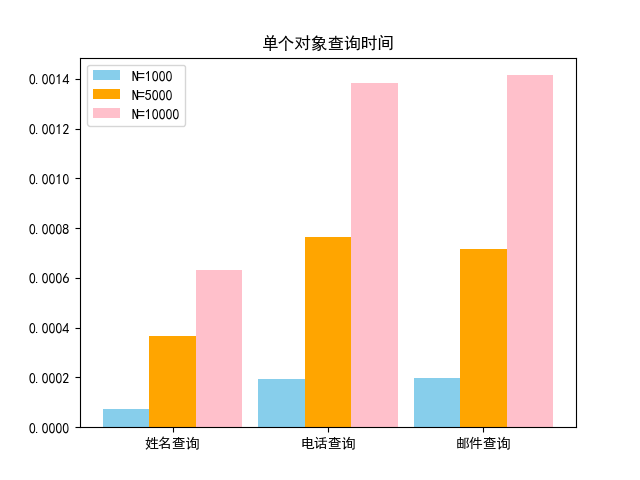

      + 对单个对象进行普通查询，通过图标分析可发现：

        + 姓名查询的效率显著高于电话查询和邮件查询，但姓名查询存在重名的风险

        + 在特定的查询情景下，查询时间基本随样本量线性变化，即复杂度为`O(N)`
        + 电话查询和邮件查询的效率基本相当

      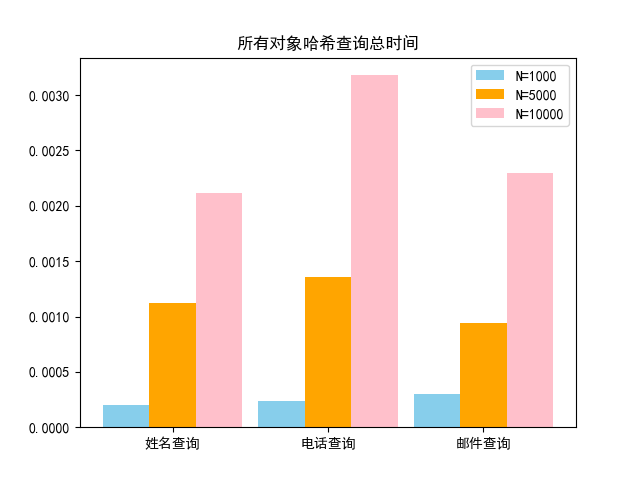

      + 因单个哈希查询的时间太短，故对所有对象的哈希查询总时间进行分析：
        + 不同查询方式的查询时间没有显著性差异，区别可能在于构造哈希字典上
        + 同种查询方式下，总查询时间基本与联系人数正比增加，即对于单个对象的查询来说，其查询的复杂度为`O(1)`

      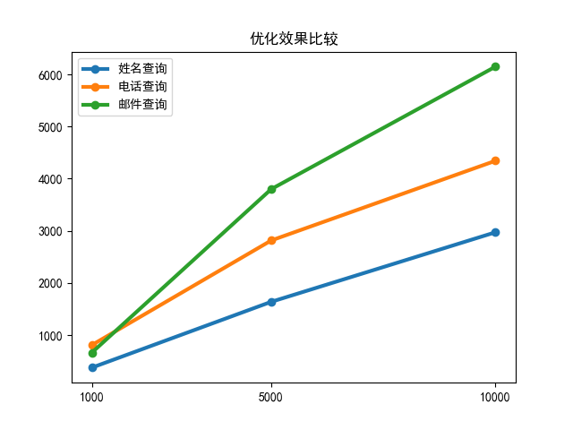

      + 比较普通查询和哈希查询可以发现：

        + y轴为普通查询时间和哈希查询时间之比，不同查找条件下的优化效果为：邮件查询 > 电话查询 > 姓名查询

        + 当联系人数目越大时，哈希查询的优化效果越明显，但同时也会带来更大的空间开销

+ **通信簿类排序**

  ```python
  def main():
  	period1 = phonebook.order_print("name")
      period2 = phonebook.order_print("tel")
      period3 = phonebook.order_print("mail")
      print(period1,period2,period3)
  ```

  + 姓名排序

    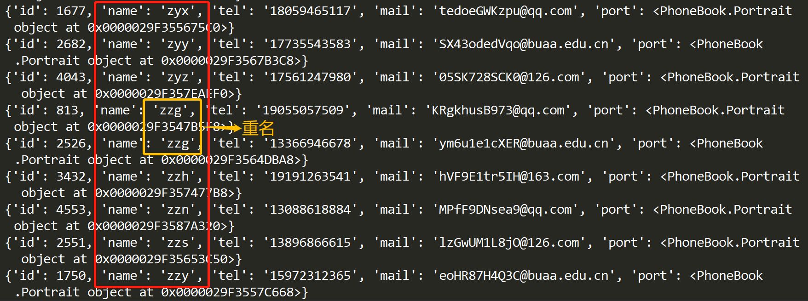

  + 电话排序

    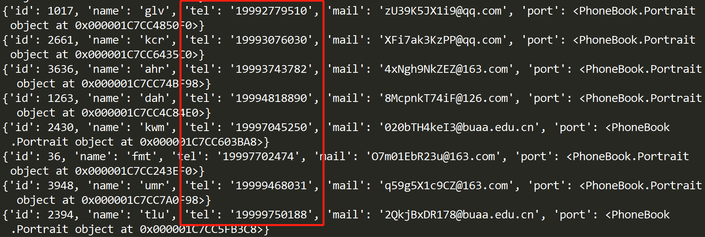

  + 邮件排序

    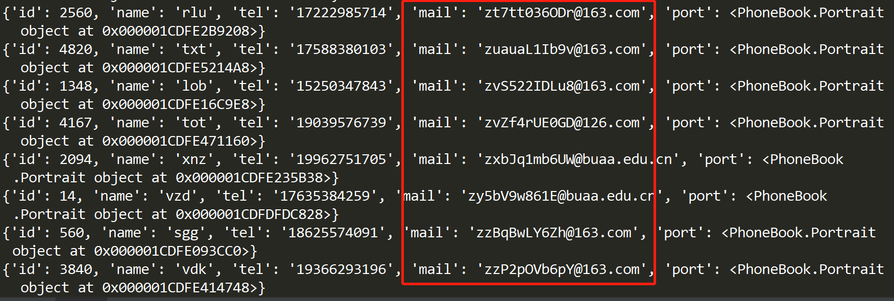

  + 排序时间比较

    从排序时间上看，对于同一个随机数种子生成的随机数据，各种排序之间无明显时间差异

    | 实验序号 | 姓名排序    | 电话排序    | 邮件排序    |
    | -------- | ----------- | ----------- | ----------- |
    | 实验1    | 0.05254817  | 0.068817139 | 0.06382823  |
    | 实验2    | 0.076420069 | 0.066821337 | 0.072798491 |
    | 实验3    | 0.044078588 | 0.049895525 | 0.034204483 |

  

### 3 选做作业

#### 3.1 拼音检索

> PS C:\Users\zjh> **pip install xpinyin**
> WARNING: pip is being invoked by an old script wrapper. This will fail in a future version of pip.
> Please see https://github.com/pypa/pip/issues/5599 for advice on fixing the underlying issue.
> To avoid this problem you can invoke Python with '-m pip' instead of running pip directly.
> Collecting xpinyin
> Downloading xpinyin-0.5.7-py2.py3-none-any.whl (127 kB)
>   |████████████████████████████████| 127 kB 409 kB/s
> Installing collected packages: xpinyin
> Successfully installed xpinyin-0.5.7

> **PS C:\Users\zjh> pip install pypinyin**
>
> WARNING: pip is being invoked by an old script wrapper. This will fail in a future version of pip.
> Please see https://github.com/pypa/pip/issues/5599 for advice on fixing the underlying issue.
> To avoid this problem you can invoke Python with '-m pip' instead of running pip directly.
> Collecting pypinyin
> Downloading pypinyin-0.39.1-py2.py3-none-any.whl (780 kB)
>   |████████████████████████████████| 780 kB 386 kB/s
> Installing collected packages: pypinyin
> Successfully installed pypinyin-0.39.1

+ 代码

```python
    def chinese_search(self,data):
        start_time = time.time()
        p = Pinyin()
        person_list = self.person_list
        search_list = []
        for d in person_list:
            temp_name = d["person"].name                           #取出姓名
            if data == p.get_initials(temp_name, u'').lower():     #取首字母
                search_list.append(d["person"])                    #查找到符合条件
        return search_list,time.time() - start_time
```

+ 结果展示

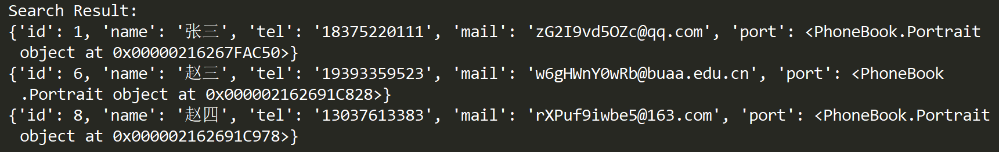

#### 3.2 拼音排序

+ 代码

```python
    def chinese_order(self):
        p = Pinyin()
        temp_list = sorted(self.person_list, key=lambda x: p.get_initials(
                            x["person"].name,u'').lower())  #以首字母为排序的key
        for d in temp_list:
            print(d["person"].__dict__)
        return temp_list
```

+ 结果

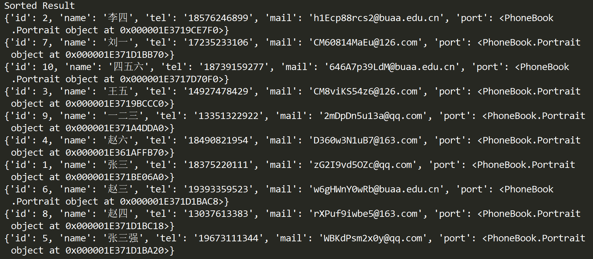

#### 3.3 文件导入导出

+ 代码

```python
    def mysave(self):
        with open('../data/PhoneBook.txt', 'w') as f:
            f.write("id\tname\ttel\tmail\tadd_time\trenew_time\n")
            person_list = self.__dict__["person_list"]
            for d in person_list:
                person_info = d["person"].__dict__
                for info in list(person_info.values())[:4]:  #projection some attr
                    f.write(str(info)+"\t")
                f.write(str(d["add_time"])+"\t"+str(d["renew_time"]))
                f.write("\n")
        pickle.dump(self, open("../data/PhoneBook.p", "wb"))


    def myload(self,filename):
        data = pickle.load(open("../data/"+filename,"rb"))
        print(data)
```

+ 结果

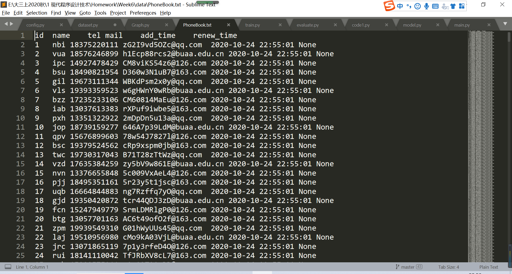

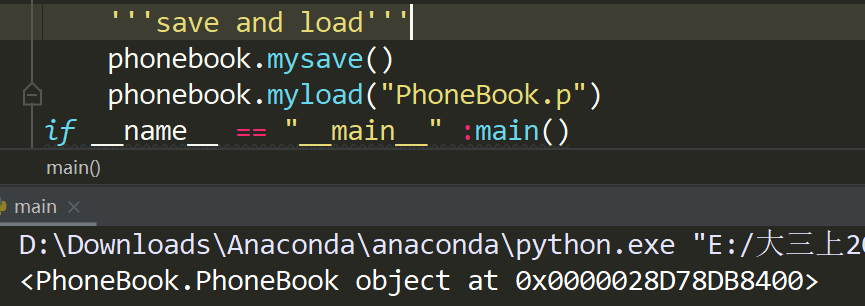

### 4 附录

#### 4.1 一些表达

+ 按类的某属性排序

  + `sort`函数

  ```python
  class Person(object):
      def __init__(self, name, age):
          self.name = name
          self.age = age
          
  if __name__ == '__main__':
      a = (0, 8, 2, 6, 3)
      b = [('a', 12), ('b', 12), ('c', 1), ('d', 13), ('e', 2)]
      person_list = [Person('q', 2), Person('w', 1), Person('e', 3), Person('r', 6)]
      a.sort(cmp=None, key=None, reverse=True)   # reverse 参数为 True 时逆向排序
      b.sort(key=lambda x: x[1])
      print(a,b)
      person_list.sort(key=lambda x: x.age)
      for i in person_list:
          print(i.age)
  ```

  + `sorted`函数

  ```python
  class Person(object):
      def __init__(self, name, age):
          self.name = name
          self.age = age
          
  if __name__ == '__main__':
      a = [0, 8, 2, 6, 3]
      b = [('a', 12), ('b', 12), ('c', 1), ('d', 13), ('e', 2)]
      person_list = [Person('q', 2), Person('w', 1), Person('e', 3), Person('r', 6)]
      print(sorted(a))
      print(sorted(b, key=lambda x: x[1]))
      m = sorted(person_list, key=lambda x: x.age, reverse=True)
      for i in m:
          print (i.age)
  ```


+ 获取绝对路径

  `ABS_PATH = os.path.dirname(os.path.abspath(__file__))`

  可以利用`join`函数对其进行修改	