## Week7 

### 1 作业要求

近年来，基于卷积神经网络（CNN）的图片处理模型在物体识别、图像分类等领域取得了远超传统模型的效果，使得大量图片数据的应用成为可能。该模型中的卷积块，灵感一定程度上来自于早期图像处理领域的“滤波器（filter）"，它用于提取图像中的某类特定特征或对图像做某些变换。因此，本次作业要求基于类继承，体会多种滤波器的使用效果与实际应用，并初步了解python对图片的简单处理。

1. 实现基类Filter，至少包括两个数据属性，一个属性是待处理的图片实例，即PIL库的Image实例，另一个是参数列表，用以存储可能使用参数的滤波器的参数；至少包括一个方法属性，即filter()方法，能够对Image实例的特定处理。但在该类中并不需要进行实现，其实现细节应该交给子类。

2. 实现Filter类的多个子类，分别实现对图片的一些滤波处理，至少应进行边缘提取，锐化，模糊及大小调整四类操作，也即应实现至少4个子类，分别对基类中的filter()方法进行实现。注意，并不需要真正实现对应的操作，可简单地通过PIL中的Image和ImageFilter模块来实现。具体可参见https://pillow.readthedocs.io/en/stable/reference/ImageFilter.html。

3. 实现类ImageShop，其至少包含四个数据属性，分别是**图片格式，图片文件（应该支持目录），存储图片实例(Image实例)的列表以及存储处理过的图片**（如果需要的话）。至少包含如下方法属性，分别是**从路径加载特定格式的图片**（load_images()，应加载文件或目录中的所有特定格式图片）；指**处理图片的内部方法**\__batch_ps(Filter),利有某个过滤器对所有图片进行处理；**批量处理图片的对外公开方法**（batch_ps()），注意该方法要至少有一个操作参数，且该参数可以不定长，即可以处理同时进行若干操作（如调整大小并模糊等），其参数可定义成一种特定格式的tuple输入，比如（操作名，参数），根据操作名生成对应的Filter子类并调用 __batch_ps来完成批处理；**处理效果显示**（display（）），注意该方法应该有参数，如考虑多图片呈现可能需要行，列以及每张图片的大小，以及最多显示多少张等，可通过matplotlib中的subplot等来实现；**处理结果输出**（save()），该方法应该有输出路径或输出格式等参数。

4. 实现测试类TestImageShop，对该类进行测试，指定图片路径，指定要进行的操作（如有参数也可应提供），并对执行结果进行呈现和存储。

5. 附加：观察一些经过过滤后图片的变化，思考这些处理对图片本身的一些相关的计算，如图片的相似性等有无影响，并进行简单的实验验证。

### 2 作业概述

#### 2.1 Filter类及其子类

| 类名          | 实例属性                                      | 实例方法               |
| ------------- | --------------------------------------------- | ---------------------- |
| **Filter**    | self.img：Image图像实例                       | load：导入图像         |
|               |                                               | save：导出图像         |
| **Contour**   | self.img：Image图像实例                       | + filter：边缘提取     |
| **Blur**      | self.img：Image图像实例                       | + filter：模糊效果     |
| **Sharpen**   | self.img：Image图像实例                       | + filter：锐化效果     |
| **SquareAdj** | + self.length 图片长度；+ self.width 图片宽度 | + filter：改变图片大小 |

+ 其中Contour/Blur/Shapern/ShapeAdj继承自Filter类，也含有self.img属性和导入导出方法

#### 2.2 ImageShop类

| 类名              | 实例属性                                   | 实例方法                                                     |
| ----------------- | ------------------------------------------ | ------------------------------------------------------------ |
| **ImageShop**     | self.format_ = format_ ：图片格式          | load_images：加载图片                                        |
|                   | self.package = package ：图片batch的包路径 | __batch_ps(self,path_list,key,*args)：私有方法，指定方法key，对path_list中的所有图片过滤，args为参数 |
|                   | self.path_list = []：图片batch的路径列表   | def batch_ps(self,path_list,Contour=False,Blur=False,                 Sharpen=False,SquareAdj=None): 公开的方法 |
|                   | self.img_list = []：图片batch的Image实例   | def display(self,nrow,ncol,max_img=6): 展示self.rlt_list中的部分图片 |
|                   | self.result_list = []：处理后的图片实例    |                                                              |
| **TestImageShop** |                                            |                                                              |


### 3 具体实现

#### 3.1 Filter类及其子类

```python
class Filter:
    def __init__(self):
        self.img = None

    def load(self,path,has_filter=0):
        # 首次
        if not has_filter:
            self.img = Image.open(path)
        # 否则从result中读取
        else:
            file_name = os.path.basename(path)
            file_dir = os.path.dirname(path)
            new_path = os.path.join(file_dir, "result")
            new_path = os.path.join(new_path, file_name)
            self.img = Image.open(new_path)
        return self.img

    def save(self,path):
        file_name = os.path.basename(path)
        file_dir = os.path.dirname(path)
        new_path = os.path.join(file_dir, "result")
        new_path = os.path.join(new_path,file_name)
        print(new_path," saved!")
        self.img.save(new_path)


    def filter(self):
        pass

class Contour(Filter):  #边缘提取
    def filter(self):
        self.img = self.img.filter(ImageFilter.CONTOUR)
        return self

class Blur(Filter):  #模糊效果
    def filter(self):
        self.img = self.img.filter(ImageFilter.BLUR)
        return self

class Sharpen(Filter):
    def filter(self):
        self.img = self.img.filter(ImageFilter.SHARPEN)
        return self

class SquareAdj(Filter):
    def __init__(self,length,width):
        super(SquareAdj, self).__init__()
        self.length = length
        self.width = width
    def filter(self):
        self.img.thumbnail((self.length,self.width))
        return self
```

+ **框架部分**：先定义父类Filter，为了实现批处理，在实例化父类的时候无法将其与某个具体的图片绑定，因此引入load和save方法，分别将图片保存至`self.img`和本地。所有的子类可以继承上述方法，并通过重新定义filter方法改写父类的方法。

+ **子类部分**：边缘提取、模糊效果、锐化效果不需要改写父类的属性，而为了使filter的形式统一，调整大小需要把长度和宽度与作为父类的实例属性，故需要通过super函数继承父类的属性

+ **文件路径处理**：由于`__batch_ps`完成的是①根据路径读取图片②过滤图片③存储文件，因此在Filter中定义存取操作，其路径处理如下，实现文件存储路径的变换：

  ```python
  #"../images/batch1/img1.jpg"
  file_name = os.path.basename(path)            #-- "img1.jpg"
  file_dir = os.path.dirname(path)              #-- "../images/batch1"
  new_path = os.path.join(file_dir, "result")   #-- "../images/batch1\result"
  new_path = os.path.join(new_path,file_name)   #-- "../images/batch1\result\img1.jpg"
  ```

  新增`result`包存放各种操作之后得到的结果

  `load`：首次读取时读取源文件，多个操作同时进行时，从第二个操作起，读取`result`文件中的图片

  `save`：文件写入`result`文件中，第一次新增，第二次起覆盖

+ 各种filter操作结果显示：

  + 边缘提取（相似度：0.16065799507270795）

  <center class="half">    
  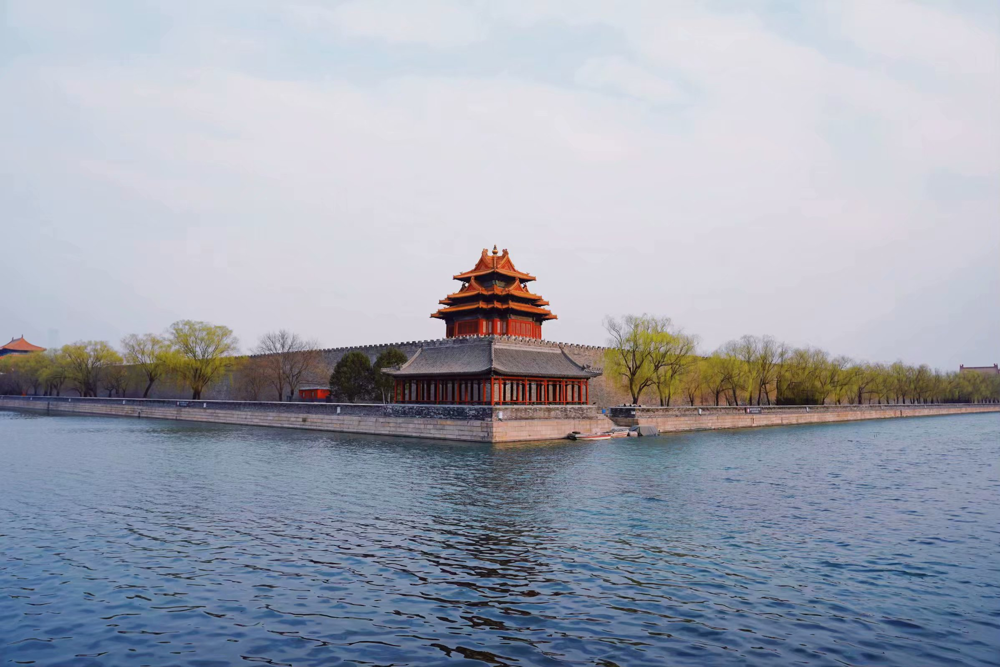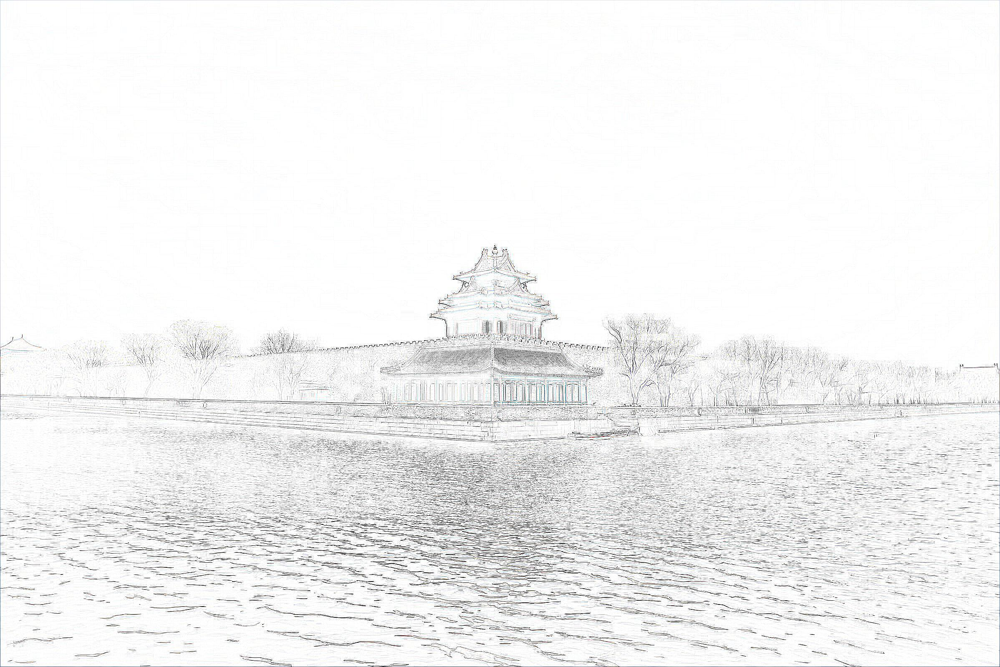
  </center>

  
+ 模糊（相似度：0.7159472652619748）
  
  <center class="half">    
  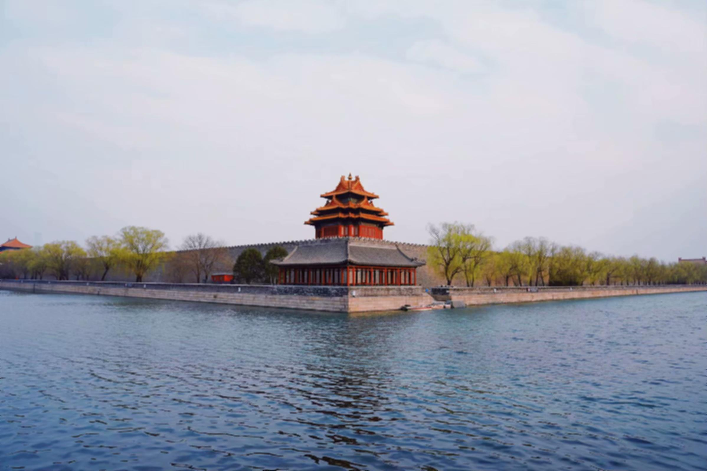
</center>
  
  
  
  + 锐化（相似度：0.7198312995592926）
  
  <center class="half">    
  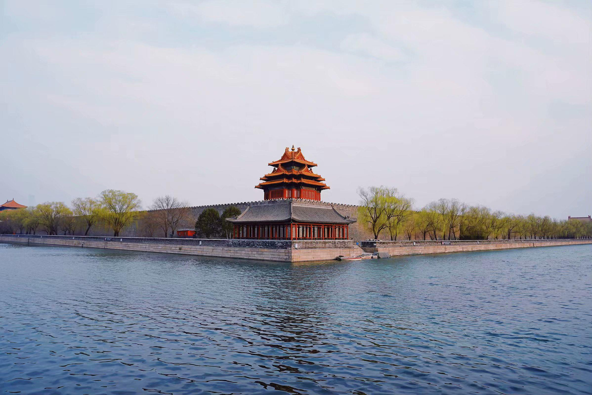
  </center>
  
  
  
  + 大小缩放（相似度：1）
  
  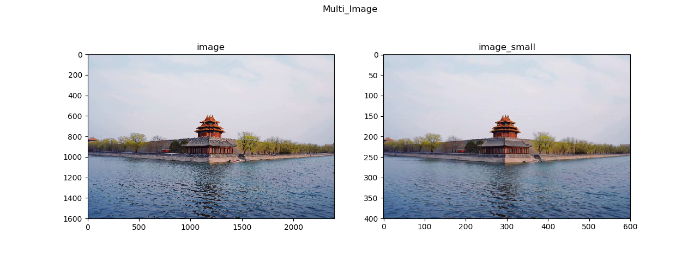
  

#### 3.2 ImageShop相关操作

+ 类的属性

  ```python
  class ImageShop:
      has_filter = 0
      def __init__(self, format_, package):
          self.format_ = format_    #图片格式
          self.package = package    #图片集包路径
          self.path_list = []       #原始图片的地址
          self.img_list = []        #原始图片的实例
          self.result_list = []     #修改后图片的实例(不覆盖)
  ```

+ 加载方法

  ```python
      def load_images(self):
          listdir_ = os.listdir(self.package)
          for dir_ in listdir_:
              if dir_[-len(self.format_):] == self.format_:  # 筛选符合条件的文件
                  path = os.path.join(self.package, dir_)
                  self.path_list.append(path)                # 构建输入的图片路径列表
          return self.path_list 
  ```

+ 批量处理

  私有化实现过程`__batch_ps`，并封装为格式较为清楚的`batch_ps`提供给用户使用

  ```python
      def __batch_ps(self,path_list,key,*args):   
          #args:如果key为SquareAdj时,需要制定图片缩放的长和宽;否则不用,故用不定长参数
          #构建过滤子类的字典
          filter_dict = {"Contour":Contour(),"Blur":Blur(),
                         "Sharpen":Sharpen(),"SquareAdj":SquareAdj(3968,2976)}
          if args:
              #print("args=",args)
              filter_dict["SquareAdj"] = SquareAdj(args[0],args[1])
              
          f = filter_dict[key]
  
          for path in path_list:
              if self.has_filter:
                  f.load(path, self.has_filter)                       #否则只打开
              else:
                  self.img_list.append(f.load(path,self.has_filter))  #首次处理构建实例列表
              Img = f.filter()                                # Img为特定处理后的图片对象
              Img.save(path)
              self.result_list.append(Img.img)                #result_list存放处理后的图像
          self.has_filter = 1
  
  
      def batch_ps(self,path_list,Contour=False,Blur=False,
                   Sharpen=False,SquareAdj=None):
          flag = 0
          if Blur:
              self.__batch_ps(path_list,"Blur");flag=1
          if Sharpen:
              self.__batch_ps(path_list,"Sharpen");flag=1
          if Contour:
              self.__batch_ps(path_list,"Contour");flag=1
          if SquareAdj:
              config = list(SquareAdj)
              self.__batch_ps(path_list,"SquareAdj",*config)   # SquareAdj: tuple
            flag = 1
          if flag == 0:  # 导入导出不进行任何操作
            Img = Filter()
              for path in path_list:
                if self.has_filter:
                      Img.load(path, self.has_filter)
                else:
                      self.img_list.append(Img.load(path, self.has_filter))
                  Img.save(path)
                  self.result_list.append(Img.img)  # result_list存放处理后的图像
              self.has_filter = 1  
              #当没有指定任何操作时,将img_list赋值给result_list,但是不额外保存
  ```
  
  原图：
  
  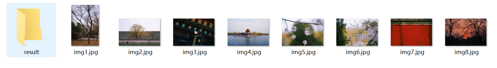
  
  经过Counter和SquareAdj操作之后的图：
  
  > **Counter操作**
  >
  > ../images/batch1\result\img1.jpg  saved!
  > ../images/batch1\result\img2.jpg  saved!
  > ../images/batch1\result\img3.jpg  saved!
  > ../images/batch1\result\img4.jpg  saved!
  > ../images/batch1\result\img5.jpg  saved!
  > ../images/batch1\result\img6.jpg  saved!
  > ../images/batch1\result\img7.jpg  saved!
  > ../images/batch1\result\img8.jpg  saved!
  >
  > **SquareAdj操作**
  >
  > ../images/batch1\result\img1.jpg  saved!
  > ../images/batch1\result\img2.jpg  saved!
  > ../images/batch1\result\img3.jpg  saved!
  > ../images/batch1\result\img4.jpg  saved!
  > ../images/batch1\result\img5.jpg  saved!
  > ../images/batch1\result\img6.jpg  saved!
  > ../images/batch1\result\img7.jpg  saved!
  > ../images/batch1\result\img8.jpg  saved!

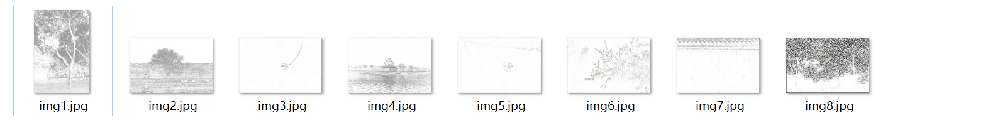

+ 显示处理：

  ```python
      def display(self,nrow,ncol,max_img=6):
          plt.figure(figsize=(3*ncol, 2*nrow))  # 设置窗口大小
          plt.suptitle(f"Display_Image")     # 图片名称
          rlt_list = self.result_list[:max_img]
          print(rlt_list)
          for i in range(len(rlt_list)):
              plt.subplot(nrow, ncol, i+1);plt.title(f"image{i+1}")
              plt.imshow(rlt_list[i]);plt.axis('off')
          plt.show()
  ```
  
  以batch1不进行任何处理为例：
  
  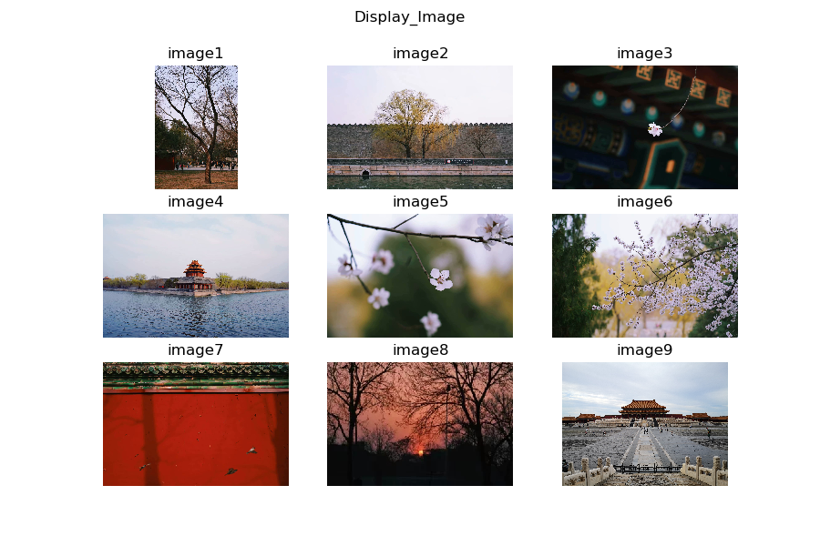

#### 3.3 TestImageShop测试

```python
class TestImageShop(ImageShop):
    # 沿用父类的所有属性


    # 将图片转化为RGB
    def __make_regalur_image(self,img, size=(64, 64)):
        gray_image = img.resize(size).convert('RGB')
        return gray_image

    # 计算直方图
    def __hist_similar(self,lh, rh):
        assert len(lh) == len(rh)
        hist = sum(1 - (0 if l == r else float(abs(l - r)) / max(l, r)) for l, r in zip(lh, rh)) / len(lh)
        return hist

    # 计算相似度
    def __calc_similar(self,li, ri):
        li = self.__make_regalur_image(li)
        ri = self.__make_regalur_image(ri)
        calc_sim = self.__hist_similar(li.histogram(), ri.histogram())
        return calc_sim

    def similar_test(self,start):
        img_num = len(self.img_list)
        li = self.img_list[start]
        ri_list = self.result_list[start::img_num]
        for ri in ri_list:
            print(self.__calc_similar(li, ri))


    def test(self,nrow,ncol,max_img=9,*args):
        filter_dict = {"Contour": False, "Blur": False, "Sharpen": False}
        path_list = self.load_images()
        for tup in args:
            op = tup[0]; param = tup[1]
            filter_dict[op] = True
        #print(filter_dict)
        self.batch_ps(path_list,**filter_dict,SquareAdj=param)
        self.display(nrow, ncol, max_img)
        self.similar_test(0)  #表示比较第几张图处理前后的相似性
```

+ 示例1：batch3数据集；边缘提取和锐化操作；最大显示9图（共8图）

  ```python
  T = TestImageShop("jpg","../images/batch3")
  T.test(3,3,9,("Contour",None),("Sharpen",None))
  ```

  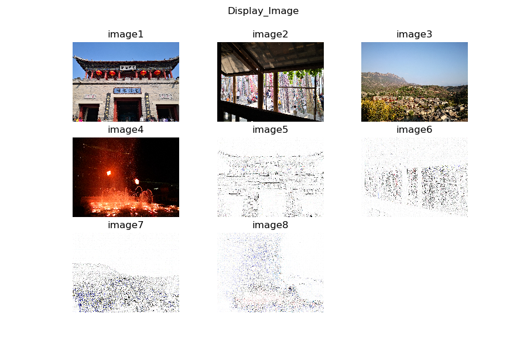

  image1-4为锐化结果；image5-8位锐化并提取边缘的结果

+ 示例2：batch3数据集；模糊操作和边缘提取；调整排版格式，最大8图

  ```python
  T = TestImageShop("jpg","../images/batch3")
  T.test(2,4,8,("Contour",None),("Blur",None))
  ```

  

  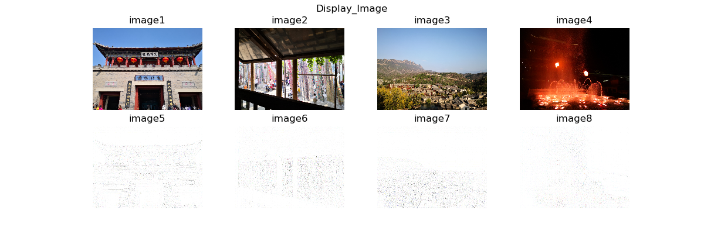

+ 结果展示（batch1）

  + 模糊操作：

  

  + 锐化操作：

  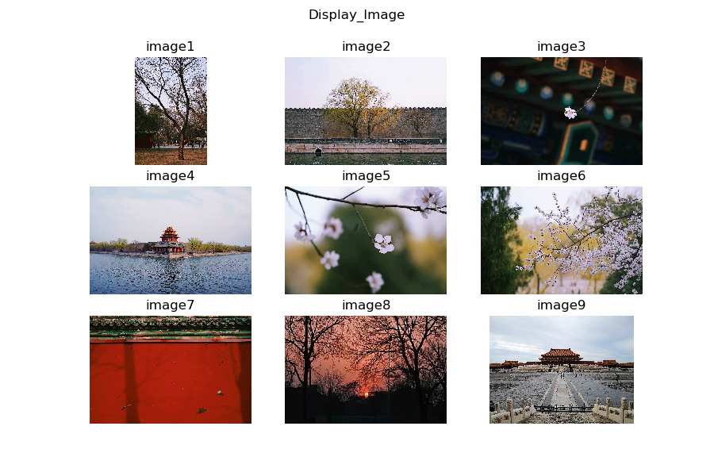

  + 边缘提取

  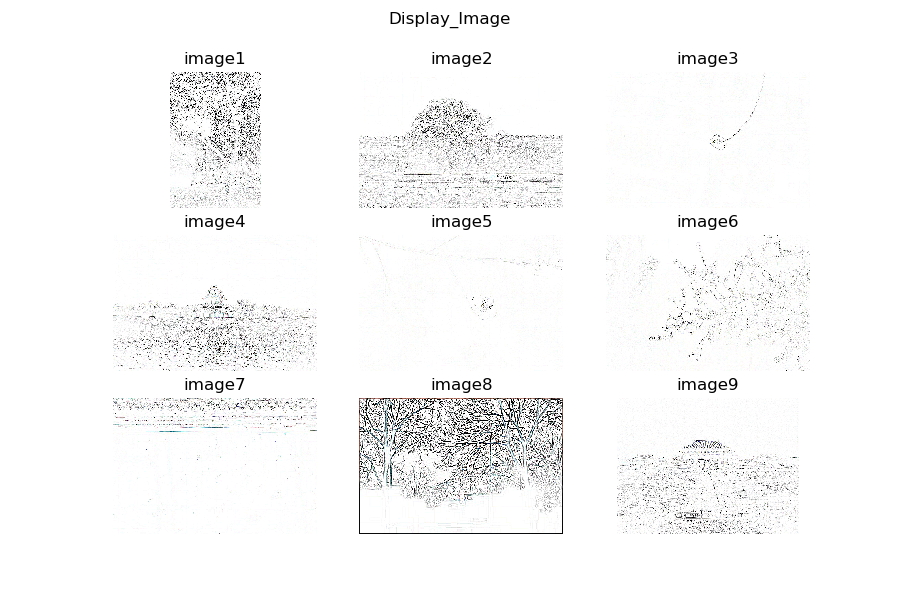

+ 相似性度量（batch4）

  图片示例（从左往右分别为image1-3）

  <center class="half">    
  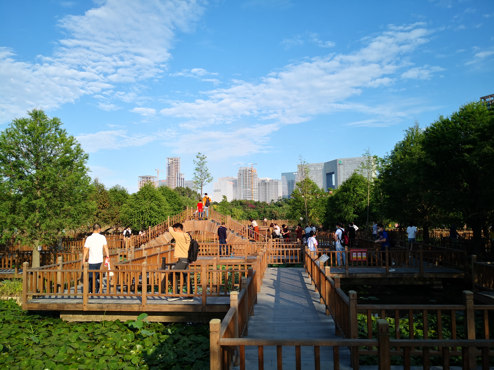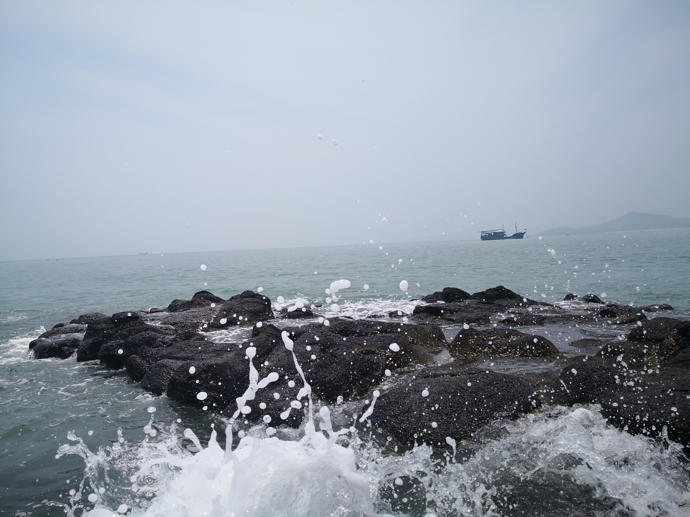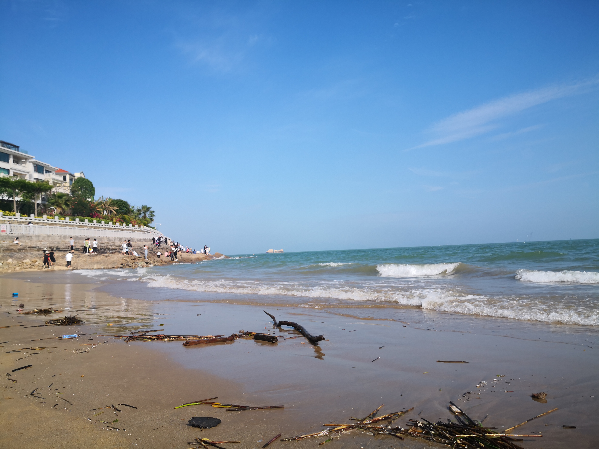
  </center>


  |                          | **iamge1**          | **image2**          | **image3**          |
  | ------------------------ | ------------------- | ------------------- | ------------------- |
  | **Contour**              | 0.1679177929513388  | 0.10687517755056768 | 0.11800297268768349 |
  | **Blur**                 | 0.7278743065459591  | 0.7338343264104852  | 0.7062045740174477  |
  | **Sharpen**              | 0.7346132394843927  | 0.7255269771988578  | 0.7129875984225919  |
  | **Blur+Sharpen**         | 0.7202641894399763  | 0.74616381656173    | 0.7124596539007017  |
  | **Blur+Contour**         | 0.08671735189131112 | 0.05912328912087054 | 0.08362556385453045 |
  | **Sharpen+Contour**      | 0.1881446230186424  | 0.1565527817998332  | 0.15536051835917578 |
  | **Blur+Sharpen+Contour** | 0.12888471272246832 | 0.07696546313374891 | 0.09573375068095791 |

  从中可以看出：

  + 边缘提取对图片改变最大，模糊和锐化改变方向不同但程度相当，调整大小不改变图片相似性
  + 当边缘提取和锐化同时操作时，会使得操作后的图片相比只用边缘操作来说更接近原图片，直观表现为把边缘绘制得更加清楚
  + 一般情况下，主题特征较为突出且清晰的图片，进行边缘操作后的效果较好（相似度较高，例子中展现为image1比image2和image3的边缘操后与原图的相似性更大）

### 4 附录

#### 4.1 大图对比

+ 模糊

  + 原图

  

  + 模糊图

  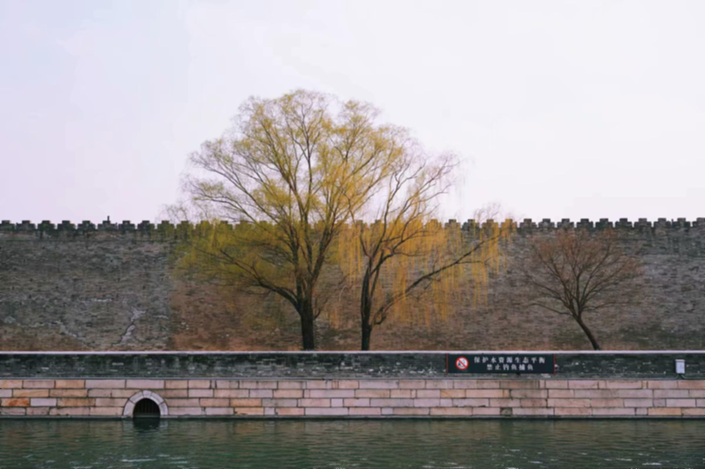

+ 锐化

  + 原图

  

  + 锐化后

  