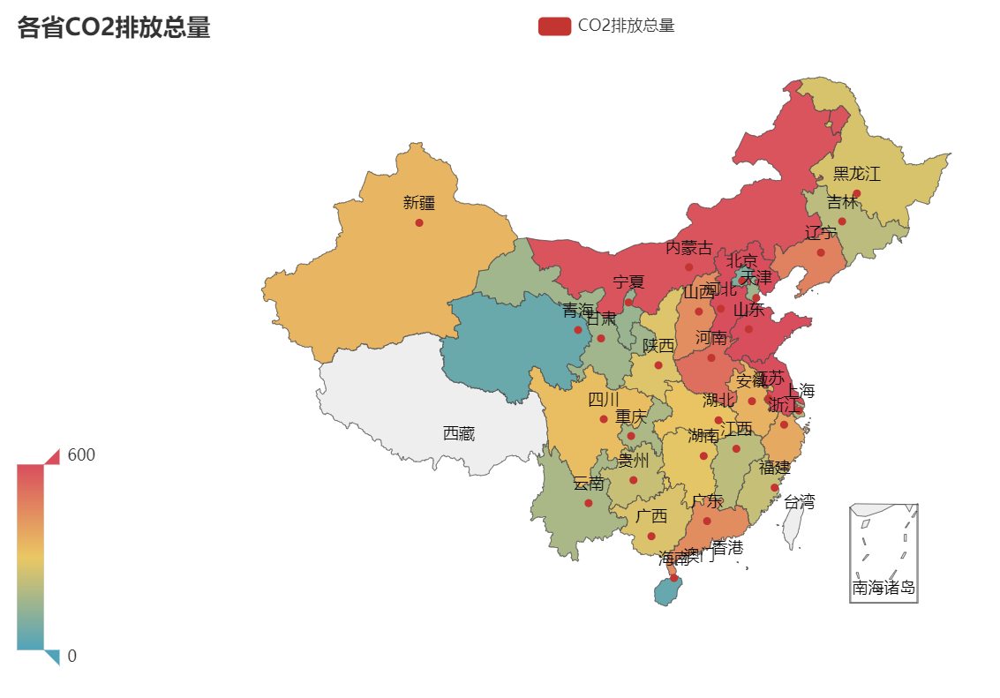

## Week8 CO2排放分析

### 8.1 作业内容

经济管理中通常有大量的数据以excel格式存在，如本次作业提供的中国各省长周期CO2排放数据（见资源/data/co2_demo.zip)。数据格式如下：所有数据按年份存储在不同的文件中：Province_sectoral_CO2_emissions_20xx.xlsx，其中20xx为年份。单个excel文件中，”sum“数据页给出了各省的总$CO_2$排放量以及来源明细，其余以省命名的数据页则给出了各省不同行业不同来源的$CO_2$排放量。

1. 至少实现一个数据分析类，以提供数据的读取及基本的时间（如某区域某类型排放随时间的变化）和空间分析（某一年全国排放的空间分布态势）方法。

2. 至少实现一个数据可视化类，借助matplotlib等库的帮助，提供上述时空分析结果的可视化，如以曲线、饼等形式对结果进行呈现。

3. 由于数据中包含空值等异常值，在进行数据分析以及可视化前需要检查数据。因此需要实现NotNumError类，继承ValueError，并加入新属性year，province，industry，type，对数据进行检测，若取到的一列数据中包含nan，则抛出该异常，并提供异常相关的年份，省份，工业和排放类型等信息。在此基础上，利用try except捕获该异常，打印异常信息，并对应位置的数据进行适当的填充。

4. 由于部分省份排放总量数据为0，要求在计算比例时进行检验，若检验发现总量为0，则抛出ZeroDivisionError，并打印对应的行名等信息。

5. （附加）按时间分析时，注意观察不同区域随时间排放量的变化，是否存在一些明显的趋势，以及趋势的空间差异，并思考这些趋势及差异的管理意义。提示：可以使用xlrd来读取excel文件。

### 8.2 异常处理(NaN)

#### 8.2.1 定义异常处理类

```python
class NotNumError(Exception):
    def __init__(self,year,province,industry,type_):
        self.year = year
        self.province = province
        self.industry = industry
        self.type = type_
        self.message = "NAN in data.ErrorLocation: date:{:}, place:{:}, industry:{:}, type:{:}" \
                        .format(year,province,industry,type_)

    def interpolate_nan(self,df,place):
        df = df.dropna()
        date = df['date'].values
        value = df[f"{place},{ctsv2.type}_co2"].values
        #print(date, value)
        f = interpolate.interp1d(date, value, kind="quadratic")
        date_new = np.arange(1997, 2016)
        value_new = f(date_new)
        #print(date_new, value_new)

        df_all = pd.DataFrame({"date": date_new, f"{place},{ctsv2.type}_co2":value_new},
                          columns=['date', f"{place},{ctsv2.type}_co2"])

        return df_all
```

+ `NotNumError`继承至`Exception`类
+ 遇到异常，将相应的错误信息返回（具体信息由初始化过程获得，通过外界参数给出）
+ `interpolate_nan`处理思路：如果遇到某地区部分年份的数据丢失，则可以通过`quadratic`插值补全。首先需要清理掉存在nan所在的行的内容（年份+数据），然后根据前后年份的数据插值得到相应的数据，将完整的数据框`df_all`返回

#### 8.2.2 抛出异常

以绘制时间序列图为例：

```python
def time_series_plot(self,df,place):
    # Get data
    date_name = df.columns.tolist()[0]
    value_name = df.columns.tolist()[1]
    date = df[date_name].tolist()
    value = df[value_name].tolist()

    if np.isnan(sum(value)):
        raise NotNumError([date[i] for i in np.where(np.isnan(value))[0]],
                          place,self.industry,self.type)
```
`sum(value)`用于判断`value`数据结构中是否存在nan值，如果存在，获取相应的信息，并根据该信息实例化NotNumError异常类，抛出异常

具体异常如下所示

Except可以捕捉到下列信息：

>Traceback (most recent call last):
>File "E:/大三上2020秋/1 现代程序设计技术/Homework/Week8/codes/co2.py", line 140, in <module>
>cv.time_series_plot(df,place,industry,type_)
>File "E:/大三上2020秋/1 现代程序设计技术/Homework/Week8/codes/co2.py", line 57, in time_series_plot
>raise NotNumError(date,place,industry,type_)
>\__main__.NotNumError: (‘2002’, 'Hainan', 'Total Consumption', 'sum_co2')

#### 8.2.3 捕获异常及处理

```python
    try:
        ctsv2.time_series_plot(df,place)
    except NotNumError as nne:
        message = nne.message
        print(message)
        df_all = nne.interpolate_nan(df)
        ctsv2.time_series_plot(df_all, place)
        print(f"{place} Finished")
    else:
        print(f"{place} Finished")
```

若出现上述问题则查看主函数的try...except...结构是否正确

+ 异常结果

> Successfully Load Hainan data!
> **NAN in data.ErrorLocation: date:[2002], place:Hainan, industry:Total Consumption, type:Total**
> Hainan Finished

> Successfully Load Ningxia data!
> **NAN in data.ErrorLocation: date:[2000, 2001, 2002], place:Ningxia, industry:Total Consumption, type:Total**
> Ningxia Finished

+ 正常结果

> Chongqing Finished
> Successfully Load Sichuan data!

### 8.3 数据分析及可视化

#### 8.3.1 数据分析

```python
class CO2Description:
    def __init__(self):
        self.DATA_PATH = "../data/co2_demo"
        self.filelist = os.listdir(self.DATA_PATH)

    def load_total_data(self):
        co2_total_data = []
        for name_ in self.filelist:
            filename = os.path.join(self.DATA_PATH, name_)
            co2_total_data.append(pd.read_excel(filename, sheet_name=0))
        print(f"Successfully Load Total data!")
        return co2_total_data

    def load_local_data(self,province):
        co2_local_data = []
        for name_ in self.filelist:
            filename = os.path.join(self.DATA_PATH, name_)
            co2_local_data.append(pd.read_excel(filename, sheet_name=province))
        print(f"Successfully Load {province} data!")
        return co2_local_data
```

+ **CO2Description**

  实例属性：数据的绝对路径，数据文件的列表

  实例方法：批量加载总量数据；批量加载地区数据

#### 8.3.2 可视化父类

```python
class CO2Visualization:
    def __init__(self):
        self.place_list  = [
              'Beijing','Tianjin','Hebei','Shanxi','InnerMongolia',
              'Liaoning','Jilin','Heilongjiang','Shanghai','Jiangsu',
              'Zhejiang','Anhui','Fujian','Jiangxi','Shandong',
              'Henan','Hubei','Hunan','Guangdong','Guangxi',
              'Hainan','Chongqing','Sichuan','Guizhou','Yunnan',
              'Shaanxi','Gansu','Qinghai','Ningxia','Xinjiang']
```

+ **CO2Visualization**

  实例属性：按文档顺序的省份列表

#### 8.3.3 时序图子类

+ **Co2TimeSeriesVis**

  实例方法：绘制折线图，绘制堆叠图

```python
class Co2TimeSeriesVis(CO2Visualization):
    def __init__(self,industry,type_):
        super(Co2TimeSeriesVis, self).__init__()
        self.industry = industry
        self.type = type_
        # 时空数据跟随场景变化--for

    def time_series_plot(self,df,place):
        # Get data
        date_name = df.columns.tolist()[0]
        value_name = df.columns.tolist()[1]
        date = df[date_name].tolist()
        value = df[value_name].tolist()

        if np.isnan(sum(value)):
            raise NotNumError([date[i] for i in np.where(np.isnan(value))[0]],
                              place,self.industry,self.type)

        else:
            # Draw Plot
            plt.figure(figsize=(16, 10), dpi=80)
            plt.plot(date, value,'o-',color='tab:blue',label=self.industry)

            # Decoration
            xtick_labels = df[date_name].tolist()
            plt.xticks(ticks=xtick_labels, labels=xtick_labels, rotation=0, fontsize=12, horizontalalignment='center',
                       alpha=.7)
            plt.yticks(fontsize=12, alpha=.7)
            plt.title(f"{value_name} (1997 - 2015)", fontsize=22)
            for a, b in zip(date, value):
                plt.text(a, b+0.5, round(b,2), ha='center', va='bottom', fontsize=10)
            plt.grid(axis='both', alpha=.3)

            # peak and through location
            data = df[value_name].values
            doublediff = np.diff(np.sign(np.diff(data)))
            peak_locations = np.where(doublediff == -2)[0] + 1
            doublediff2 = np.diff(np.sign(np.diff(-1 * data)))
            trough_locations = np.where(doublediff2 == -2)[0] + 1

            plt.scatter(df[date_name][peak_locations], df[value_name][peak_locations], marker=mpl.markers.CARETUPBASE,
                        color='tab:green', s=100, label='Peaks')
            plt.scatter(df[date_name][trough_locations], df[value_name][trough_locations], marker=mpl.markers.CARETDOWNBASE,
                        color='tab:red', s=100, label='Troughs')

            # Remove borders
            plt.gca().spines["top"].set_alpha(0.0)
            plt.gca().spines["bottom"].set_alpha(0.3)
            plt.gca().spines["right"].set_alpha(0.0)
            plt.gca().spines["left"].set_alpha(0.3)
            plt.legend()
            plt.show()


```

+ **CO2总量变化图**


从曲线图中可以看出，我国CO2总排放量在1997-2015年之间呈现较为明显的S形曲线，从2003年其增长速率较快，而到2011年后，增长速率有所放缓，总量基本没有大幅变化。这与近些年来对于环境保护意识增强和相关控制举措的实行有关。

------


```python
    def time_series_stack(self,df):
        # Draw Plot and Annotate
        fig, ax = plt.subplots(1, 1, figsize=(16, 9), dpi=80)
        columns = df.columns[1:]
        date_name = df.columns[0]
        # Prepare data
        x = df[date_name].values.tolist()
        y0 = df[columns[0]].values.tolist()
        y1 = df[columns[1]].values.tolist()
        y2 = df[columns[2]].values.tolist()
        ......
        y = np.vstack([y0,y1,y2,y3,y4,y5,y6,y7,y8,
                       y9,y10,y11,y12,y13,y14,y15,y16,y17])

        # Plot for each column
        labs = columns.values.tolist()
        ax = plt.gca()
        ax.stackplot(x, y, labels=labs, alpha=0.8)

        # Decorations
        ax.set_title('Different Type Co2 Time Series(1997-2015)', fontsize=18)
        ax.set(ylim=[0, 10000])
        ax.legend(fontsize=10, ncol=3,loc="upper left")
        plt.xticks(x[::1], fontsize=10, horizontalalignment='center')
        plt.xlim(x[0], x[-1])

        # Lighten borders
        plt.gca().spines["top"].set_alpha(0)
        plt.gca().spines["bottom"].set_alpha(.3)
        plt.gca().spines["right"].set_alpha(0)
        plt.gca().spines["left"].set_alpha(.3)

        plt.show()
```


从图中可以看出，绝大多数的省份的CO2排放量已经过了转折点，近些年来已经逐渐下降；部分地区CO2仍处在高位，但是排放总量甚至趋于稳定；有极少数地区仍处于上升状态中，如广西、新疆、宁夏、青海等，但从图中也可以看出其增长速度和前几年相比有所放缓。

**空间规律**：一般而言，较为发达的省份，CO2的排放量已经得到了有效的控制，排放量逐渐下降；而一些较不发达的地区，CO2排放量仍处于高位。

------

+ **各种类型的CO2变化图**


燃烧原煤（raw coal）所排放的CO2一直是占据着半数以上的比例，但2011年后有下降趋势。

除了原煤，焦炭（coke），柴油（diesel oil），工艺（process）产生的CO2也占有较大比重

而其他煤炭（otehr coal），焦炭，其他燃气（other gas）在今年来的排放量逐渐增多

#### 8.3.4 斜线图子类

```python
class CO2ProportionVis(CO2Visualization):
    def set_year(self,year):
        self.year = year

    def set_place(self,place):
        self.place = place

    def set_industry(self,industry):
        self.industry = industry

    def set_type(self,type_):
        self.type = type_

    # draw line
    def calculate_pro(self,df_,place):
        columns = df_.columns
        before = df_[columns[0]];before_sum = sum(before)
        after = df_[columns[1]];after_sum = sum(after)
        print("before_sum",before_sum,"after_sum",after_sum)
        if before_sum == 0 :
            print(f"Error in {columns[0]}")
            raise ZeroDivisionError
        if after_sum == 0:
            print(f"Error in {columns[1]}")
            raise  ZeroDivisionError

        if np.isnan(before_sum):
            raise NotNumError(columns[0],place,self.industry,self.type)
        if np.isnan(after_sum):
            raise NotNumError(columns[1],place,self.industry,self.type)


        before = [i/before_sum for i in before]
        after = [i/after_sum for i in after]
        df = pd.DataFrame({f"{columns[0]}":before,f"{columns[1]}":after,
                          f"{columns[2]}":df_[columns[2]].values.tolist()},
                          columns = columns)
        return df

    def newline(self,p1, p2,color='black'):
        ax = plt.gca()
        l = mlines.Line2D([p1[0], p2[0]], [p1[1], p2[1]], color='red' if p1[1] - p2[1] > 0 else 'green', marker='o',
                          markersize=6)
        ax.add_line(l)
        return l

    def slopt_plot(self,df_,place,title):
        df = self.calculate_pro(df_,place)
        print(df)
        columns = df.columns
        b_data = columns[0]
        a_data = columns[1]
        name = columns[2]
        y_max_lim = max(max(df[b_data]),max(df[a_data]))

        fig, ax = plt.subplots(1, 1, figsize=(14, 14), dpi=80)

        # Vertical Lines
        ax.vlines(x=1, ymin=0, ymax=y_max_lim, color='black', alpha=0.7, linewidth=1, linestyles='dotted')
        ax.vlines(x=3, ymin=0, ymax=y_max_lim, color='black', alpha=0.7, linewidth=1, linestyles='dotted')

        # Points
        ax.scatter(y=df[b_data], x=np.repeat(1, df.shape[0]), s=10, color='black', alpha=0.7)
        ax.scatter(y=df[a_data], x=np.repeat(3, df.shape[0]), s=10, color='black', alpha=0.7)

        # Line Segmentsand Annotation
        for p1, p2, loc in zip(df[b_data], df[a_data], df[name]):
            self.newline([1, p1], [3, p2])
            ax.text(1 - 0.05, p1, loc + ', ' + str(round(p1,4)), horizontalalignment='right', verticalalignment='center',
                    fontdict={'size': 10})
            ax.text(3 + 0.05, p2, loc + ', ' + str(round(p2,4)), horizontalalignment='left', verticalalignment='center',
                    fontdict={'size': 10})

        # 'Before' and 'After' Annotations
        ax.text(1 - 0.05, 13000, 'BEFORE', horizontalalignment='right', verticalalignment='center',
                fontdict={'size': 18, 'weight': 700})
        ax.text(3 + 0.05, 13000, 'AFTER', horizontalalignment='left', verticalalignment='center',
                fontdict={'size': 18, 'weight': 700})

        # Decoration
        ax.set_title(title, fontdict={'size': 22})
        ax.set(xlim=(0, 4), ylim=(0, y_max_lim), ylabel='total co2 from each province')
        ax.set_xticks([1, 3])
        ax.set_xticklabels([b_data, a_data])
        #plt.yticks(np.arange(500, 13000, 2000), fontsize=12)

        # Lighten borders
        plt.gca().spines["top"].set_alpha(.0)
        plt.gca().spines["bottom"].set_alpha(.0)
        plt.gca().spines["right"].set_alpha(.0)
        plt.gca().spines["left"].set_alpha(.0)
        #plt.show()
        plt.savefig(place)
```

+ **不同省份CO2比重的变化图**


+ 从斜线图中可以看出：在1997年，CO2排放量最多的几个省份是河北、辽宁、山东，最少的是海南；2015年CO2排放量是山东、江苏和河北，而CO2排放量最少的仍然是海南。

+ 此外可以根据排放CO2的占比可以将省份分为两类：

  + 占比下降省份有：辽宁，山西，湖北，黑龙江，四川，浙江，安徽，上海，湖南，贵州，北京，云南，重庆，广西

  + 其余省份为占比上升省份

+ 从斜线的斜率可以看出，在这个阶段中，辽宁的CO2控制相对较好，其CO2比重下降幅度最多；而内蒙古的CO2控制有待提升，其CO2比重涨幅最多

------

+ 全国不同CO2类型比重变化图


从图中可以看到原煤燃烧带来的CO2最多，但近年其比重有所下降，然仍然占据主导地位

为了更好反映其他类型的CO2，剔除原煤重新绘图，如下图所示


从图中可以看出：原煤之外，焦炭，工艺，柴油等产生CO2的比重也较大，且比重在有所上升

而燃油的比重也有大幅下降，从中可以看出我国工业原材料上的一些转变

------

+ 不同地区CO2类型比重变化图


经过对各个省份各类型CO2比重的分析，可以看出不同省份之间比重变化存在一定区别

绝大多数地区从1997-2015年均是原煤产生的CO2占比最大，且除了海南、新疆，内蒙古之外，该比重2015年相比1997年有所下降

所有省份中，北京的燃烧天然气产生的CO2在2015年超过了燃烧原煤，说明北京新能源的普及和使用更加到位

#### 8.3.5 地图子类



从中可以看出：CO2排放量具有一定的聚集性，总体而言华北地区排放量最多，其次为华东地区，再者为东南沿海及西北地区。

+ 动态地图

> 详见Week8/images/map_plot/dynamic_map.html


### 8.4 附录

#### 8.4.1 部分参考资料

+ 本文中的部分图片代码参考该网站：https://www.machinelearningplus.com/plots/top-50-matplotlib-visualizations-the-master-plots-python/#1.-Scatter-plot

  **Top 50 matplotlib Visualizations – The Master Plots (with full python code)**

#### 8.4.2 数据形式

+ `co2_total_data`：共19个data，每个data是数据表中的sum工作表，读入后为DataFrame

[32 rows x 19 columns],                 Total  Raw Coal   ...     Natural Gas  Process
Beijing          95.2      18.6   ...            30.6      1.8
Tianjin         151.9      68.9   ...            13.2      2.3
Hebei           734.1     305.3   ...            15.0     26.5
Shanxi          440.2     273.1   ...            14.0     11.0
InnerMongolia   584.7     480.2   ...             6.8     16.9
Liaoning        472.1     216.6   ...            10.5     13.3
Jilin           207.6     144.8   ...             4.5      9.7
Heilongjiang    265.5     166.1   ...             7.5      9.0
Shanghai        188.6      62.7   ...            15.8      1.3
Jiangsu         759.5     382.7   ...            34.4     52.5
Zhejiang        375.4     224.4   ...            16.8     32.9
Anhui           351.3     210.6   ...             7.5     38.4
Fujian          230.4     125.2   ...             9.8     22.6
Jiangxi         210.4     103.3   ...             3.6     27.5
Shandong        824.4     509.8   ...            17.4     44.3
Henan           517.8     251.4   ...            15.6     48.5
Hubei           308.2     156.4   ...             8.1     32.4
Hunan           289.2     142.6   ...            12.6     33.9
Guangdong       444.1     200.2   ...            23.9     42.2
Guangxi         269.7      83.0   ...             1.7     32.4
Hainan           42.3      18.5   ...             4.6      6.5
Chongqing       179.3      62.9   ...            12.3     19.9
Sichuan         322.8      72.9   ...            26.6     40.9
Guizhou         233.6     135.1   ...             2.6     28.9
Yunnan          175.9      78.6   ...             1.3     27.4
Shaanxi         276.9     153.1   ...            16.9     24.9
Gansu           158.5      94.5   ...             4.7     13.8
Qinghai          51.1      25.2   ...             8.7      5.1
Ningxia         140.8     112.0   ...             3.8      5.1
Xinjiang        342.5     232.1   ...            31.4     12.4
NaN               NaN       NaN   ...             NaN      NaN
Sum-CO2        9644.0    5110.8   ...           382.2    684.3

+ `co2_local_data`：（以北京为例），为19年列表，每个data为Beijing表的DataFrame

[50 rows x 19 columns],                                                    Raw Coal   ...     Total
NaN                                                  Mt CO2   ...    Mt CO2
NaN                                                     NaN   ...       NaN
Total Consumption                                      18.6   ...      95.2
Farming, Forestry, Animal Husbandry, Fishery an...      0.5   ...       0.7
Coal Mining and Dressing                       ...        0   ...         0
Petroleum and Natural Gas Extraction           ...        0   ...       0.1
Ferrous Metals Mining and Dressing             ...        0   ...         0
Nonferrous Metals Mining and Dressing          ...        0   ...         0
Nonmetal Minerals Mining and Dressing          ...        0   ...         0
Other Minerals Mining and Dressing             ...        0   ...         0
Logging and Transport of Wood and Bamboo       ...        0   ...         0
Food Processing                                ...        0   ...       0.1
Food Production                                ...        0   ...       0.1
Beverage Production                                     0.1   ...       0.1
Tobacco Processing                             ...        0   ...         0
Textile Industry                               ...        0   ...         0
Garments and Other Fiber Products              ...        0   ...         0
Leather, Furs, Down and Related Products       ...        0   ...         0
Timber Processing, Bamboo, Cane, Palm Fiber & S...        0   ...         0
Furniture Manufacturing                        ...        0   ...         0
Papermaking and Paper Products                 ...        0   ...         0
Printing and Record Medium Reproduction        ...        0   ...         0
Cultural, Educational and Sports Articles      ...        0   ...         0
Petroleum Processing and Coking                ...        0   ...       3.1
Raw Chemical Materials and Chemical Products   ...        0   ...       0.1
Medical and Pharmaceutical Products            ...        0   ...       0.1
Chemical Fiber                                 ...        0   ...         0
Rubber Products                                ...        0   ...         0
Plastic Products                               ...        0   ...         0
Nonmetal Mineral Products                      ...      0.3   ...       2.4
Smelting and Pressing of Ferrous Metals        ...        0   ...         0
Smelting and Pressing of Nonferrous Metals     ...        0   ...         0
Metal Products                                 ...        0   ...       0.1
Ordinary Machinery                             ...        0   ...       0.1
Equipment for Special Purposes                 ...        0   ...       0.1
Transportation Equipment                       ...        0   ...       0.2
Electric Equipment and Machinery               ...        0   ...         0
Electronic and Telecommunications Equipment    ...        0   ...         0
Instruments, Meters, Cultural and Office Machin...        0   ...         0
Other Manufacturing Industry                   ...        0   ...         0
Scrap and waste                                           0   ...         0
Production and Supply of Electric Power, Steam ...     10.9   ...      32.4
Production and Supply of Gas                   ...        0   ...       0.1
Production and Supply of Tap Water             ...        0   ...         0
Construction                                   ...      0.1   ...       1.2
Transportation, Storage, Post and Telecommunica...      0.2   ...      22.2
Wholesale, Retail Trade and Catering Services  ...      0.4   ...       3.5
Others                                         ...        2   ...       8.6
Urban                                                   1.5   ...      15.7
Rural                                                   2.5   ...       4.1
