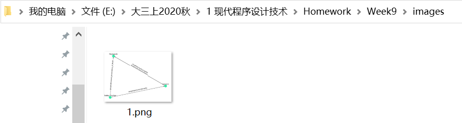

## Week9 装饰器

### 9.1 作业内容

当进行大批量数据读取、模型训练等，往往需要花费大量时间。这类耗时长的程序有一些通用的功能需求，可以通过装饰器实现，具体如下：

1. 实现一个类，在其中提供一些方法模拟耗时耗内存的一些操作，以测试如下的装饰器，如大的数据结构生成、遍历、写入文件序列化等。

2. 如果需要知道程序的运行时间、运行进度、内存占用情况，请利用line_profiler、memory_profiler、tqdm等装饰器实现相关功能，要求在程序执行结束后，打印程序的内存占用和运行时间。

3. 在程序处理结束后，通常需要将模型或者数据处理结果保存下来。但是，有时会因为路径设置错误（忘记新建文件夹）等原因导致文件无法存储，浪费大量的时间重复运行程序。一种解决方法是在执行程序前对参数中的路径进行检查。要求利用装饰器函数实现这一功能，接收函数的路径参数，检查路径对应文件夹是否存在，若不存在，则给出提示，并在提示后由系统自动创建对应的文件夹。

4. 在程序运行结束后，可以给用户发送一个通知，比如播放一段音乐等。要求实现对应的装饰器类，在被装饰的函数执行结束后，可以主动播放声音（了解并使用一下playsound或其他声音文件处理的库）。

### 9.2 实现过程

#### 9.2.1 实现类

在`RelationNetworkx`模块中实现一个根据“关系矩阵”，抽取原文中实体关系，并进行可视化分析的类

如下所示：

<center class="half">    

</center>

相关数据为：

+ test_relation_part.json：关系矩阵数据，每一条文本所生成的关系对应如左上图所示的二维数据

+ test_text.json：原始文本数据
+ relation_laebl_tag.txt：所有关系集合

实现过程详见附录，调用过程为：

```python
C = RelationNetwork('../data/test_relation_part.json',
                       '../data/test_text.json',
                       '../data/relation_label_tag.txt')
f = C.lazy_vis()
f(0,label_show=True,save_pth = "../images/1.png")
f(0,1,2,4,5,label_show=False)
```
实例化模拟类，通过闭包的形式实现数据一次加载多次使用

#### 9.2.2 进行程序监控

+ 内存管理

```python
from memory_profiler import profile
```

随后利用`@profile`装饰

数据读入部分的内存显示


主函数所有内存显示


+ 时间管理

运行：` kernprof -l -v main.py`，生成`main.py.lprof`文件

处理单个文本


处理多个文本


+ 进度管理（以多文本输入为例）

  当输入多个句子时，利用tqdm进度条观察程序正在处理哪一句

```python
G = nx.MultiDiGraph()
bar = tqdm(list(args))
for sen in bar:
    bar.set_description("Now get sen " + str(sen))
    d_tuple = torch.tensor(data[sen]).nonzero()
    d_tuple = d_tuple.numpy()
    text = self.__text[sen].split()   # 成功访问到self？
    print(d_tuple,text)
    array,label_dict = self.__node_process(d_tuple,text)
    print(array,label_dict)
    edges = self.__relation_process(array)
    

    for e in edges:
        G.add_edge(e[0],e[1],ind=e[2],name=e[3])

    time.sleep(1)
```


若删除函数中的所有print内容，可以展现出进度条的效果


#### 9.2.3 文件检查装饰器

+ 采用带有参数的装饰器（传入参数为文件的存储路径）

```python
def check_file(filepath):
    def decorater(func):
        @wraps(func)
        def wrapper(*args,**kwargs):
            print("@check_file:function_name:",wrapper.__name__)  # 如何给decorater装饰?
            #if not os.path.isdir(filepath):
            if not os.path.exists(os.path.dirname(filepath)):
                print("Warining:The input file dir doesn't exist. "+
                      "It's created automatically\n"+
                      f"filepath:{filepath}")
                os.makedirs(os.path.dirname(filepath))
            func(*args,**kwargs)
        return wrapper
    return decorater
```

+ 结果展示




#### 9.2.4 声音提示装饰器

+ 采用不带参数的装饰器

```python
def sound(func):
    @wraps(func)
    def wrapper(*args,**kwargs):
        #print(kwargs)
        print("@sound:function_name:",wrapper.__name__)
        func(*args,**kwargs)
        playsound("../sound/notice.mp3")
    return wrapper
```


并在程序进行完毕后播放`notice.mp3`

### 9.4 附录

#### 9.4.1 完整代码

+ RelationNetwork.py

```python
#-*- coding=utf-8 -*-
#@Time:  
#@Author: zjh
#@File: RelationNetwork.py
#@Software: PyCharm

import json
import torch
import numpy as np
import networkx as nx
import matplotlib.pyplot as plt
from memory_profiler import profile

class RelationNetwork:
    def __init__(self,path_tag,path_text,path_rel):
        self.__path = path_tag
        self.__text = path_text
        self.__rel = path_rel
        #self.__savepth = ""

    # def save_path(self,save_path):
    #     self.__savepth = save_path

    def __append_dict(self,dict,key,value):
        if value not in dict.values():
            dict[key] = value

    def __search_rel_name(self,num):
        for r in self.__rel:
            if int(r.split()[1]) == num:
                break
        if num // 10 == 0:
            return r.split()[0][:-2]
        elif num // 10 == 1:
            return r.split()[0][:-3]

    def __node_process(self,d_tuple,text):
        '''
        将单词进行合并
        :param d_tuple: 原始的二维关系标签组
        :param text: 原文列表
        :return: (字符串标签,关系代号)二维数组,标签列表
        '''
        idex = np.lexsort([d_tuple[:,1]])  # 按照关系代号排序
        d_tuple = d_tuple[idex, :]
        #print("hello",d_tuple)


        label_dict = {}
        temp_str = []  # 存放已经出现在label_dict中的实体名
        node_num = 0   # 生成标准图的字典键
        i=0
        array = []
        while i < len(d_tuple):
            #print("i=",i,"node_num=",node_num)
            if i == len(d_tuple)-1: # 最后一位
                if d_tuple[i][1] != d_tuple[i-1][1]:
                    #self.__append_dict(label_dict,f"Node{node_num}",text[d_tuple[i][0]])
                    if text[d_tuple[i][0]] not in temp_str:  # 最后一个不需要再放入temp_str中
                        node_num += 1
                        label_dict[f"Node{node_num}"] = text[d_tuple[i][0]]
                    array.append(list([text[d_tuple[i][0]], d_tuple[i][1]])) #不用字典是因为node_num不好控制
            else:
                if d_tuple[i][1] == d_tuple[i+1][1]:
                    #if text[d_tuple[i][0]] + ' ' + text[d_tuple[i+1][0]] not in label_dict.values():
                    if text[d_tuple[i][0]] not in temp_str:
                        node_num += 1
                        label_dict[f"Node{node_num}"] = text[d_tuple[i][0]] + ' ' + text[d_tuple[i+1][0]]
                        temp_str.extend([text[d_tuple[i][0]],text[d_tuple[i+1][0]]])

                    array.append(list([text[d_tuple[i][0]] + ' ' + text[d_tuple[i+1][0]], d_tuple[i][1]]))
                    i += 1   # 等所有操作都完成后才能改变索引位置
                else:
                    if text[d_tuple[i][0]] not in temp_str:
                        node_num += 1
                        label_dict[f"Node{node_num}"] = text[d_tuple[i][0]]
                        temp_str.append(text[d_tuple[i][0]])
                    array.append(list([text[d_tuple[i][0]], d_tuple[i][1]]))
            i += 1

        return array,label_dict

    def __relation_process(self,d_tuple):
        '''
        抽取关系,转化为绘图所需的结构
        :param d_tuple: (字符串标签,关系代号)二维数组[按照标签序号排好序]
        :param rel 完整的关系,不同关系列表,一个关系一个字符串
        :return: (字符串1,字符串2,关系代号)
        '''
        #print(d_tuple)
        edges = []
        for i in range(0,len(d_tuple),2):
            row_1 = d_tuple[i][0]        # 第一个实体
            row_2 = d_tuple[i+1][0]      # 第二个实体
            row_3 = d_tuple[i][1]        # 关系代号
            row_4 = self.__search_rel_name(row_3)  # 关系内容
            #print(row_1,row_2,row_4)
            edges.append(list([row_1,row_2,row_3,row_4]))
        return edges

    def __getkey(self,d,value):
        return [k for k, v in d.items() if v == value][0]
        # 此处可以保证一个单词只对应一个node


    @profile
    def lazy_vis(self):
        with open(self.__path, 'r') as f:
            data = json.load(f)
        with open(self.__text, 'r') as f:
            self.__text = json.load(f)
        with open(self.__rel, 'r') as f:
            self.__rel = f.read().splitlines()
            # for r in rel:
            #     print(r.split()[0][:-2])

        def vis(*args,label_show = True,save_pth = "../images/1.png"):
            #G = nx.DiGraph()
            # plot the networkx
            G = nx.MultiDiGraph()
            for sen in args:
                d_tuple = torch.tensor(data[sen]).nonzero()
                d_tuple = d_tuple.numpy()
                text = self.__text[sen].split()   # 成功访问到self？
                print(d_tuple,text)
                array,label_dict = self.__node_process(d_tuple,text)
                print(array,label_dict)
                edges = self.__relation_process(array)
                #print(edges,"hello")

                for e in edges:
                    G.add_edge(e[0],e[1],ind=e[2],name=e[3])

            #pos = nx.spring_layout(G, seed=3113794652)  # positions for all nodes
            pos = nx.spring_layout(G, scale=1)           #标准布局
            nx.draw(G,pos,node_color = '#31ECA8')
            for p in pos:  # raise text positions
                pos[p][1] += 0.07
            nx.draw_networkx_labels(G, pos)

            edge_labels = {}   # 用来整合edge_dict信息

            if label_show == True:
                edge_dict = nx.get_edge_attributes(G, 'name')
            else:
                edge_dict = nx.get_edge_attributes(G, 'ind')

            for k,v in edge_dict.items():
                if k[-1] == 0:
                    edge_labels[k[:2]] = str(v)
                else:
                    edge_labels[k[:2]] = edge_labels[k[:2]] + '\n' + str(v)
            #print(edge_dict,edge_labels)
            nx.draw_networkx_edge_labels(G, pos, edge_labels=edge_labels)
            plt.savefig(save_pth)
            plt.show()
        return vis

```

+ main.py

```python
#-*- coding=utf-8 -*-
#@Time:  
#@Author: zjh
#@File: main.py
#@Software: PyCharm

import os
from functools import wraps
from playsound import playsound

import RelationNetwork as rn

def check_file(filepath):
    def decorater(func):
        @wraps(func)
        def wrapper(*args,**kwargs):
            print("@check_file:function_name:",wrapper.__name__)  # 如何给decorater装饰
            #if not os.path.isdir(filepath):
            if not os.path.exists(os.path.dirname(filepath)):
                print("Warining:The input file dir doesn't exist. "+
                      "It's created automatically\n"+
                      f"filepath:{filepath}")
                os.makedirs(os.path.dirname(filepath))
            func(*args,**kwargs)
        return wrapper
    return decorater

def sound(func):
    @wraps(func)
    def wrapper(*args,**kwargs):
        #print(kwargs)
        print("@sound:function_name:",wrapper.__name__)
        func(*args,**kwargs)
        playsound("../sound/notice.mp3")
    return wrapper

@sound
@check_file("../images/1.png")
@profile          #时间管理
def main(*args):  #句子序号,一个或多个
    C = rn.RelationNetwork('../data/test_relation_part.json',
                           '../data/test_text.json',
                           '../data/relation_label_tag.txt')
    f = C.lazy_vis()
    f(*list(args),label_show=True,save_pth = "../images/1.png")
    #f(0,1,2,4,5,6,29,label_show=False)

if __name__ == "__main__":main(0)
```

#### 9.4.2 第三方模块安装记录

+ line_profiler

  Cpython

> (base) PS C:\Users\zjh> pip install Cpython
> WARNING: pip is being invoked by an old script wrapper. This will fail in a future version of pip.
> Please see https://github.com/pypa/pip/issues/5599 for advice on fixing the underlying issue.
> To avoid this problem you can invoke Python with '-m pip' instead of running pip directly.
> Collecting Cpython
>   Downloading cPython-0.0.6.tar.gz (4.7 kB)
> Collecting pymongo
>   Downloading pymongo-3.11.0-cp37-cp37m-win_amd64.whl (381 kB)
>      |████████████████████████████████| 381 kB 198 kB/s
> Requirement already satisfied: requests in d:\python37\lib\site-packages (from Cpython) (2.22.0)
> Requirement already satisfied: urllib3!=1.25.0,!=1.25.1,<1.26,>=1.21.1 in d:\python37\lib\site-packages (from requests->Cpython) (1.25.7)
> Requirement already satisfied: chardet<3.1.0,>=3.0.2 in d:\python37\lib\site-packages (from requests->Cpython) (3.0.4)
> Requirement already satisfied: certifi>=2017.4.17 in d:\python37\lib\site-packages (from requests->Cpython) (2019.11.28)
> Requirement already satisfied: idna<2.9,>=2.5 in d:\python37\lib\site-packages (from requests->Cpython) (2.8)
> Building wheels for collected packages: Cpython
>   Building wheel for Cpython (setup.py) ... done
>   Created wheel for Cpython: filename=cPython-0.0.6-py3-none-any.whl size=4918 sha256=adc947d4a32102d7fc77a78437b907ff02162b7303506d1d380ad527636820d0
>   Stored in directory: c:\users\zjh\appdata\local\pip\cache\wheels\88\92\ea\c32ad929e979a7303e010b29c736c793368f6f61c8c9902865
> Successfully built Cpython
> Installing collected packages: pymongo, Cpython
> Successfully installed Cpython-0.0.6 pymongo-3.11.0

​		line_profiler【在github上下载whl文件】

>(base) PS D:\Python37\Lib\site-packages> **pip install line_profiler-3.0.2-cp37-cp37m-win_amd64.whl**
>WARNING: pip is being invoked by an old script wrapper. This will fail in a future version of pip.
>Please see https://github.com/pypa/pip/issues/5599 for advice on fixing the underlying issue.
>To avoid this problem you can invoke Python with '-m pip' instead of running pip directly.
>Processing d:\python37\lib\site-packages\line_profiler-3.0.2-cp37-cp37m-win_amd64.whl
>Requirement already satisfied: IPython in d:\downloads\anaconda\anaconda\lib\site-packages (from line-profiler==3.0.2) (6.5.0)
>Requirement already satisfied: colorama; sys_platform == "win32" in d:\downloads\anaconda\anaconda\lib\site-packages (from IPython->line-profiler==3.0.2) (0.3.9)
>Requirement already satisfied: pickleshare in d:\downloads\anaconda\anaconda\lib\site-packages (from IPython->line-profiler==3.0.2) (0.7.4)
>Requirement already satisfied: backcall in d:\downloads\anaconda\anaconda\lib\site-packages (from IPython->line-profiler==3.0.2) (0.1.0)
>Requirement already satisfied: decorator in d:\downloads\anaconda\anaconda\lib\site-packages (from IPython->line-profiler==3.0.2) (4.3.0)
>Requirement already satisfied: prompt-toolkit<2.0.0,>=1.0.15 in d:\downloads\anaconda\anaconda\lib\site-packages (from IPython->line-profiler==3.0.2) (1.0.15)
>Requirement already satisfied: setuptools>=18.5 in d:\python37\lib\site-packages (from IPython->line-profiler==3.0.2) (41.2.0)
>Requirement already satisfied: jedi>=0.10 in d:\downloads\anaconda\anaconda\lib\site-packages (from IPython->line-profiler==3.0.2) (0.12.1)
>Requirement already satisfied: traitlets>=4.2 in d:\downloads\anaconda\anaconda\lib\site-packages (from IPython->line-profiler==3.0.2) (4.3.2)
>Requirement already satisfied: simplegeneric>0.8 in d:\downloads\anaconda\anaconda\lib\site-packages (from IPython->line-profiler==3.0.2) (0.8.1)
>Requirement already satisfied: pygments in d:\downloads\anaconda\anaconda\lib\site-packages (from IPython->line-profiler==3.0.2) (2.2.0)
>Requirement already satisfied: six>=1.9.0 in d:\python37\lib\site-packages (from prompt-toolkit<2.0.0,>=1.0.15->IPython->line-profiler==3.0.2) (1.12.0)
>Requirement already satisfied: wcwidth in d:\downloads\anaconda\anaconda\lib\site-packages (from prompt-toolkit<2.0.0,>=1.0.15->IPython->line-profiler==3.0.2) (0.1.7)
>Requirement already satisfied: parso>=0.3.0 in d:\downloads\anaconda\anaconda\lib\site-packages (from jedi>=0.10->IPython->line-profiler==3.0.2) (0.3.1)
>Requirement already satisfied: ipython-genutils in d:\downloads\anaconda\anaconda\lib\site-packages (from traitlets>=4.2->IPython->line-profiler==3.0.2) (0.2.0)
>Installing collected packages: line-profiler
>Successfully installed line-profiler-3.0.2

+ memory_profiler

> Collecting memory_profiler
>   Downloading memory_profiler-0.58.0.tar.gz (36 kB)
> Requirement already satisfied: psutil in d:\downloads\anaconda\anaconda\lib\site-packages (from memory_profiler) (5.4.7)
> Building wheels for collected packages: memory-profiler
>   Building wheel for memory-profiler (setup.py) ... done
>   Created wheel for memory-profiler: filename=memory_profiler-0.58.0-py3-none-any.whl size=30185 sha256=17751ea8fa7d54965261d827a679cd88094fbc012cf408c58886efa536bc6da6
>   Stored in directory: c:\users\zjh\appdata\local\pip\cache\wheels\56\19\d5\8cad06661aec65a04a0d6785b1a5ad035cb645b1772a4a0882
> Successfully built memory-profiler
> Installing collected packages: memory-profiler
> Successfully installed memory-profiler-0.58.0

+ heartrate

> WARNING: pip is being invoked by an old script wrapper. This will fail in a future version of pip.
> Please see https://github.com/pypa/pip/issues/5599 for advice on fixing the underlying issue.
> To avoid this problem you can invoke Python with '-m pip' instead of running pip directly.
> Collecting heartrate
>   Downloading heartrate-0.2.1.tar.gz (238 kB)
>      |████████████████████████████████| 238 kB 386 kB/s
> Requirement already satisfied: pygments in d:\downloads\anaconda\anaconda\lib\site-packages (from heartrate) (2.2.0)
> Requirement already satisfied: Flask in d:\downloads\anaconda\anaconda\lib\site-packages (from heartrate) (0.12)
> Collecting executing
>   Downloading executing-0.5.3-py3-none-any.whl (12 kB)
> Collecting asttokens
>   Downloading asttokens-2.0.4-py2.py3-none-any.whl (20 kB)
> Requirement already satisfied: Jinja2>=2.4 in d:\downloads\anaconda\anaconda\lib\site-packages (from Flask->heartrate) (2.10)
> Requirement already satisfied: Werkzeug>=0.7 in d:\python37\lib\site-packages (from Flask->heartrate) (0.16.0)
> Requirement already satisfied: itsdangerous>=0.21 in d:\downloads\anaconda\anaconda\lib\site-packages (from Flask->heartrate) (0.24)
> Requirement already satisfied: click>=2.0 in d:\downloads\anaconda\anaconda\lib\site-packages (from Flask->heartrate) (6.7)
> Requirement already satisfied: six in d:\python37\lib\site-packages (from asttokens->heartrate) (1.12.0)
> Requirement already satisfied: MarkupSafe>=0.23 in d:\downloads\anaconda\anaconda\lib\site-packages (from Jinja2>=2.4->Flask->heartrate) (1.0)
> Building wheels for collected packages: heartrate
>   Building wheel for heartrate (setup.py) ... done
>   Created wheel for heartrate: filename=heartrate-0.2.1-py3-none-any.whl size=235975 sha256=eef9af7ef44b3dff29183ac3327c721b481cee930d39e314edec798c70161cb3
>   Stored in directory: c:\users\zjh\appdata\local\pip\cache\wheels\88\90\1b\89f554f7340a7d3031cbd24df2f7c01145261ea245278700ce
> Successfully built heartrate
> Installing collected packages: executing, asttokens, heartrate
> Successfully installed asttokens-2.0.4 executing-0.5.3 heartrate-0.2.1

+ playsound

>WARNING: pip is being invoked by an old script wrapper. This will fail in a future version of pip.
>Please see https://github.com/pypa/pip/issues/5599 for advice on fixing the underlying issue.
>To avoid this problem you can invoke Python with '-m pip' instead of running pip directly.
>Collecting playsound
>Downloading playsound-1.2.2-py2.py3-none-any.whl (6.0 kB)
>Installing collected packages: playsound
>Successfully installed playsound-1.2.2